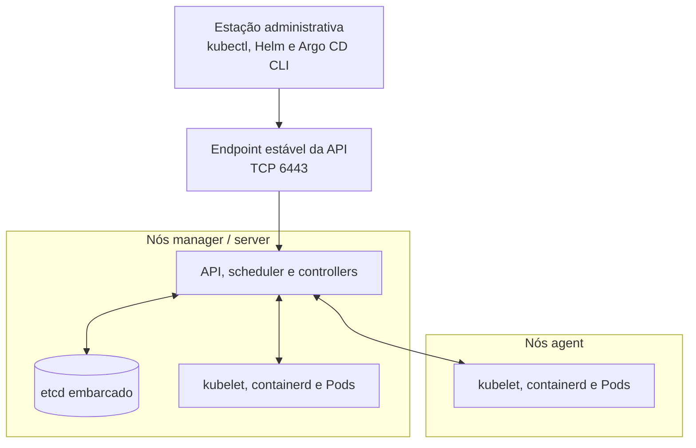

# Arquitetura do K3s

O K3s é uma distribuição Kubernetes que empacota o control plane, o runtime de containers e componentes de rede e operação em uma instalação simplificada. Os recursos e as APIs continuam sendo Kubernetes; ferramentas como `kubectl`, Helm e Argo CD não precisam de um modo especial para trabalhar com K3s.

Um nó **server**, chamado de **manager** neste guia, executa a API Kubernetes, scheduler, controllers e o datastore, além dos componentes de agent. Por isso, um manager também pode executar Pods, salvo quando forem aplicados taints ou outras restrições de agendamento. Um nó **agent** executa kubelet, runtime de containers e componentes de rede, mas não hospeda o control plane nem o datastore.

O primeiro servidor deste guia usa `cluster-init: true`, portanto inicializa etcd embarcado. Os servidores adicionais participam do mesmo control plane e do quorum do etcd; os agents registram-se pelo endpoint estável da API e executam os workloads atribuídos pelo Kubernetes.

Referência: [arquitetura do K3s](https://docs.k3s.io/architecture).
