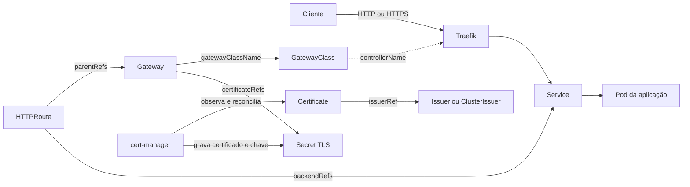

# Gateway API e Traefik

## O que são e como se relacionam

A Gateway API é uma especificação de recursos para configurar entrada e roteamento de tráfego no Kubernetes. Instalar seus CRDs ensina a API Kubernetes a armazenar objetos como `GatewayClass`, `Gateway` e `HTTPRoute`, mas os CRDs sozinhos não abrem portas nem encaminham tráfego. É necessário um controller que implemente a especificação.

O Traefik é o controller de entrada usado pelo K3s neste guia. Com o provider `kubernetesGateway` habilitado, ele observa os recursos da Gateway API, configura listeners HTTP/HTTPS e encaminha as requisições aceitas para Services Kubernetes.

| Recurso | Escopo e responsabilidade |
| --- | --- |
| `GatewayClass` | Recurso do cluster que identifica qual implementação controla um conjunto de Gateways; neste caso, Traefik |
| `Gateway` | Recurso de namespace que declara listeners, portas, protocolos, certificados e quais Routes podem se conectar |
| `HTTPRoute` | Recurso de namespace que associa hostnames, caminhos, filtros e regras aos Services de destino |
| `Service` | Backend estável que seleciona os Pods da aplicação |

O fluxo abaixo separa o caminho percorrido pela requisição das relações declarativas que configuram esse caminho:



Um `HTTPRoute` somente é aceito quando referencia um Gateway compatível e um listener desse Gateway permite a associação. A separação possibilita que a equipe responsável pela infraestrutura controle Gateways e certificados enquanto as equipes das aplicações mantêm suas próprias rotas. Referências: [introdução à Gateway API](https://gateway-api.sigs.k8s.io/docs/introduction/) e [provider Gateway API do Traefik](https://doc.traefik.io/traefik/reference/install-configuration/providers/kubernetes/kubernetes-gateway/).

Instale primeiro os CRDs Standard da Gateway API. O cert-manager e o provider Gateway API do Traefik dependem deles.

> **Executar em:** qualquer máquina com `KUBECONFIG` e acesso administrativo à API.

```bash
read -r -p "Versão da Gateway API [v1.5.1]: " GATEWAY_API_VERSION
GATEWAY_API_VERSION="${GATEWAY_API_VERSION:-v1.5.1}"

kubectl apply --server-side=true \
  -f "https://github.com/kubernetes-sigs/gateway-api/releases/download/${GATEWAY_API_VERSION}/standard-install.yaml"
```

Valide os CRDs principais:

> **Executar em:** qualquer máquina com `KUBECONFIG` e acesso à API.

```bash
kubectl get crd \
  gatewayclasses.gateway.networking.k8s.io \
  gateways.gateway.networking.k8s.io \
  httproutes.gateway.networking.k8s.io
```

Configure o Traefik empacotado pelo K3s:

> **Executar em:** qualquer máquina com `KUBECONFIG` e acesso administrativo à API.

```bash
kubectl apply -f - <<'EOF'
apiVersion: helm.cattle.io/v1
kind: HelmChartConfig
metadata:
  name: traefik
  namespace: kube-system
spec:
  valuesContent: |-
    providers:
      kubernetesGateway:
        enabled: true

    gateway:
      enabled: false

    ports:
      web:
        port: 80
        exposedPort: 80
        expose:
          default: true

      websecure:
        port: 443
        exposedPort: 443
        expose:
          default: true
EOF
```

Espere a reconciliação e confira os logs:

> **Executar em:** qualquer máquina com `KUBECONFIG` e acesso à API.

```bash
kubectl --namespace kube-system rollout status deployment/traefik --timeout=180s
kubectl --namespace kube-system get pods -l app.kubernetes.io/name=traefik
kubectl --namespace kube-system logs deployment/traefik --tail=100
```

O chart não cria um `Gateway` por padrão. Crie `GatewayClass`, `Gateway` e rotas de acordo com a topologia do ambiente.

## Fontes e leitura adicional

- [Introdução à Gateway API](https://gateway-api.sigs.k8s.io/docs/introduction/): apresenta o projeto, seus objetivos e a separação de responsabilidades por papéis.
- [Visão geral da API](https://gateway-api.sigs.k8s.io/concepts/api-overview/): detalha `GatewayClass`, `Gateway`, Routes, listeners e as relações entre esses recursos.
- [Roteamento HTTP](https://gateway-api.sigs.k8s.io/guides/user-guides/http-routing/): fornece exemplos oficiais de associação de `HTTPRoute`, regras de correspondência e backends.
- [Provider Kubernetes Gateway do Traefik](https://doc.traefik.io/traefik/reference/install-configuration/providers/kubernetes/kubernetes-gateway/): documenta a ativação e as opções do provider que reconcilia a Gateway API.
- [Serviços de rede do K3s](https://docs.k3s.io/networking/networking-services#traefik-ingress-controller): explica como o K3s empacota, configura e atualiza o Traefik.
