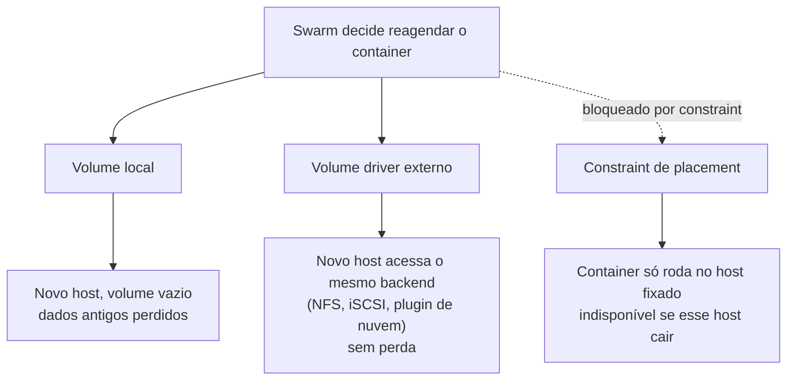

> **Para quem é:** operadores armazenando dados de aplicação em Swarm.

Docker Swarm não oferece orquestração nativa de volumes entre hosts. Um volume é local ao host em
que o container roda; se o Swarm reagenda esse container para outro host (por falha, atualização
ou rebalanceamento), o volume antigo fica para trás e o container reinicia com um volume vazio no
novo host.

O diagrama a seguir contrasta o que acontece com os dados nas três abordagens descritas nesta
página quando o Swarm decide reagendar o container para outro host: o volume local perde os dados,
o volume driver externo preserva o acesso porque os dados nunca estiveram presos a um host
específico, e a constraint de placement evita o reagendamento por completo, trocando disponibilidade
por simplicidade.



## Local volumes

Esse é o comportamento padrão: cada host mantém sua própria cópia local do volume, sem
sincronização entre hosts.

```bash
docker service create \
  --mount type=volume,source=mydata,target=/data \
  --name app \
  <imagem>
```

Essa abordagem é adequada para ambientes de staging e desenvolvimento, ou para aplicações que já
replicam seus próprios dados entre réplicas (um banco de dados distribuído, um cache com
replicação própria). Ela é inadequada para um banco de dados centralizado ou qualquer dado que
exista em uma única cópia: perder o host onde o volume vive significa perder os dados, já que não
existe cópia em nenhum outro lugar.

## Volume driver externo

Conecta um backend compartilhado (NFS, iSCSI, plugin de nuvem):

```bash
# Criar volume via driver externo
docker volume create --driver nfs --opt addr=<nfs_server> <nome>

docker service create \
  --mount type=volume,source=<nome>,target=/data \
  --name db \
  <imagem>
```

Permite que um container seja reagendado em qualquer host e ainda acesse os mesmos dados.

## Constraints de placement

Fixa um container em hosts específicos (workaround para volumes locais):

```bash
docker service create \
  --constraint node.hostname==db-host-1 \
  --mount type=volume,source=db_data,target=/data \
  --name db \
  postgres
```

Desvantagem: se `db-host-1` cai, o serviço fica indisponível.

## Backup manual

Não há integração nativa com snapshot de volumes. Backup é responsabilidade da aplicação:

```bash
# Dentro da aplicação ou em um container auxiliar:
pg_dump | gzip > /backup/db.sql.gz

# Sincronizar /backup para storage externo (rsync, S3, etc.)
```

## Checklist

- [ ] Se a aplicação precisa de persistência real, um volume driver externo ou constraints de
      placement foram escolhidos (não o volume local padrão).
- [ ] Se a aplicação roda com múltiplas réplicas, elas coordenam o acesso aos dados entre si (via
      raft, quorum ou outro mecanismo próprio), em vez de presumir um volume compartilhado que o
      Swarm não oferece.
- [ ] O procedimento de backup está documentado e já foi testado, não apenas escrito.
- [ ] RTO e RPO estão definidos: quanto tempo o serviço pode ficar fora, e quantos dados a
      organização aceita perder em uma recuperação.

## Referências

- [Volumes in Docker](https://docs.docker.com/storage/volumes/): tipos de volumes.
- [Volume drivers](https://docs.docker.com/engine/extend/plugins_volume/): plugins para backends compartilhados.
