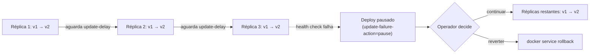

> **Para quem é:** operadores atualizando aplicações em produção e precisando de rollback rápido.

Docker Swarm oferece rolling updates e rollback automático se algo falhar.

## Rolling update com validação

O diagrama a seguir mostra a ordem temporal de um rolling update com `--update-parallelism 1`: o
Swarm atualiza uma réplica por vez, espera o `--update-delay` configurado, e só então passa para a
próxima. Se uma réplica falhar o health check nesse meio-tempo, `--update-failure-action pause`
interrompe a sequência antes de atualizar as réplicas restantes, deixando a decisão de continuar ou
reverter para o operador.



Configurar um service para atualizar uma réplica por vez:

```bash
docker service create \
  --update-parallelism 1 \
  --update-delay 30s \
  --update-failure-action pause \
  --name app \
  myapp:v1
```

Depois, atualizar:

```bash
docker service update --image myapp:v2 app
```

Observar o progresso:

```bash
docker service ps app
# watch docker service ps app  (atualização passo a passo)
```

## Rollback automático

Se o health check falhar em uma nova versão, pausar (não atualizar as demais):

```bash
docker service update \
  --update-failure-action pause \
  app
```

Depois, decidir se continua ou volta:

```bash
# Ver histórico
docker service ps app --no-trunc

# Rollback manualmente
docker service rollback app
```

## Rollback automático com detecção de falha

Swarm não oferece rollback automático real: mesmo com `--update-failure-action pause`, um
container que falha faz o deploy pausar, mas não volta à versão anterior por conta própria. A
decisão de continuar ou reverter continua sendo do operador, que precisa monitorar o resultado
antes de agir.

Padrão recomendado:

1. Deploy versão nova com `--update-failure-action pause`.
1. Monitorar logs e health checks por alguns minutos.
1. Se tudo bem, continuar o deploy (há tarefas pausadas):

   ```bash
   docker service update app  # continua o deploy
   ```

1. Se mal, fazer rollback:

   ```bash
   docker service rollback app
   ```

## Blue-green deployment

Uma alternativa ao rolling update é manter duas versões completas rodando lado a lado:

```bash
# Versão antiga
docker service create \
  --publish 80:8080 \
  --network mynet \
  --name app-blue \
  myapp:v1

# Nova versão, sem publicar ainda
docker service create \
  --network mynet \
  --name app-green \
  myapp:v2

# Testar app-green internamente
docker service ps app-green

# Ao ficar pronto, switchar load balancer ou ingress
docker service update --publish-rm 80:8080 app-blue
docker service update --publish-add 80:8080 app-green

# Remover versão antiga
docker service remove app-blue
```

Vantagem: rollback instantâneo. Desvantagem: precisa de LB externo ou API de rota customizada.

## Drain/cordon de nós durante atualização

Se atualizar todo o cluster (Swarm, Docker daemon):

```bash
# No nó a ser atualizado:
docker node update --availability drain <node_id>
# (move todas as tasks para outros nós)

# Atualizar o host
systemctl stop docker
apt update && apt upgrade docker.io
systemctl start docker

# Trazer nó de volta
docker node update --availability active <node_id>
```

## Estratégia de teste

Antes de fazer rollout:

1. Deploy em **staging** com mesma configuração.
2. Testar completamente (health checks, logs, carga esperada).
3. Deploy em **prod** com rolling update lento.
4. Monitorar por 10-15 min antes de considerar "deployado".

## Referências

- [Service update reference](https://docs.docker.com/engine/reference/commandline/service_update/): opções de atualização.
- [Swarm mode tutorial: rolling update](https://docs.docker.com/engine/swarm/swarm-tutorial/rolling-update/): exemplo passo a passo.
