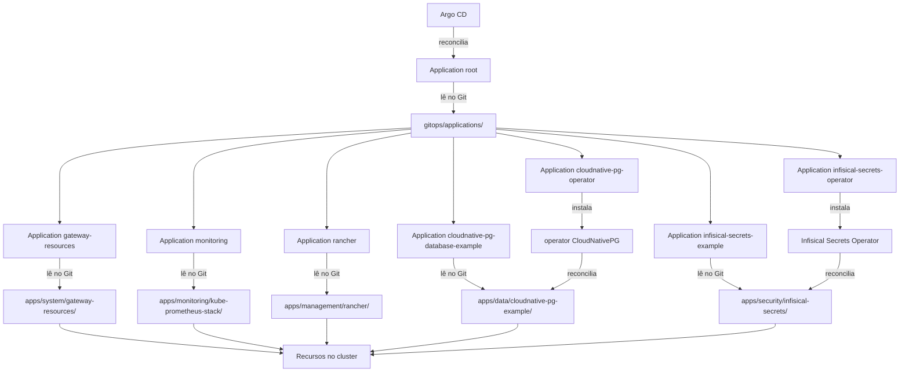

Depois da instalação, o próximo passo é fazer o Argo CD observar um repositório que contenha o estado desejado do cluster. O modelo disponível neste repositório usa o padrão App-of-Apps: uma `Application` chamada `root` observa o diretório `gitops/applications/`, e cada arquivo YAML desse diretório define uma `Application` independente para uma funcionalidade que o usuário decidiu instalar.



O termo `root` não indica um tipo especial de repositório no Argo CD. Ele é apenas o nome da Application de bootstrap. Seu manifesto aponta para `gitops/applications/`; as Applications encontradas nesse diretório passam a observar seus próprios caminhos em `gitops/apps/`. Como os manifests são independentes, mantenha somente os arquivos das aplicações que deseja usar.

Siga esta sequência:

1. Crie um repositório Git para a configuração do cluster ou escolha um repositório existente.
2. Copie [`templates/gitops`](https://github.com/guesant/cluster-management-notes/tree/main/templates/gitops) para o diretório `gitops/` desse repositório.
3. Remova de `gitops/applications/` as Applications que não deseja instalar e remova também os respectivos diretórios em `gitops/apps/`.
4. Substitua `https://github.com/example/cluster-config.git` em `gitops/root/application.yaml` e nas Applications mantidas pela URL real do repositório. Revise também os domínios, versões, namespaces e valores dos charts.
5. Valide, faça commit e envie a estrutura para a branch indicada por `targetRevision`, que nos exemplos é `main`.
6. Se o repositório for privado, cadastre no Argo CD uma credencial somente de leitura. Um repositório público normalmente pode ser clonado diretamente pela URL informada nas Applications.
7. Aplique uma única vez a Application `root`; a partir dela, o Argo CD descobrirá e reconciliará as demais Applications.

Para um repositório privado acessado por SSH, registre uma chave de leitura dedicada depois de autenticar a CLI do Argo CD. Não reutilize uma chave administrativa pessoal:

> **Executar em:** estação administrativa com a CLI do Argo CD autenticada e acesso à chave de leitura do repositório.

```bash
read -r -p "URL SSH do repositório GitOps: " GITOPS_REPO_URL
read -r -p \
  "Caminho absoluto da chave privada [${HOME}/.ssh/argocd_gitops]: " \
  GITOPS_SSH_KEY

GITOPS_SSH_KEY="${GITOPS_SSH_KEY:-${HOME}/.ssh/argocd_gitops}"

argocd repo add "${GITOPS_REPO_URL}" \
  --ssh-private-key-path "${GITOPS_SSH_KEY}"
```

Depois de enviar o conteúdo personalizado para o Git, faça o bootstrap:

> **Executar em:** qualquer máquina com `KUBECONFIG` e acesso administrativo à API, na raiz da cópia local do repositório GitOps.

```bash
read -r -p \
  "Caminho da Application raiz [gitops/root/application.yaml]: " \
  ROOT_APPLICATION

ROOT_APPLICATION="${ROOT_APPLICATION:-gitops/root/application.yaml}"
kubectl apply -f "${ROOT_APPLICATION}"
```

Confira se a Application raiz e as Applications escolhidas foram criadas e observe as colunas de sincronização e saúde:

> **Executar em:** qualquer máquina com `KUBECONFIG` e acesso à API.

```bash
kubectl --namespace argocd get applications.argoproj.io
kubectl --namespace argocd describe application root
```

Os templates começam com `prune: false`: o Argo CD corrige recursos alterados quando `selfHeal` está habilitado, mas não exclui automaticamente do cluster um recurso removido do Git. Revise os diffs e o comportamento de cada Application antes de habilitar `prune`, pois a exclusão no repositório poderá resultar na exclusão correspondente no cluster.

## Fontes e leitura adicional

- [Cluster bootstrapping — Argo CD](https://argo-cd.readthedocs.io/en/stable/operator-manual/cluster-bootstrapping/): apresenta o padrão App-of-Apps, suas alternativas e cuidados de administração.
- [Especificação de `Application` — Argo CD](https://argo-cd.readthedocs.io/en/stable/user-guide/application-specification/): referência dos campos usados para origem, destino e política de sincronização.
- [Sincronização automatizada — Argo CD](https://argo-cd.readthedocs.io/en/stable/user-guide/auto_sync/): explica `selfHeal`, `prune` e os efeitos da reconciliação automática.
- [Repositórios privados — Argo CD](https://argo-cd.readthedocs.io/en/stable/user-guide/private-repositories/): documenta credenciais HTTPS e SSH, chaves de deploy e verificação do servidor.
- [Princípios do OpenGitOps](https://opengitops.dev/): descreve os princípios declarativo, versionado, aplicado automaticamente e continuamente reconciliado.
