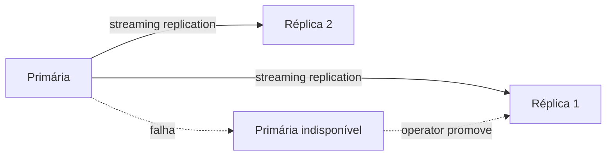

import ScriptHelper from '../../../../../components/ScriptHelper.astro';
import createPostgresqlClusterScript from '../../../../../scripts/create-postgresql-cluster.sh?raw';

> **Pré-requisitos:** [operator CloudNativePG instalado](../install-cloudnative-pg-operator/), StorageClass disponível (veja [criar uma StorageClass](../../storage/create-storage-class/)).
> **Versões testadas:** CloudNativePG 1.30, PostgreSQL 17.

Um recurso `Cluster` do CloudNativePG declara quantas instâncias PostgreSQL rodam, qual armazenamento usam e como se comunicam entre si. O operator provisiona os Pods, configura replicação em streaming entre elas e promove uma réplica automaticamente se a primária falhar.



Em um cluster de nó único (`instances: 1`), esse diagrama não se aplica: não há réplica para promover, e a única proteção contra a perda do Pod é o restart automático do Kubernetes no mesmo volume.

## Criar o cluster

<ScriptHelper
  runWhere="qualquer máquina com `KUBECONFIG` e acesso administrativo à API"
  script={createPostgresqlClusterScript}
  fields={[
    { var: 'PG_NAMESPACE', label: 'Namespace do cluster' },
    { var: 'PG_CLUSTER_NAME', label: 'Nome do cluster' },
    { var: 'PG_INSTANCES', label: 'Número de instâncias (1 = sem HA, 3 recomendado)' },
    { var: 'PG_STORAGE_SIZE', label: 'Tamanho do volume', placeholder: '10Gi' },
    { var: 'PG_STORAGE_CLASS', label: 'StorageClass a usar' },
  ]}
/>

Em um cluster de nó único, `instances: 1` é a única opção realista: múltiplas instâncias não protegem contra a perda do único host físico, apenas do processo PostgreSQL isoladamente. Veja [decisões do blueprint](../../../../guides/blueprints/k3s-single-node-gitops/#decisões-adotadas) para o contexto dessa limitação.

## Validação

> **Executar em:** qualquer máquina com `KUBECONFIG` e acesso à API.

```bash
kubectl --namespace "${PG_NAMESPACE}" get cluster "${PG_CLUSTER_NAME}"
kubectl --namespace "${PG_NAMESPACE}" get pods -l cnpg.io/cluster="${PG_CLUSTER_NAME}"
```

A coluna `STATUS` do `Cluster` deve mostrar `Cluster in healthy state`, e os Pods devem estar `Running` com uma réplica marcada como `primary` no rótulo `cnpg.io/instanceRole`.

## Troubleshooting

Se os Pods ficarem `Pending`, confirme capacidade da `StorageClass` e do nó (veja [validar requisitos do host](../../host/validate-host-requirements/)). Se o cluster nunca sair de `Setting up primary`, revise `kubectl --namespace "${PG_NAMESPACE}" describe cluster "${PG_CLUSTER_NAME}"` para o evento específico.

## Rollback

```bash
kubectl --namespace "${PG_NAMESPACE}" delete cluster "${PG_CLUSTER_NAME}"
```

:::danger
Excluir o `Cluster` remove os Pods e, conforme a política de retenção do volume (veja [PersistentVolumes na prática](../../../../learn/storage/persistent-volumes/)), pode remover também os dados. Confirme a `reclaimPolicy` da StorageClass antes de excluir um cluster com dados importantes.
:::

## Próximo passo

[Configurar credenciais de aplicação](../configure-application-credentials/).

## Fontes e leitura adicional

- [CloudNativePG: Quickstart](https://cloudnative-pg.io/documentation/current/quickstart/): fluxo oficial de criação de um primeiro cluster.
- [CloudNativePG: API Reference](https://cloudnative-pg.io/documentation/current/cloudnative-pg.v1/): referência completa do campo `spec` do recurso `Cluster`.
