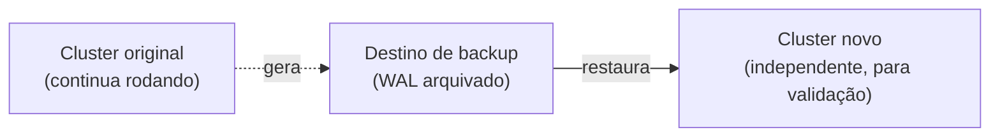

import ScriptHelper from '../../../../../components/ScriptHelper.astro';
import restorePostgresqlClusterScript from '../../../../../scripts/restore-postgresql-cluster.sh?raw';

> **Pré-requisitos:** [backup do PostgreSQL configurado](../configure-postgresql-backups/) e um backup existente no destino.
> **Versões testadas:** CloudNativePG 1.30.

O CloudNativePG restaura criando um **novo** cluster a partir do backup; não substitui o cluster existente no lugar. Isso permite validar a restauração sem afetar o cluster em produção, o mesmo princípio usado na [restauração de volumes Longhorn](../../storage/restore-volume-backup/).



Só depois de validar a integridade dos dados no cluster novo é que se decide redirecionar a aplicação para ele; até lá, o original permanece intocado.

## Restaurar como um novo cluster

<ScriptHelper
  runWhere="qualquer máquina com `KUBECONFIG` e acesso administrativo à API"
  script={restorePostgresqlClusterScript}
  fields={[
    { var: 'PG_NAMESPACE', label: 'Namespace do novo cluster' },
    { var: 'PG_RESTORED_NAME', label: 'Nome do novo cluster restaurado' },
    { var: 'BACKUP_DESTINATION', label: 'URL do destino de backup original' },
    { var: 'RECOVERY_TARGET_TIME', label: 'Ponto de recuperação (timestamp ISO 8601, vazio = mais recente)' },
  ]}
/>

Sem `targetTime`, o CloudNativePG restaura até o ponto mais recente disponível no WAL arquivado.

## Validação

> **Executar em:** qualquer máquina com `KUBECONFIG` e acesso à API.

```bash
kubectl --namespace "${PG_NAMESPACE}" get cluster "${PG_RESTORED_NAME}"
```

Depois que o cluster restaurado ficar saudável, valide a integridade dos dados na camada da aplicação: confira schema, contagens conhecidas ou checksums, não apenas a existência do Pod:

```bash
kubectl --namespace "${PG_NAMESPACE}" exec -it "${PG_RESTORED_NAME}-1" -- psql -U postgres -c '\dt'
```

## Troubleshooting

Se a restauração ficar presa em `Setting up primary` por muito tempo, confirme que a credencial do `externalClusters` tem permissão de leitura no destino original e que o `destinationPath` está correto: um caminho errado normalmente falha silenciosamente até o timeout.

## Rollback

```bash
kubectl --namespace "${PG_NAMESPACE}" delete cluster "${PG_RESTORED_NAME}"
```

## Próximo passo

Depois de validar a integridade, decida se o cluster restaurado substitui o original (redirecione a aplicação para os novos Services) ou serve apenas como evidência de um restore drill; veja o [roteiro de restore drill](../../../../operations/backups/backup-and-recovery/#roteiro-de-restore-drill).

## Fontes e leitura adicional

- [CloudNativePG: Recovery](https://cloudnative-pg.io/documentation/current/recovery/): referência oficial de recuperação point-in-time e `externalClusters`.
