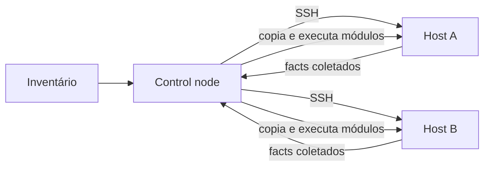

> **Para quem é:** quem nunca usou Ansible e precisa entender o modelo antes de escrever o primeiro playbook.

Ansible aplica configuração em um conjunto de hosts a partir de um único ponto de controle, sem exigir que nenhum agente fique instalado e rodando permanentemente nesses hosts. Ele resolve um problema diferente do provisionamento de máquinas: enquanto uma ferramenta de Infraestrutura como Código como o [Terraform](../iac-overview/) cria a máquina, o Ansible configura o que roda dentro dela (pacotes instalados, arquivos de configuração, serviços habilitados) depois que ela já existe.

## Como funciona

O host onde os comandos `ansible`/`ansible-playbook` são executados é o **control node**. Ele não precisa de nenhum componente especial instalado nos hosts de destino além de um interpretador Python e acesso SSH: a cada execução, o Ansible se conecta via SSH, copia os módulos necessários para o host de destino, executa-os e remove os arquivos temporários ao final. Não existe um daemon Ansible rodando continuamente no host gerenciado, ao contrário de ferramentas como Puppet ou Chef, que dependem de um agente instalado e de um servidor central com o qual esse agente sincroniza periodicamente.

O **inventário** é a lista de hosts que o Ansible gerencia, organizados em grupos (por função, ambiente, região, o que fizer sentido). Pode ser um arquivo estático (INI ou YAML) ou gerado dinamicamente a partir de uma fonte externa (um provedor de nuvem, por exemplo), útil quando os hosts mudam com frequência demais para manter uma lista manual atualizada.

Um **módulo** é a unidade de trabalho que o Ansible executa em um host: instalar um pacote, gerenciar um arquivo, garantir que um serviço esteja habilitado, entre centenas de outros disponíveis na distribuição padrão. Cada módulo espera atingir um estado declarado (“este pacote deve estar presente”), não descreve uma sequência imperativa de comandos a rodar.

No início de cada execução, o Ansible coleta **facts**: informações sobre o host de destino (sistema operacional, endereços de rede, quantidade de memória, entre dezenas de outras). Esses facts ficam disponíveis como variáveis dentro do playbook, permitindo condicionar uma tarefa ao que o host realmente é, em vez de assumir um ambiente uniforme.

## Idempotência como contrato

Um módulo bem escrito reporta `changed` quando ele de fato alterou algo no host, e não reporta quando o estado já correspondia ao desejado. Rodar o mesmo playbook duas vezes seguidas contra o mesmo host deve produzir `changed=0` na segunda execução, se nada mudou entre as duas: essa é a prova prática de que a automação é idempotente, e não apenas um script que reaplica ações às cegas a cada execução.

Essa garantia é um contrato que cada módulo se compromete a cumprir, não uma propriedade automática do Ansible. O módulo `apt`, por exemplo, verifica se o pacote já está na versão desejada antes de agir; mas uma tarefa que roda um comando de shell arbitrário (`ansible.builtin.command` ou `ansible.builtin.shell`) executa o comando a cada vez, goste ou não do estado atual, a menos que a própria tarefa seja escrita com uma condição explícita (`creates`, `changed_when`) que restaure esse contrato. Preferir módulos declarativos específicos a comandos de shell genéricos é, na prática, a forma mais direta de manter um playbook idempotente.

## Alternativas

Puppet e Chef seguem o modelo oposto: um agente instalado em cada host puxa (`pull`) a configuração de um servidor central em um intervalo programado, em vez do control node empurrar (`push`) a configuração sob demanda. O modelo pull escala melhor para um número muito grande de hosts, porque o servidor central não precisa se conectar ativamente a cada um deles, mas exige manter esse agente e esse servidor rodando permanentemente. O modelo push do Ansible é mais simples de operar em um cluster pequeno ou em um laboratório, exatamente pela ausência de infraestrutura de agente.

Salt (SaltStack) oferece os dois modelos, com um daemon opcional (`salt-minion`) para pull em tempo quase real, mantendo também um modo agentless via SSH parecido com o do Ansible.

Comparado a uma ferramenta de Infraestrutura como Código como Terraform ou OpenTofu, a diferença de camada importa mais que a diferença de sintaxe: IaC declara e provisiona recursos (a própria máquina, uma rede, um disco), enquanto o Ansible configura o que roda dentro de uma máquina que já existe. As duas camadas são complementares, não concorrentes, e é comum usar Terraform para criar os hosts e Ansible para configurá-los na sequência.

## Quando usar

Configuração de hosts que já existem, aplicada de forma repetível e auditável (o playbook é o registro do que foi feito), sem exigir instalar um agente permanente. Também é adequado para tarefas pontuais de operação em lote contra vários hosts ao mesmo tempo, fora do escopo de configuração contínua.

## Quando evitar

Para provisionar a máquina em si (criar a instância, alocar disco, configurar rede na nuvem), uma ferramenta de IaC resolve isso de forma mais direta; usar Ansible para simular provisionamento (via módulos de cloud) funciona, mas perde o rastreamento de estado que uma ferramenta de IaC mantém nativamente. Em ambientes com milhares de hosts e necessidade de reconciliação contínua (não sob demanda), o modelo pull de Puppet/Chef tende a escalar com menos coordenação manual do que disparar Ansible periodicamente contra todos eles.

## Páginas relacionadas

- [Estrutura de um projeto Ansible: playbooks, roles e Vault](../ansible-structure/), a continuação natural: como organizar mais de uma tarefa num projeto real.
- [Infraestrutura como código: Terraform, OpenTofu, Pulumi](../iac-overview/), para a camada de provisionamento que o Ansible não cobre.
- [Ferramentas de automação e orquestração](../../../toolbox/tools/automation/automation-tools/), para instalação do `ansible-core` e o que avaliar antes de adotá-lo.

## Referências

- [Ansible: How Ansible works](https://docs.ansible.com/ansible/latest/getting_started/index.html): visão geral oficial do modelo agentless e do fluxo control node → hosts.
- [Ansible: Idempotency](https://docs.ansible.com/ansible/latest/reference_appendices/glossary.html#term-Idempotency): definição oficial do termo no glossário do projeto.
- [Ansible: Working with inventory](https://docs.ansible.com/ansible/latest/inventory_guide/index.html): formatos de inventário estático e dinâmico.
