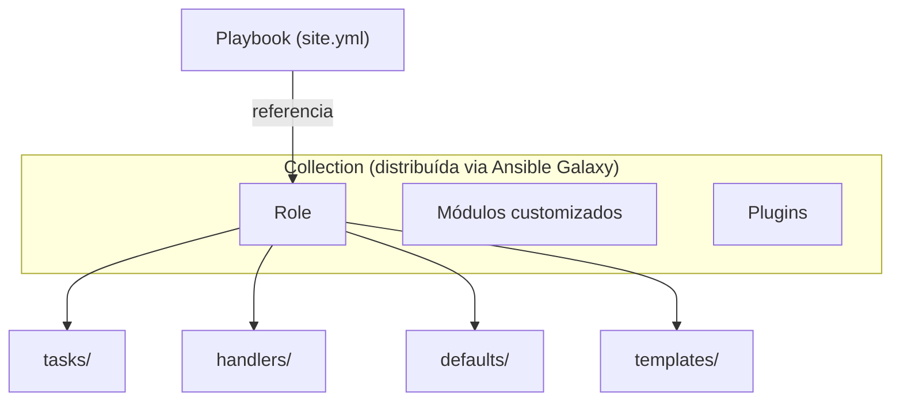

> **Para quem é:** quem já entende o modelo mental do Ansible (a página anterior desta trilha) e precisa organizar mais de uma tarefa solta num projeto real, sem se perder entre playbook, role e collection.

O [modelo mental do Ansible](../ansible-model/) explica o que acontece numa execução isolada: control node, inventário, módulos, idempotência. Esta página cobre como esses elementos se organizam num projeto real, à medida que cresce além de um único arquivo de tarefas.

## Playbooks: a unidade que o operador executa

Um **playbook** é um arquivo YAML que declara uma ou mais **plays**, cada uma associando um grupo de hosts do inventário a uma lista de tarefas a aplicar. A execução (`ansible-playbook site.yml`) processa as plays em ordem, e dentro de cada play, as tarefas em ordem, host por host (por padrão, em paralelo até um limite de forks configurável). Um playbook pequeno pode conter as tarefas diretamente; um playbook maior delega a maior parte do trabalho a roles (a próxima seção), funcionando mais como um índice de o que aplicar a quem do que como uma lista de tarefas em si.

## Handlers: reagir a uma mudança, não repetir a cada execução

Um **handler** é uma tarefa especial que só executa quando explicitamente notificada (`notify: nome-do-handler`) por outra tarefa que reportou `changed`, e mesmo assim só uma vez ao final da play, independente de quantas tarefas diferentes o notificaram. O caso de uso canônico é reiniciar um serviço depois de alterar seu arquivo de configuração: a tarefa que copia o arquivo notifica o handler de restart, mas o restart só acontece se o arquivo realmente mudou (o módulo `copy`/`template` só reporta `changed` quando o conteúdo é diferente do já presente no host), preservando a idempotência já discutida na página anterior em vez de reiniciar o serviço a cada execução do playbook, tenha algo mudado ou não.

## Roles: a unidade reutilizável

Uma **role** empacota tarefas, handlers, variáveis padrão, templates e arquivos relacionados a uma responsabilidade específica (configurar o firewall do host, instalar um pacote com sua configuração), numa estrutura de diretórios padronizada (`tasks/`, `handlers/`, `defaults/`, `vars/`, `templates/`, `files/`) que o Ansible reconhece automaticamente pelo nome de cada subdiretório, sem exigir configuração explícita de onde cada peça está. Isso torna uma role portável entre projetos diferentes: aplicá-la a um novo playbook é uma questão de referenciá-la (`roles: [minha-role]` numa play), não de copiar arquivos manualmente. Dividir um projeto em roles bem definidas, uma por responsabilidade, é o que evita um único playbook monolítico difícil de reutilizar ou testar em partes.

## Collections: como roles e módulos se distribuem

Uma **collection** é o formato de distribuição que empacota roles, módulos, plugins e documentação juntos, versionados como uma unidade, instalável via `ansible-galaxy collection install`. Módulos que cobrem uma tecnologia específica não incluída no `ansible-core` (um provedor de nuvem, um produto de rede específico) tipicamente chegam como parte de uma collection publicada pelo fabricante ou pela comunidade, em vez de fazerem parte da instalação base do Ansible. Entender a diferença entre role e collection evita um erro comum de vocabulário: uma role é uma unidade de automação reutilizável; uma collection é a embalagem que pode conter várias roles (além de módulos e plugins) para distribuição.

## Variáveis e precedência: a visão honesta, não a tabela completa

O Ansible aceita variáveis de mais de vinte fontes diferentes (inventário, `group_vars`, `host_vars`, defaults de role, vars de role, vars de play, `extra-vars` de linha de comando, entre outras), com uma ordem de precedência oficial documentada em detalhe pelo próprio projeto. Memorizar essa tabela completa raramente compensa o esforço; o que importa na prática, e o que vale reter, é a lógica geral: variáveis mais **específicas** e mais **explícitas** vencem as mais genéricas e implícitas. `defaults/main.yml` de uma role é o valor de fallback mais fraco, pensado para ser sobrescrito; `--extra-vars` na linha de comando é a fonte mais forte, pensada exatamente para forçar um valor numa execução pontual, sobrepondo qualquer outra definição. Entre esses dois extremos, a regra prática que evita a maioria das surpresas é: se um valor não está saindo como esperado, procurar primeiro por uma definição mais específica (mais próxima da tarefa, ou vinda de `--extra-vars`) sobrescrevendo o que foi definido de forma mais genérica, em vez de tentar decorar a posição exata de cada fonte na tabela oficial.

## Ansible Vault: cifrar segredos dentro do próprio repositório

**Ansible Vault** é o mecanismo do próprio Ansible para cifrar um arquivo inteiro (tipicamente um arquivo de variáveis com valores sensíveis) ou uma string individual dentro de um playbook, usando uma senha ou uma chave para decifrar no momento da execução. `ansible-vault encrypt vars/secrets.yml` cifra o arquivo no lugar; `ansible-vault edit vars/secrets.yml` abre o conteúdo decifrado num editor e recifra ao salvar; `ansible-vault view` mostra o conteúdo sem editar. A execução de um playbook que referencia um arquivo cifrado exige a senha (`--ask-vault-pass`) ou um arquivo de senha (`--vault-password-file`, tipicamente fora do controle de versão) para decifrar em tempo real.

É importante não confundir **Ansible Vault** com **HashiCorp Vault**, apesar do nome compartilhado: são produtos completamente distintos, resolvendo problemas diferentes. Ansible Vault cifra dados estáticos dentro do próprio repositório de automação, sem servidor, sem rotação automática, sem controle de acesso granular por identidade; é adequado para segredos usados só durante a execução do playbook, versionados de forma cifrada junto com o resto do código. HashiCorp Vault (e seu fork open-source OpenBao, já coberto em [OpenBao e Vault](../../secrets-management/openbao-and-vault/)) é um secret store dedicado, rodando como serviço, com unseal, rotação, políticas de acesso e auditoria, pensado para servir segredos a aplicações em tempo real, não para cifrar um arquivo de configuração de automação. Um projeto pode perfeitamente usar os dois ao mesmo tempo, para propósitos diferentes: Ansible Vault para os poucos segredos que o próprio playbook de provisionamento precisa (uma senha inicial, uma chave de API usada só durante o setup), e um secret store real para os segredos que a aplicação em produção consome continuamente.

## Páginas relacionadas

- [Modelo mental do Ansible](../ansible-model/): control node, inventário, módulos e idempotência, a base que esta página assume.
- [OpenBao e Vault](../../secrets-management/openbao-and-vault/): o secret store dedicado, sem relação de código com o Ansible Vault desta página além do nome compartilhado.
- [Visão geral de gerenciamento de segredos](../../secrets-management/overview/): o panorama mais amplo de estratégias de segredo que este notebook cobre.

## Referências

- [Ansible: Playbooks](https://docs.ansible.com/ansible/latest/playbook_guide/index.html): estrutura de plays e tarefas.
- [Ansible: Handlers](https://docs.ansible.com/ansible/latest/playbook_guide/playbooks_handlers.html): como `notify` e handlers funcionam.
- [Ansible: Roles](https://docs.ansible.com/ansible/latest/playbook_guide/playbooks_reuse_roles.html): estrutura de diretórios padrão de uma role.
- [Ansible: Using collections](https://docs.ansible.com/ansible/latest/collections_guide/index.html): instalação e uso de collections via Ansible Galaxy.
- [Ansible: Understanding variable precedence](https://docs.ansible.com/ansible/latest/playbook_guide/playbooks_variables.html#understanding-variable-precedence): a tabela oficial completa, para quando o caso específico exigir precisão além da regra geral desta página.
- [Ansible: Protecting sensitive data with Ansible vault](https://docs.ansible.com/ansible/latest/vault_guide/index.html): documentação oficial do Ansible Vault.
