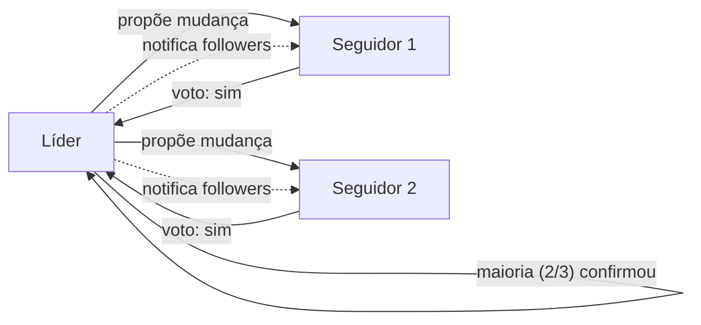

O quorum é o conceito central que torna clusters distribuídos resilientes a falhas. Sem entender quorum, é fácil configurar um cluster que aparenta estar em HA mas que quebra da primeira vez que você perde um nó.

## O que é quorum?

Um quorum é um **consenso entre a maioria**: em um grupo de N participantes, o quorum é `floor(N/2) + 1`. Nada é decidido sem quorum.

Exemplos:

| N | Quorum | Significado |
| --- | --- | --- |
| 1 | 1 | 1 servidor: qualquer falha = travado (sem HA) |
| 2 | 2 | 2 servidores: perda de 1 = travado (não é HA) |
| 3 | 2 | 3 servidores: perda de 1 = funciona ✅ |
| 5 | 3 | 5 servidores: perda de 2 = funciona ✅ |

## Por quê quorum?

Servidores em um cluster precisam concordar sobre o estado: "qual é a versão atual da configuração? qual pod está rodando onde? quanto espaço disco tem?"

Se todos pudessem responder diferente, não haveria consenso. Se você deixasse 1 servidor decidir sozinho (sem consenso), e aquele servidor falhasse, o cluster pararia.

**Quorum garante:** mesmo que alguns servidores falhem, a maioria viva pode concordar e continuar operando. Assim que a minoria volta, ela sincroniza com a maioria que continuou decidindo.

## Eleição de líder (Raft)

Servidores em um cluster K3s com etcd embarcado usam o algoritmo **Raft** para concordar. Raft funciona assim:

1. **Líder eleito:** um servidor vira "líder"; os outros são "seguidores"
2. **Líder propõe mudanças:** "vamos adicionar pod X no agente Y"
3. **Seguidores votam:** "ok, vi a mudança"
4. **Maioria confirma = decisão:** assim que quorum confirma, a mudança é commitada



## Cenário: Perda de 1 servidor em 3

```yaml
Antes:
  [Srv-0 (líder)]  [Srv-1 (seg)]  [Srv-2 (seg)]
        3           3              3
      
Srv-1 cai:
  [Srv-0]        ❌              [Srv-2]
     2            X               2
            quorum = 2 ✅

Novo líder eleito entre Srv-0 e Srv-2
Continuam concordando
```

Quorum de 2 (em 3 servidores) significava: máximo de 1 falha = cluster continua.

## Cenário: Perda de quorum (2+ em 3)

```yaml
Antes:
  [Srv-0]  [Srv-1]  [Srv-2]
     3       3        3

Srv-1 E Srv-2 caem:
  [Srv-0]  ❌       ❌
     1      X        X
  
  Quorum = 2, mas só 1 vivo → TRAVADO
  Nenhuma decisão pode ser tomada
```

Srv-0 fica sozinho. Mesmo que seja o líder anterior, não consegue convencer os outros (não consegue alcançá-los) de que uma mudança é válida. É bom que ele não decida sozinho — a decisão dele poderia estar errada enquanto os outros 2 concordam em algo diferente "lá fora".

Quando Srv-1 e Srv-2 voltarem, eles terão uma verdade diferente. Qual é certa? O sistema não arruma isso automaticamente.

**Por isso você precisa de backup e restore de etcd** quando perde quorum.

## Números recomendados

| Topologia | Servidores | Quorum | Tolerância | Recomendado? |
| --- | --- | --- | --- | --- |
| Single-node | 1 | N/A | 0 (qualquer falha = total) | ❌ Dev/test |
| 1 servidor + agentes | 1 | N/A | 0 | ⚠️ HA apenas em workloads |
| 2 servidores | 2 | 2 | 0 (perda de 1 = travado) | ❌ **Nunca use 2** |
| 3 servidores | 3 | 2 | 1 (pode perder 1) | ✅ **Recomendado** |
| 5 servidores | 5 | 3 | 2 (pode perder 2) | ✅ Para escala maior |
| 7 servidores | 7 | 4 | 3 (pode perder 3) | ✅ Raríssimo |

**Regra de ouro:** sempre números ímpares (1, 3, 5, 7). Números pares não adicionam tolerância e gastam recurso.

Exemplo: 2 servidores tem quorum 2; perda de 1 = travado. 3 servidores tem quorum 2; perda de 1 = funciona. Dois a mais de máquinas, 1 a mais de redundância.

## Datastore externo

Se você está usando Postgres ou etcd externo (não etcd embarcado), o quorum é gerenciado pelo **datastore externo**, não pelos servidores K3s.

Você pode ter:
- 1 servidor K3s (não precisa de quorum K3s)
- 10 servidores K3s (todos apontam para o mesmo Postgres)

O quorum está no Postgres. Se Postgres cair, todos os servidores K3s caem.

Trade-off: desacoplamento (K3s não cuida de consenso), mas mais uma camada operacional.

## Quando evitar HA (quorum)

- **Labs e desenvolvimento:** 1 servidor é mais simples
- **Quando a perda é aceitável:** ex., um ambiente CI que você pode desligar e reconstruir
- **Quando não há orçamento:** HA exige múltiplas máquinas

Mas se seu aplicativo precisa rodar 24/7 sem downtime, quorum é não-negociável.

## Tópicos relacionados

- [Topologias recomendadas](../../guides/blueprints/k3s-multinode/topologies/): escolher número de servidores
- [Arquitetura de quorum e etcd](../../guides/blueprints/k3s-multinode/architecture/): detalhamento técnico
- [Embedded vs. External Datastore](./embedded-vs-external-datastore/): trade-offs de armazenamento de estado

## Fontes e leitura adicional

- [etcd — Consensus using Raft](https://etcd.io/docs/v3.5/learning/design-client/): especificação de Raft.
- [K3s — High Availability Setup](https://docs.k3s.io/datastore/ha-embedded): configuração de HA em K3s.
- [Distributed Systems — Consensus](https://en.wikipedia.org/wiki/Consensus_(computer_science)): fundamentos de consenso.
