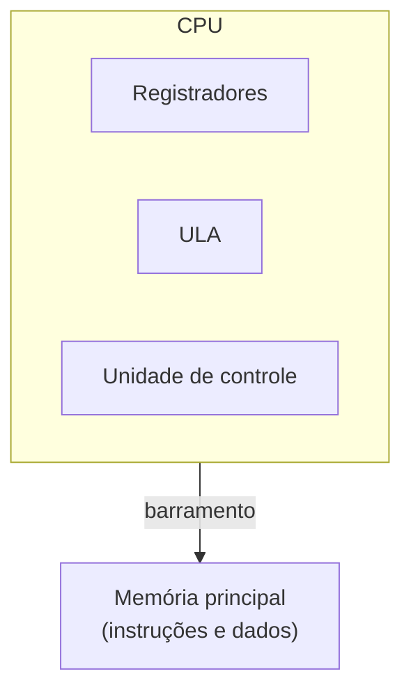

> **Para quem é:** quem já usa termos como "kernel", "syscall" ou "modo usuário" no dia a dia de operação de hosts e containers, mas nunca parou para ver o que existe embaixo deles: o que a CPU de fato executa, e como ela decide o que é código e o que é dado.

Um programa em execução parece, à primeira vista, uma sequência contínua de comandos de alto nível: abrir um arquivo, somar dois números, imprimir um texto. Nada disso, porém, é o que o processador realmente enxerga. Uma CPU não interpreta `open()`, `printf()` ou `CreateFileW()`; ela executa apenas instruções da sua própria arquitetura, como `mov`, `add`, `cmp` ou `jmp`, cada uma codificada como uma sequência específica de bytes. Um programa compilado é, no fundo, essa sequência de bytes gravada em disco: algo como `48 89 E5 48 83 EC 10 ...`, que só ganha sentido quando a CPU a busca, decodifica e executa na ordem correta. Esta página descreve esse nível mais baixo: o ciclo que a CPU repete para processar cada instrução, a forma como instruções e dados convivem na memória, os componentes que fazem esse trabalho além da unidade aritmética, e a distinção entre instrução, dado e entrada/saída que sustenta tudo o que vem depois, incluindo o mecanismo de chamadas de sistema descrito em [modos de privilégio e chamadas de sistema](../privilege-levels-and-system-calls/).

## O ciclo de busca, decodificação e execução

Independentemente da arquitetura, uma CPU processa cada instrução repetindo o mesmo ciclo básico: busca a próxima instrução na memória, decodifica o que ela representa, busca os operandos de que precisa, executa a operação correspondente e armazena o resultado. Esse ciclo, conhecido como fetch-decode-execute, é a unidade de trabalho fundamental de qualquer processador, do menor microcontrolador embarcado ao maior servidor multi-core.

Processadores modernos não executam esse ciclo de forma estritamente sequencial. Técnicas como pipeline (sobrepor as etapas de instruções diferentes), execução fora de ordem e predição de desvios existem justamente para manter as unidades internas da CPU ocupadas em vez de esperar cada instrução terminar por completo antes de começar a próxima. Nada disso muda o resultado lógico do programa, apenas a velocidade com que ele é produzido; o modelo de fetch-decode-execute continua sendo a forma correta de raciocinar sobre o que uma instrução faz, mesmo que a implementação física seja mais paralela do que o ciclo sugere.

## Arquitetura de von Neumann e arquiteturas Harvard modificadas

Na arquitetura de von Neumann, instruções e dados compartilham o mesmo espaço de memória e o mesmo barramento de acesso. A CPU não tem como saber, só olhando o conteúdo de um endereço, se aquilo é uma instrução ou um valor: o significado vem do contexto em que o endereço é usado. O mesmo padrão de bits que a CPU interpreta como "some 5 com 3" ao buscar uma instrução pode, em outro momento, ser lido como os valores 5 e 3 propriamente ditos, se o programa tratar aquele endereço como dado em vez de código.

Uma arquitetura Harvard pura resolve essa ambiguidade separando fisicamente a memória e o barramento de instruções da memória e do barramento de dados, eliminando a necessidade de inferir o papel de cada endereço pelo contexto. Processadores de uso geral atuais não adotam nenhum dos dois modelos de forma pura: a memória principal continua unificada, no espírito de von Neumann, mas o caminho entre a CPU e essa memória passa por caches separadas de instrução e de dados, cada uma otimizada para o padrão de acesso do seu tipo de conteúdo. É por isso que CPUs modernas costumam ser descritas como arquiteturas Harvard modificadas: unificadas no nível da memória principal, divididas no nível do cache que fica entre a CPU e essa memória.

## A ULA e os demais componentes da CPU

A Unidade Lógica e Aritmética, ou ULA (ALU em inglês), é a parte da CPU responsável por operações inteiras e lógicas: soma, subtração, AND, OR, XOR, comparações e deslocamentos de bits. Uma expressão de alto nível como `resultado = a + b;` normalmente se traduz, depois da compilação, em uma instrução equivalente a `add rax, rbx`: a ULA recebe os dois valores já carregados em registradores, realiza a soma e grava o resultado em outro registrador, pronto para ser usado pela instrução seguinte ou devolvido à memória.

A ULA, porém, é só um dos componentes internos da CPU. Os principais são:

| Componente | Função |
| --- | --- |
| Registradores | Armazenamento extremamente rápido dentro da própria CPU, usado para operandos e resultados imediatos. |
| Unidade de controle | Decodifica cada instrução e coordena a sequência de sinais que faz os demais componentes executá-la. |
| ULA | Operações inteiras e lógicas. |
| FPU | Operações de ponto flutuante, separadas da ULA por exigirem um formato de representação numérica diferente. |
| SIMD/vetorial | Aplica a mesma operação sobre vários valores simultaneamente, a base de otimizações em multimídia e computação numérica. |
| MMU | Traduz endereços virtuais, os que o programa enxerga, para endereços físicos de memória de fato, viabilizando isolamento de memória entre processos. |
| Cache | Mantém instruções e dados usados recentemente fisicamente próximos da CPU, reduzindo a latência de acesso à memória principal. |
| Branch predictor | Tenta antecipar o resultado de um desvio condicional antes de ele ser de fato resolvido, para manter o pipeline ocupado. |

Um processador moderno de uso geral combina várias unidades de execução operando em paralelo, não uma ULA única processando uma instrução de cada vez; o texto acima descreve o papel lógico de cada componente, não a contagem física de quantas cópias dele existem no silício.

## Instrução, dado e entrada e saída

Uma instrução é uma ordem que a CPU sabe executar, como `add x0, x1, x2` (equivalente a `x0 = x1 + x2`). Um dado é o valor sobre o qual essa instrução opera: um inteiro, um trecho de texto, um endereço, parte de uma imagem, um campo de uma estrutura. Para a memória, a distinção entre os dois não existe fisicamente; tudo é apenas uma sequência de bits, e o significado é inteiramente atribuído pelo programa que os interpreta. O byte `01000001`, por exemplo, pode representar o número 65, o caractere ASCII `A`, parte de uma instrução ou parte de uma imagem, dependendo exclusivamente de como o código em execução decide tratá-lo.

Entrada e saída (I/O) é a comunicação da CPU com dispositivos externos ao processador e à memória principal: disco, teclado, mouse, placa de rede, GPU, USB, áudio. Existem duas formas principais de a CPU alcançar esses dispositivos. Em I/O mapeado em memória, os registradores do próprio dispositivo aparecem em endereços específicos do espaço de memória; a CPU escreve nesse endereço como se estivesse escrevendo em memória comum, e o controlador do dispositivo interpreta essa escrita como um comando. É o modelo predominante em ARM e cada vez mais comum em geral. Em I/O por portas, usado historicamente pela arquitetura x86, existe um espaço de endereçamento separado, dedicado a dispositivos, acessado por instruções próprias como `in` e `out`. Mesmo em x86, porém, boa parte da comunicação com dispositivos atuais já migrou para memória mapeada, deixando o I/O por portas como um mecanismo legado ainda suportado, não o caminho principal.

## Páginas relacionadas

- [Modos de privilégio e chamadas de sistema](../privilege-levels-and-system-calls/): como o sistema operacional impede que um programa comum acesse a MMU, os dispositivos ou a memória de outros processos diretamente, e como uma chamada de sistema atravessa essa barreira de forma controlada.
- [RISC e CISC](../risc-vs-cisc/): como o conjunto de instruções que a CPU entende (a ISA) varia entre arquiteturas, e por que essa escolha é hoje mais uma questão de estilo de conjunto de instruções do que de complexidade interna do processador.

## Referências

- [Intel 64 and IA-32 Architectures Software Developer's Manuals](https://www.intel.com/content/www/us/en/developer/articles/technical/intel-sdm.html): referência completa da arquitetura x86-64, incluindo o conjunto de instruções e o modelo de execução.
- [Arm Architecture Reference Manual for A-profile architecture](https://developer.arm.com/documentation/ddi0487/latest/): especificação oficial da arquitetura ARM64 usada em servidores e dispositivos móveis atuais.
- [RISC-V Instruction Set Manual](https://riscv.org/technical/specifications/): especificação da ISA RISC-V, usada como referência de arquitetura load/store aberta.
