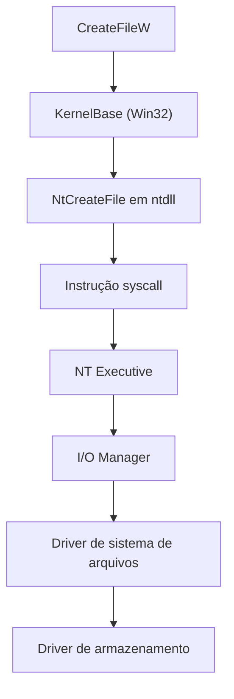

> **Para quem é:** quem já entende, a partir de [modos de privilégio e chamadas de sistema](../privilege-levels-and-system-calls/), o mecanismo genérico de uma syscall, e quer saber como Linux, Windows e macOS constroem sobre esse mecanismo suas próprias convenções de biblioteca, identificador e API pública.

O mecanismo de transição para modo kernel descrito na página anterior é o mesmo em qualquer sistema operacional moderno: uma instrução especial, uma mudança de privilégio, uma operação executada pelo kernel, um retorno ao chamador. O que muda entre Linux, Windows e macOS é tudo o que fica acima e ao redor desse mecanismo: quais bibliotecas o programa chama antes de chegar à syscall, que tipo de identificador o kernel devolve para representar um recurso, e como o sistema organiza a descoberta e a configuração desses recursos. Esta página percorre os três casos separadamente e termina com uma comparação direta.

## Linux: syscalls, descritores e a convenção de representar tudo como arquivo

No Linux, os mecanismos mais importantes para um programa alcançar o kernel são as próprias syscalls, descritores de arquivo, sockets, `mmap`, pipes, signals, `ioctl` e uma coleção de arquivos de dispositivo e pseudo-sistemas de arquivo como `/proc` e `/sys`. O Linux segue de perto a convenção Unix de representar recursos do sistema como arquivos ou descritores: `/dev/nvme0n1` representa um dispositivo de armazenamento, `/dev/input/event0` um dispositivo de entrada, `/proc/123/status` expõe informações sobre o processo de PID 123, e `/sys/class/net` expõe informações sobre interfaces de rede. Dizer que "tudo é um arquivo" no Linux é uma aproximação útil, não uma regra literal: nem toda interface do kernel é de fato um arquivo no sentido tradicional, mas a convenção de expor recursos através de descritores e de uma hierarquia navegável no sistema de arquivos é forte o suficiente para orientar a maior parte do design do sistema.

Um programa comum no Linux normalmente não emite a instrução `syscall` diretamente; ele chama uma função de uma biblioteca C, glibc ou musl, que prepara a chamada de sistema correspondente. A chamada `write(1, "olá\n", 5);`, por exemplo, é a própria função de biblioteca preparando e disparando a syscall equivalente. Nem toda função de biblioteca precisa entrar no kernel para cada chamada: partes de operações relacionadas a relógio, por exemplo, podem usar a VDSO, uma pequena região de código fornecida pelo próprio kernel mas executada em modo usuário, evitando o custo de uma transição de modo para operações de alta frequência e baixo risco.

Vale separar aqui duas ideias que parecem a mesma coisa mas não são: POSIX é uma especificação de API (`open`, `read`, `write`, `fork`, `exec`, `pthread`, sockets, entre outras), enquanto a ABI de syscall do Linux é a implementação binária concreta por trás dessa API. Um programa chama `open()`, mas a glibc pode implementar essa chamada usando a syscall `openat()`; a API que o programador vê e a syscall que a CPU efetivamente executa não precisam ter o mesmo nome nem a mesma assinatura.

## Windows: da API Win32 até a NT Native API

O caminho equivalente no Windows costuma ter mais camadas explícitas. Um programa normalmente chama funções da API Win32, como `CreateFileW`, `ReadFile`, `WriteFile` ou `CreateProcessW`. Essas funções não disparam a syscall diretamente; elas passam por bibliotecas intermediárias como KernelBase, Kernel32, User32 ou Advapi32, que por sua vez chamam a NT Native API exposta por `ntdll`, a camada mais baixa ainda em espaço de usuário antes da própria instrução de syscall.

No nível interno, as funções que de fato cruzam para o kernel têm nomes próprios, como `NtCreateFile`, `NtReadFile`, `NtWriteFile` ou `NtAllocateVirtualMemory`. Programas comuns não devem codificar diretamente os números dessas syscalls: eles variam entre versões e builds do Windows, ao contrário do Linux, onde a ABI de syscall é um contrato estável entre versões do kernel.

O Windows também usa um modelo de identificador diferente do descritor de arquivo Unix: o handle (`HANDLE`). Um handle pode representar um arquivo, um processo, uma thread, um evento, um mutex, um socket, um token de segurança ou uma seção de memória. Assim como o descritor Unix, o handle não é o objeto do kernel em si, apenas uma referência controlada que o sistema operacional gerencia em nome do programa. Por trás desses handles, o Windows NT organiza um modelo mais explícito de objetos, coordenado pelo Object Manager, I/O Manager, Memory Manager, Process Manager e Security Reference Monitor, com objetos existindo em namespaces internos como `\Device`, `\Driver` ou `\BaseNamedObjects`.

## macOS: o kernel XNU, combinando Mach e BSD

O macOS usa o kernel XNU (parte do sistema Darwin), que combina componentes originados do microkernel Mach com componentes originados do BSD. Um programa típico chega ao kernel por um de dois caminhos que convergem na mesma biblioteca de base: frameworks Apple de alto nível (Foundation, AppKit, Core Foundation, Metal, Network.framework) ou APIs POSIX diretas (`open()`, `read()`, `write()`, `mmap()`). Os dois caminhos passam pela `libSystem`, que agrega bibliotecas fundamentais como libc, pthread, malloc, dyld e as interfaces de comunicação com o Mach.

Internamente, o XNU expõe dois grupos de mecanismos para alcançar o kernel: syscalls de origem BSD, equivalentes em espírito às do Linux, e Mach traps, a interface de baixo nível do microkernel Mach. O Mach contribui conceitos próprios ao sistema: tasks, threads, ports, mensagens e memória virtual. Uma "port" no Mach não tem relação com uma porta TCP; é uma capacidade, um canal usado para comunicação entre processos e entre processos e serviços do kernel. Drivers modernos no ecossistema Apple utilizam mecanismos relacionados ao I/O Kit e, cada vez mais, o DriverKit, que move parte da lógica de driver para espaço de usuário.

## Comparação resumida

| Aspecto | Linux | Windows | macOS |
| --- | --- | --- | --- |
| Kernel | Linux monolítico modular | NT híbrido | XNU híbrido |
| API comum | POSIX, libc | Win32, COM, .NET | POSIX e frameworks Apple |
| Interface de baixo nível | Syscalls Linux | NT Native API | Syscalls BSD e Mach traps |
| Recurso típico | Descritor de arquivo | Handle | Descritor de arquivo e Mach port |
| Dispositivos | `/dev`, sysfs, `ioctl` | Device objects, handles, IOCTL | I/O Kit, DriverKit |
| Configuração do kernel | `/proc`, `/sys`, netlink | APIs NT, Registry, WMI | sysctl, IOKit, Mach |
| Biblioteca-base | glibc ou musl | KernelBase, ntdll | libSystem |

O conceito de chamada de sistema existe nos três, mas a instrução exata que dispara a transição depende da arquitetura de CPU, não do sistema operacional: Linux e Windows em x86-64 usam `syscall`; Linux e Windows em ARM64 usam `svc`; macOS usa `syscall` em Intel e `svc` em Apple Silicon. O kernel precisa ser compilado especificamente para a arquitetura de destino, e a relação entre sistema operacional e arquitetura de CPU é tratada com mais detalhe em [RISC e CISC](../risc-vs-cisc/).

## Páginas relacionadas

- [Modos de privilégio e chamadas de sistema](../privilege-levels-and-system-calls/): o mecanismo genérico de syscall que cada sistema operacional constrói sobre sua própria pilha de bibliotecas.
- [POSIX: o que o padrão garante, e o que fica de fora](../../unix/posix-and-standards/): aprofunda a especificação POSIX citada aqui como a API comum entre Linux e macOS.
- [A família BSD](../../unix/bsd-family/): contexto sobre a origem BSD de parte do kernel XNU do macOS.

## Referências

- [The Linux Kernel documentation](https://docs.kernel.org/): documentação oficial do kernel Linux.
- [Windows Driver Kit documentation (Microsoft Learn)](https://learn.microsoft.com/windows-hardware/drivers/): referência oficial sobre o I/O Manager, drivers e a arquitetura do kernel NT.
- [Apple: Kernel Programming Guide](https://developer.apple.com/library/archive/documentation/Darwin/Conceptual/KernelProgramming/Architecture/Architecture.html): visão oficial da arquitetura XNU, Mach e BSD.
