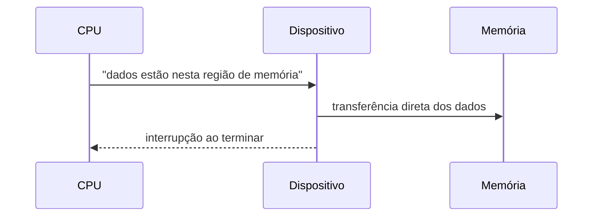
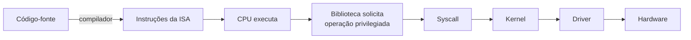

> **Para quem é:** quem já acompanhou [como a CPU executa instruções](../how-cpus-execute-instructions/) e [modos de privilégio e chamadas de sistema](../privilege-levels-and-system-calls/) e quer entender o último elo da cadeia, como o kernel de fato movimenta dados de e para um dispositivo físico, sem a CPU precisar copiar cada byte manualmente.

As páginas anteriores desta trilha descreveram o caminho que uma chamada de sistema percorre até o kernel. Esta página fecha o raciocínio explicando o que acontece depois que o kernel decide que uma operação envolve um dispositivo físico: como ele evita que a CPU fique presa copiando dados byte a byte, como o dispositivo avisa quando termina, e como todos esses mecanismos, chamada de função, chamada de sistema, interrupção de hardware e exceção, se diferenciam entre si apesar de parecerem, à primeira vista, formas equivalentes de "algo acontecer".

## DMA: acesso direto à memória

O fluxo entre uma chamada de sistema e o hardware segue, de forma geral, o caminho aplicação → syscall → subsistema do kernel → driver → controlador do dispositivo → dispositivo físico. Em uma operação de rede, por exemplo, uma chamada `send()` desce pela pilha TCP/IP do kernel até o driver da placa de rede, que enfileira a transmissão para a própria placa.

A CPU não precisa participar dessa transferência copiando cada byte manualmente. Ela pode configurar DMA (Direct Memory Access): informa ao dispositivo em qual região de memória os dados estão, e o próprio dispositivo transfere esses dados diretamente, sem exigir que a CPU movimente byte por byte entre a memória e o controlador. Isso libera a CPU para executar outro trabalho enquanto a transferência acontece em paralelo, um ganho que se torna significativo em cargas de rede ou disco de alto volume.

## Interrupções

Quando a transferência termina, ou quando qualquer outro evento assíncrono acontece (um pacote de rede chegou, uma operação de disco terminou, uma tecla foi pressionada, um timer expirou), o dispositivo ou o próprio hardware da CPU gera uma interrupção. Uma interrupção pausa temporariamente o fluxo de execução atual e transfere o controle para um manipulador específico do kernel, responsável por tratar aquele evento antes de devolver a CPU ao que estava rodando. Em cargas de trabalho muito intensas, onde o volume de eventos tornaria as interrupções custosas demais, sistemas operacionais também recorrem a polling ou a mecanismos híbridos, verificando o estado do dispositivo periodicamente em vez de reagir a cada interrupção individual.

## Quatro mecanismos que parecem, mas não são, a mesma coisa

Chamada de função comum, chamada de sistema, interrupção de hardware e exceção são frequentemente confundidas porque todas envolvem, em algum sentido, "transferir o controle para outro lugar". Elas diferem, porém, em quem inicia a transferência e em que privilégio ela ocorre.

Uma chamada de função comum, como `strlen(texto);`, acontece inteiramente em modo usuário: uma função chama outra e o fluxo continua no mesmo nível de privilégio, sem qualquer envolvimento do kernel. Uma chamada de sistema, como `read(fd, buffer, size);`, é iniciada deliberadamente pelo programa, que solicita um serviço privilegiado e provoca a mudança para modo kernel descrita nas páginas anteriores. Uma interrupção de hardware, como a chegada de um pacote de rede, é iniciada por um dispositivo externo, de forma assíncrona em relação ao que a CPU estava executando, sem que o programa em modo usuário tenha pedido nada naquele instante exato. Uma exceção, por fim, é um evento causado pela própria execução de uma instrução, como divisão por zero, um page fault, uma instrução inválida ou um acesso de memória proibido: não é solicitada pelo programa, mas também não vem de um dispositivo externo, é uma consequência direta da instrução que acabou de rodar. Uma chamada de sistema, tecnicamente, também usa um mecanismo de exceção controlada ou trap para atravessar para o modo kernel, mas se diferencia das exceções de erro por ser intencional: o programa pediu exatamente aquilo.

## Exemplo de ponta a ponta: `printf("Olá\n")`

Amarrando toda a série, considere o que acontece quando um programa executa `printf("Olá\n");`. O `printf` primeiro formata o texto inteiramente em espaço de usuário, sem qualquer envolvimento do kernel até esse ponto. Em seguida, a biblioteca C chama `write()`, que prepara os registradores segundo a ABI da syscall: o número da chamada, o descritor 1 (saída padrão), o endereço do texto formatado e a quantidade de bytes a escrever. A CPU executa a instrução `syscall` (ou `svc`, dependendo da arquitetura) e muda para modo kernel. O kernel valida a chamada, o endereço fornecido é acessível ao processo, o descritor existe, e então encaminha a escrita ao destino correspondente, um terminal, um pipe ou um arquivo, conforme o que o descritor 1 estiver apontando naquele processo. O driver ou subsistema responsável realiza a operação, o kernel coloca o resultado em um registrador de retorno, a CPU volta ao modo usuário, `write()` retorna esse resultado para `printf`, e `printf` retorna para o programa que o chamou.

O ponto central de toda esta trilha está resumido nesse exemplo: um programa não "chama o kernel" como chamaria uma função comum. Ele atravessa uma interface binária controlada, entra no kernel por uma instrução especial reservada para esse fim, e recebe de volta referências abstratas, como descritores de arquivo, handles ou Mach ports, em vez de acesso direto ao hardware ou às estruturas internas que o sistema operacional mantém para si.

## Páginas relacionadas

- [Modos de privilégio e chamadas de sistema](../privilege-levels-and-system-calls/): o mecanismo de transição de modo que esta página assume como conhecido.
- [Como Linux, Windows e macOS expõem seus serviços](../how-linux-windows-macos-expose-services/): a variação desse mesmo caminho em cada sistema operacional.

## Referências

- [The Linux Kernel documentation](https://docs.kernel.org/): documentação oficial sobre interrupções, DMA e o subsistema de I/O do kernel Linux.
- [`signal(7)`](https://man7.org/linux/man-pages/man7/signal.7.html): referência sobre sinais no Linux, o mecanismo assíncrono mais próximo de uma interrupção visível em espaço de usuário.
