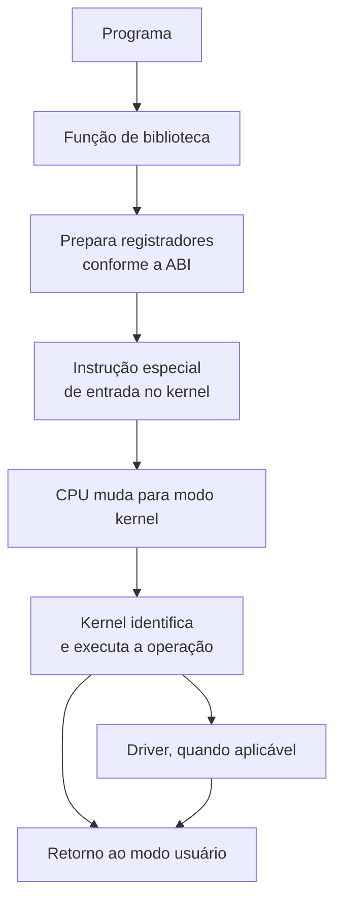

> **Para quem é:** quem já entende, a partir de [como a CPU executa instruções](../how-cpus-execute-instructions/), o que uma instrução e um dado são, e quer entender por que um programa comum não pode simplesmente acessar o disco, a rede ou qualquer endereço físico diretamente.

Um programa comum não deveria poder acessar livremente o disco, a placa de rede ou qualquer endereço físico de memória: se pudesse, um processo qualquer conseguiria ler a memória de outro processo, corromper o sistema de arquivos de outro programa, ou reconfigurar um dispositivo que não lhe pertence. Esse isolamento não é uma convenção do sistema operacional; é uma capacidade da própria CPU, que reserva certas operações para um modo de execução mais privilegiado e as bloqueia no modo em que aplicações comuns rodam. Esta página explica como esses modos de privilégio funcionam, o que muda quando um programa precisa de um serviço que só o modo privilegiado pode fornecer, e o caminho exato que uma chamada de sistema percorre entre o programa e o kernel.

## Modo usuário e modo kernel

Em uma simplificação válida para praticamente qualquer sistema operacional de propósito geral, a CPU opera em dois modos relevantes para este raciocínio: modo usuário, onde uma aplicação comum roda com acesso restrito, e modo kernel, onde o sistema operacional pode configurar a MMU, acessar dispositivos diretamente, gerenciar interrupções, executar drivers, mapear páginas de memória e controlar processos. A diferença entre os dois modos não é uma convenção de software: é imposta pelo próprio hardware da CPU, que rejeita certas instruções privilegiadas quando executadas em modo usuário.

Cada arquitetura implementa essa separação com um mecanismo próprio. Em x86, os níveis de privilégio são chamados de rings, numerados de 0 a 3; na prática, sistemas operacionais modernos usam apenas o Ring 0 para o kernel e o Ring 3 para aplicações, deixando os Rings 1 e 2 praticamente sem uso. Em ARM, o mecanismo equivalente são os Exception Levels: EL0 para aplicações, EL1 para o kernel, EL2 para um hypervisor (quando presente) e EL3 para firmware e o secure monitor. Os nomes e a contagem de níveis mudam entre arquiteturas, mas o princípio é o mesmo em qualquer uma delas: aplicações rodam em um nível sem acesso direto a hardware, e uma camada mais privilegiada existe especificamente para mediar esse acesso.

## API e ABI: duas camadas diferentes de contrato

Quando um programa precisa de um serviço que só o modo kernel pode fornecer, como ler um arquivo do disco, ele não invoca o kernel como invocaria uma função comum da própria biblioteca. O kernel não expõe uma biblioteca compartilhada que o programa simplesmente linka e chama; em vez disso, ele expõe uma ABI (interface binária) de chamadas de sistema, um contrato bem mais rígido do que uma API de código-fonte.

A distinção entre as duas camadas importa porque cada uma resolve um problema diferente. Uma API, como a assinatura `ssize_t read(int fd, void *buffer, size_t count);`, é uma interface em nível de código-fonte: descreve nomes, tipos e parâmetros que um programador lê e usa ao escrever código. Uma ABI é o contrato binário que faz esse mesmo chamado funcionar em tempo de execução, sem o código-fonte por perto: qual registrador contém o número da chamada de sistema, qual registrador contém cada argumento, qual instrução exata transfere o controle para o kernel, e como o resultado retorna ao chamador. Um programa compilado só precisa da ABI para funcionar; a API existe para que humanos escrevam esse programa de forma legível.

## O caminho de uma chamada de sistema

O fluxo geral de uma chamada de sistema segue sempre a mesma estrutura, independentemente da arquitetura ou do sistema operacional: o programa chama uma função de biblioteca, essa função prepara os registradores de acordo com a ABI vigente, executa uma instrução especial de entrada no kernel, a CPU muda de modo usuário para modo kernel, o kernel identifica qual operação foi solicitada e a executa (ou delega a um driver), e o controle retorna ao modo usuário com o resultado já disponível para o chamador.

A instrução específica que dispara essa transição muda por arquitetura, não por sistema operacional: em x86-64, o mecanismo moderno é a instrução `syscall`; em ARM, é `svc`. Versões antigas de Linux em x86 usavam a interrupção de software `int 0x80` para o mesmo propósito, um mecanismo mais lento que `syscall` e mantido hoje apenas por compatibilidade com binários muito antigos.

## Exemplo: lendo um arquivo

Um programa em C que executa `int fd = open("dados.txt", O_RDONLY); read(fd, buffer, 1024); close(fd);` percorre, no Linux, um caminho concreto entre a aplicação e o dispositivo de armazenamento: da aplicação para a biblioteca C (glibc ou musl), dessa biblioteca para a chamada de sistema `openat`, dali para o kernel Linux, que consulta a VFS (a camada que abstrai diferentes sistemas de arquivos), a VFS delega ao driver do sistema de arquivos específico (ext4, Btrfs, XFS ou outro), esse driver passa pela camada de bloco genérica do kernel, e finalmente chega ao driver do dispositivo físico (NVMe, SATA, ou outro barramento de armazenamento).

O kernel devolve ao programa um descritor de arquivo, um número inteiro que não é o arquivo em si, apenas uma referência que o programa usa para se referir a ele nas chamadas seguintes. Todo processo já nasce com três descritores abertos por convenção (0 para entrada padrão, 1 para saída padrão, 2 para erro padrão); descritores de valor 3 em diante são atribuídos conforme o programa abre arquivos, sockets ou pipes adicionais. O programa nunca recebe o objeto interno que o kernel mantém para representar aquele arquivo aberto; ele recebe apenas o número que serve de índice para essa estrutura, mantida inteiramente do lado do kernel.

## Páginas relacionadas

- [Como a CPU executa instruções](../how-cpus-execute-instructions/): o ciclo de execução e os componentes da CPU que operam por baixo de qualquer chamada de sistema.
- [Como Linux, Windows e macOS expõem seus serviços](../how-linux-windows-macos-expose-services/): como cada sistema operacional constrói, por cima desse mecanismo genérico de syscall, sua própria pilha de bibliotecas e convenções.

## Referências

- [The Linux Kernel documentation: System Calls](https://docs.kernel.org/): índice da documentação oficial do kernel Linux, incluindo a implementação de chamadas de sistema.
- [`syscall(2)`](https://man7.org/linux/man-pages/man2/syscall.2.html): página de manual do Linux sobre a convenção de chamada de sistema por arquitetura.
- [Arm Architecture Reference Manual for A-profile architecture](https://developer.arm.com/documentation/ddi0487/latest/): define os Exception Levels e a instrução `svc` usada para chamadas de sistema em ARM64.
