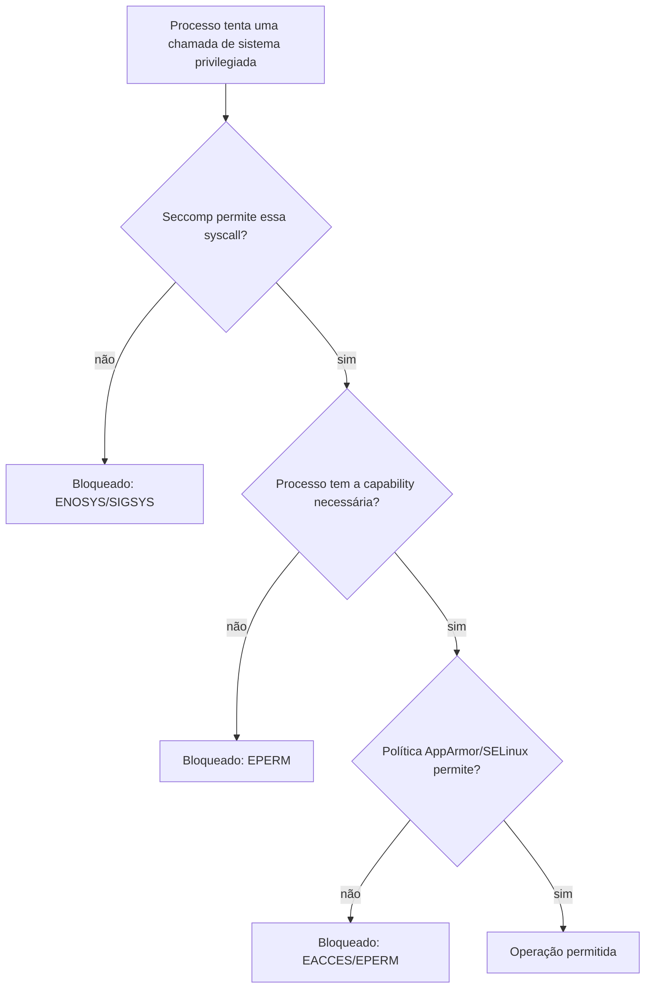

> **Para quem é:** quem já entende que [namespaces](../namespaces/) controlam visibilidade e [cgroups](../cgroups/) controlam consumo de recursos, e quer saber o que ainda falta para impedir um processo de fazer algo perigoso mesmo dentro do próprio namespace.

Um processo isolado por namespaces e limitado por cgroups ainda pode, se rodar como root dentro do seu namespace (o modo [rootful](../user-namespaces/#rootless-vs-rootful-na-prática)), tentar operações privilegiadas: montar um filesystem, carregar um módulo do kernel, manipular interfaces de rede. Capabilities, seccomp e módulos de segurança do Linux (LSMs, como AppArmor e SELinux) são três mecanismos independentes que restringem exatamente isso, cada um respondendo a uma pergunta diferente sobre o que aquele processo pode fazer.

| Mecanismo | Pergunta que responde | Nível de atuação |
| --- | --- | --- |
| Capabilities | De quais privilégios de root este processo dispõe? | Concede ou nega categorias inteiras de operação privilegiada |
| Seccomp | Quais chamadas de sistema este processo pode sequer invocar? | Filtra na entrada do kernel, antes de qualquer checagem de privilégio |
| LSM (AppArmor/SELinux) | Quais recursos específicos (arquivos, portas, sockets) uma política permite a este processo tocar? | Aplica uma política de controle de acesso obrigatório, além da permissão discricionária tradicional |

Os três mecanismos são complementares, não substitutos um do outro: um processo pode ter uma capability concedida, mas ainda assim ter a chamada de sistema correspondente bloqueada por seccomp, ou ter a chamada permitida por seccomp mas o acesso a um arquivo específico negado por uma política AppArmor.

## Capabilities: dividindo o que "root" significa

Antes de capabilities existirem, o modelo de privilégio do Linux era binário: um processo rodava como root (UID 0), com acesso irrestrito a qualquer operação privilegiada, ou como um usuário comum, sem nenhum desses privilégios. Capabilities dividem esse poder de root em unidades discretas (cerca de quarenta, documentadas em `man 7 capabilities`), como `CAP_NET_ADMIN` (configurar interfaces de rede), `CAP_SYS_ADMIN` (um conjunto amplo de operações administrativas, historicamente a capability mais próxima de "root completo"), ou `CAP_CHOWN` (mudar o dono de um arquivo independentemente de permissão). Um processo pode ter algumas dessas capabilities concedidas e outras não, em vez de ser tudo ou nada.

Engines de container já concedem, por padrão, um subconjunto reduzido dessas capabilities a um container rodando como root, não o conjunto completo que um processo root do host teria. `--cap-drop=ALL` vai além desse padrão e remove até esse subconjunto reduzido, deixando o processo sem nenhuma capability elevada; `--cap-add` permite reconceder, uma por uma, só as capabilities que a carga de trabalho realmente precisa, seguindo o princípio de privilégio mínimo.

## `no-new-privileges`: fechando a porta de escalonamento

Independentemente de quais capabilities um processo tem, ele ainda poderia, em tese, ganhar privilégios adicionais ao executar um binário com o bit `setuid`/`setgid` ativado, ou com capabilities de arquivo atribuídas diretamente ao executável. A flag `no-new-privileges` (implementada via `prctl(PR_SET_NO_NEW_PRIVS)` no kernel) fecha essa porta: uma vez ativada, nem o processo nem nenhum processo filho dele consegue ganhar privilégios novos dessa forma, pelo resto da vida daquela árvore de processos, mesmo que o binário executado tecnicamente permitisse.

## Seccomp: filtrando chamadas de sistema na entrada

Seccomp (secure computing mode) filtra quais chamadas de sistema um processo pode sequer invocar, usando um filtro BPF avaliado no ponto de entrada do kernel, antes de qualquer checagem de capability ou permissão de arquivo. Uma chamada de sistema bloqueada por seccomp falha imediatamente (ou, dependendo da ação configurada, mata o processo), independentemente de o processo ter ou não a capability que normalmente autorizaria aquela operação; capability concedida não contorna um bloqueio de seccomp.

Engines de container aplicam um perfil seccomp padrão a todo container, que já bloqueia dezenas de chamadas de sistema raramente necessárias por uma aplicação comum e historicamente associadas a escapes de isolamento ou a operações administrativas do kernel (como `mount`, `reboot` ou carregar módulos do kernel). O conjunto exato de chamadas bloqueadas no perfil padrão muda entre versões do runtime; confira a [documentação oficial do perfil seccomp padrão do Docker](https://docs.docker.com/engine/security/seccomp/) para a lista atual antes de decidir customizar um perfil próprio.

## AppArmor e SELinux: política de controle de acesso obrigatório

AppArmor e SELinux são LSMs (Linux Security Modules): eles aplicam uma política de controle de acesso obrigatório (MAC, mandatory access control) por cima do modelo de permissão discricionário tradicional (dono/grupo/outros, complementado por capabilities). A diferença central entre os dois é o modelo: AppArmor associa uma política a um caminho de arquivo executável (um perfil descreve o que aquele binário específico pode acessar); SELinux associa rótulos (labels) a processos e recursos, e a política decide quais combinações de rótulo processo/recurso são permitidas, um modelo mais granular e também mais complexo de administrar. Debian e Ubuntu usam AppArmor por padrão; a família RHEL/Fedora usa SELinux. Nesta página, o objetivo é só esse modelo mental para reconhecer o papel dos dois; a configuração detalhada de perfis está fora do escopo desta fase.

Um engine de container aplica, por padrão, um perfil AppArmor (em um host Debian/Ubuntu) ou um contexto SELinux (em um host RHEL/Fedora) a cada container, adicionando outra camada de restrição de acesso a arquivos e recursos específicos do host, além do que capabilities e seccomp já restringem.



## Uma postura restritiva comum na prática

```bash
docker run --rm \
  --cap-drop=ALL \
  --security-opt=no-new-privileges \
  --read-only \
  imagem comando
```

Essa combinação de flags representa a postura mais restritiva comum de capabilities: `--cap-drop=ALL`, sem nenhum `--cap-add` correspondente, deixa o processo sem nenhuma capability elevada, adequado para uma carga de trabalho que não precisa de nenhum privilégio especial (nem `CAP_NET_BIND_SERVICE` para portas privilegiadas, nem qualquer outra). `--security-opt=no-new-privileges` fecha a porta de escalonamento via binários `setuid`, mesmo que algum exista na imagem por descuido ou por uma dependência de terceiros. `--read-only` (rootfs somente leitura) é tratado com mais detalhe na próxima página desta trilha.

Sem nenhuma flag adicional de seccomp ou de política AppArmor/SELinux, um container como esse conta com os perfis padrão do runtime (Podman ou Docker) para essas duas camadas, em vez de reforçá-las manualmente. Isso costuma ser suficiente: a combinação de `--cap-drop=ALL`, `--security-opt=no-new-privileges`, `--read-only` e limites de cgroup já reduz a superfície de ataque de forma explícita e auditável, sem a complexidade adicional de manter um perfil seccomp ou uma política AppArmor sob medida, que só se justifica quando os perfis padrão do runtime se mostram insuficientes para uma carga de trabalho específica.

## Referências

- [`capabilities(7)`](https://man7.org/linux/man-pages/man7/capabilities.7.html): lista completa de capabilities e o que cada uma concede.
- [`seccomp(2)`](https://man7.org/linux/man-pages/man2/seccomp.2.html): a chamada de sistema que instala um filtro seccomp, e o modelo de filtro BPF.
- [Docker: Seccomp security profiles](https://docs.docker.com/engine/security/seccomp/): o perfil seccomp padrão aplicado a containers e como customizá-lo.
- [Docker: AppArmor security profiles](https://docs.docker.com/engine/security/apparmor/): como o perfil AppArmor padrão é aplicado a containers em hosts com AppArmor.
- [AppArmor: documentação oficial](https://apparmor.net/): modelo de perfis baseados em caminho de arquivo.
- [SELinux: documentação do projeto](https://selinuxproject.org/page/Main_Page): modelo de rótulos e políticas.
