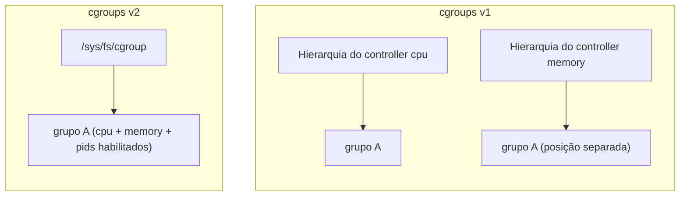

> **Para quem é:** quem já entende que [namespaces](../namespaces/) controlam o que um processo enxerga, e quer saber o mecanismo que controla quanto de CPU, memória e outros recursos esse processo pode consumir.

Cgroups (control groups) é o mecanismo do kernel que agrupa processos e limita, prioriza ou contabiliza o uso de recursos desse grupo como um todo: CPU, memória, número de processos, banda de I/O de disco, entre outros. Onde um namespace responde "o que este processo consegue ver?", um cgroup responde "quanto deste recurso este grupo de processos pode consumir, e o que acontece quando ultrapassa esse limite?". Um container comum pertence a um cgroup criado especificamente para ele, e cada flag de limite de recurso passada ao runtime (`--memory`, `--cpus`, `--pids-limit`) se traduz diretamente em um valor escrito nos arquivos de controle desse cgroup.

## Hierarquia única (cgroups v2) e o modelo antigo (v1)

A versão original de cgroups (v1) permitia montar cada controller (cpu, memory, pids, entre outros) em uma hierarquia de diretórios independente das demais, o que possibilitava, por exemplo, agrupar processos de um jeito para limite de CPU e de outro jeito completamente diferente para limite de memória. Essa flexibilidade tinha um custo real de complexidade: coordenar a posição de um processo em várias árvores independentes ao mesmo tempo, sem inconsistência entre elas, exigia disciplina adicional de quem administrava o sistema.

Cgroups v2 substitui isso por uma **hierarquia única**: uma única árvore de diretórios sob `/sys/fs/cgroup`, onde cada diretório representa um grupo, e os controllers relevantes para aquele grupo são habilitados nos arquivos `cgroup.controllers` e `cgroup.subtree_control` do próprio diretório. A v2 impõe também a regra de "sem processos internos": um cgroup que tem subgrupos com controllers habilitados não pode, ao mesmo tempo, conter processos diretamente nele, apenas nos subgrupos folha, o que evita ambiguidade sobre a qual nível da árvore um processo pertence para efeito de cada controller.



Até a escrita deste texto, distribuições atuais com `systemd` (incluindo o Debian 12, base deste notebook) usam cgroups v2 como hierarquia padrão; confirme com `mount | grep cgroup2` ou `stat -fc %T /sys/fs/cgroup/` (que retorna `cgroup2fs` quando a unificada está ativa) antes de assumir qual versão um host específico usa, já que a v1 ainda pode aparecer em sistemas mais antigos ou reconfigurados manualmente.

## Controllers principais

| Controller | Arquivo de limite (v2) | O que controla |
| --- | --- | --- |
| `cpu` | `cpu.max` (quota e período) | Quanto tempo de CPU o grupo pode usar por período; `cpu.weight` prioriza entre grupos quando a CPU está disputada, sem impor um teto rígido |
| `memory` | `memory.max` | O limite de memória do grupo; `memory.current` mostra o uso atual, `memory.swap.max` limita separadamente o uso de swap |
| `pids` | `pids.max` | O número máximo de processos e threads que o grupo pode criar, uma proteção contra um processo que trava em um loop de fork |
| `io` | `io.max` | Limites de taxa de leitura/escrita de I/O, aplicados por dispositivo de bloco |

Um valor em qualquer um desses arquivos não é uma configuração abstrata: é o próprio limite que o kernel aplica. Escrever `4294967296` em `memory.max` de um cgroup limita esse grupo a 4 GiB de memória da mesma forma, seja esse arquivo editado manualmente ou gerado por um runtime de container a partir de uma flag como `--memory=4g`.

## Onde um limite de container vira um arquivo em `/sys/fs/cgroup`

Cada container em execução tem seu próprio cgroup, criado pelo runtime na hierarquia unificada. Para inspecionar o limite efetivo de um container já rodando, primeiro descubra o PID do processo principal e, a partir dele, o caminho do cgroup:

```bash
# Descobrir o PID do processo principal do container
podman inspect --format '{{.State.Pid}}' <container>

# Ver a qual cgroup esse PID pertence
cat /proc/<PID>/cgroup

# Inspecionar os limites efetivos, usando o caminho retornado no passo anterior
# (relativo a /sys/fs/cgroup)
cat /sys/fs/cgroup<caminho>/memory.max
cat /sys/fs/cgroup<caminho>/pids.max
```

**Quando usar:** confirmar que um limite de recurso passado na criação do container realmente chegou até o kernel como o esperado, útil ao diagnosticar um container que está sendo encerrado por estourar um limite, ou que não parece respeitar o limite configurado.

**Considerações:** o caminho exato do cgroup depende do driver de cgroup usado pelo runtime (`systemd` ou `cgroupfs`) e da convenção de nomes de cada ferramenta; por isso a demonstração acima descobre o caminho a partir de `/proc/<PID>/cgroup` em vez de presumir um caminho fixo. `memory.max` sem limite configurado aparece como `max` (a string literal, não um número), o valor padrão quando nenhuma flag de memória foi passada ao runtime.

## Relação com o OOM killer

Quando o uso de memória de um cgroup ultrapassa o valor em `memory.max`, o kernel aciona o OOM (Out Of Memory) killer com escopo limitado a esse cgroup: ele escolhe e mata um processo dentro do grupo que estourou o limite, sem necessariamente afetar processos de outros cgroups, mesmo que o sistema como um todo ainda tenha memória livre. Esse comportamento contido é uma vantagem prática de cgroups sobre não ter limite nenhum: sem um `memory.max` configurado, um processo com vazamento de memória pode consumir RAM até acionar o OOM killer em escopo de sistema inteiro, arriscando derrubar qualquer processo do host, não apenas o container problemático.

O sintoma mais comum desse evento, do lado de quem opera o container, é o processo principal terminar com o código de saída `137` (128 somado ao número do sinal `SIGKILL`, 9), sem nenhuma mensagem de erro da própria aplicação, porque ela foi encerrada de fora, pelo kernel, antes de ter qualquer chance de reagir. Ver esse código específico depois de uma falha inesperada é um indício forte (não uma prova definitiva, já que outras causas também podem produzir `SIGKILL`) de que o limite de memória do cgroup foi excedido; `dmesg` ou `journalctl -k` no host costumam confirmar, com uma mensagem citando `oom-kill` e o cgroup afetado.

## Limites na prática: de flag de CLI a arquivo de cgroup

```bash
docker run --rm --pids-limit=1024 --memory=4g imagem comando
```

`--pids-limit=1024` escreve `1024` em `pids.max` do cgroup criado para o container, um teto alto o suficiente para qualquer build ou script legítimo, mas baixo o suficiente para impedir que um processo preso em fork bomb esgote a tabela de processos do host inteiro. `--memory=4g` escreve o equivalente em bytes em `memory.max`, garantindo que o processo dentro do container não consuma toda a memória disponível do host, mesmo que tenha um vazamento de memória ou processe um volume de dados maior do que o esperado. Sem uma flag de CPU equivalente (`--cpus`), `cpu.max` permanece no padrão, sem teto: um container só ganha limite de CPU quando alguém pede explicitamente, ao contrário de memória e PIDs, que muitas vezes valem a pena limitar por padrão em qualquer ambiente compartilhado.

## Referências

- [Control Group v2 (documentação do kernel)](https://docs.kernel.org/admin-guide/cgroup-v2.html): especificação oficial da hierarquia unificada, controllers e arquivos de interface.
- [`cgroups(7)`](https://man7.org/linux/man-pages/man7/cgroups.7.html): visão geral de cgroups v1 e v2 na página de manual do Linux.
- [systemd: Control Groups](https://systemd.io/CGROUP_DELEGATION/): como o `systemd` gerencia e delega cgroups para processos e containers em sistemas que o usam como driver de cgroup.
