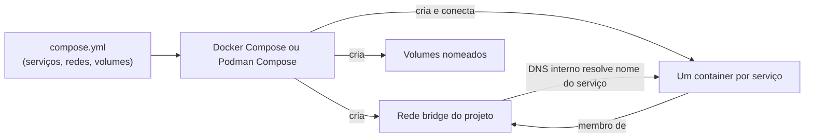

> **Para quem é:** quem já usa `docker compose`/`podman compose` no dia a dia e quer saber o que exatamente esse arquivo YAML padroniza, e por que ele funciona (quase) igual nas duas ferramentas.

A Compose Specification é uma especificação aberta, não controlada por um único fornecedor, que define o schema de um arquivo `compose.yml`: como declarar serviços, redes, volumes e a relação entre eles para descrever uma aplicação multi-container. Docker Compose e Podman Compose são duas implementações independentes dessa mesma spec, o mesmo padrão de camada neutra já visto nas [especificações OCI](../oci-specifications/): a spec define o formato; cada ferramenta decide como executá-lo.

## `compose.yml`: o arquivo e por que o nome mudou

Versões antigas do Compose (a v1 em Python, e a v2 inicial) exigiam um campo `version:` no topo do arquivo, geralmente nomeado `docker-compose.yml`. A Compose Specification eliminou a exigência do campo `version` (um arquivo sem ele é válido e assume a versão mais recente do schema suportada pela ferramenta) e padronizou `compose.yaml`/`compose.yml` como o nome de arquivo canônico, neutro de fornecedor, embora `docker-compose.yml` continue funcionando por compatibilidade retroativa na maioria das implementações.

## O que a spec padroniza: da declaração à execução

Um arquivo `compose.yml` declara um **projeto** nomeado (explicitamente via o campo `name`, ou implicitamente a partir do nome do diretório), contendo um ou mais **serviços** (cada um, essencialmente, um template de container: qual imagem ou build usar, portas, volumes, variáveis de ambiente), **redes** e **volumes** nomeados. A spec não descreve só a sintaxe do YAML; ela também define o comportamento esperado quando uma implementação processa esse arquivo, o que faz `docker compose up` e `podman compose up` produzirem resultados equivalentes a partir do mesmo `compose.yml`.

Concretamente, subir um projeto Compose (sem nenhuma rede ou volume declarado explicitamente) cria uma rede bridge exclusiva desse projeto, cujo nome deriva do nome do projeto; cada serviço definido no arquivo entra automaticamente nessa rede, e cada container fica alcançável pelos demais serviços do mesmo projeto através de um DNS interno que resolve o **nome do serviço** para o IP do container correspondente, sem precisar de IPs fixos nem de um `--link` manual. Um serviço `api` que declara `depends_on: [db]` consegue se conectar a `db:5432` diretamente, porque a resolução de nome já resolve `db` dentro da rede daquele projeto específico; um segundo projeto, com um serviço também chamado `db`, não colide com o primeiro, porque cada projeto tem sua própria rede isolada por padrão.

## Docker Compose e Podman Compose: duas implementações da mesma spec

Docker Compose (a versão atual, v2) é um plugin do Docker CLI, escrito em Go, que lê um `compose.yml` e o traduz nas chamadas de API do Docker Engine equivalentes: criar a rede do projeto, criar os volumes declarados, construir ou puxar cada imagem, e então criar e iniciar um container por serviço, respeitando a ordem implícita em `depends_on`. Podman, por sua vez, expõe o subcomando `podman compose` como um wrapper fino em torno de um provedor de compose externo, tipicamente o `docker-compose` ou o `podman-compose` (um projeto Python separado, mantido pela comunidade `containers`), configurável via `containers.conf` ou variável de ambiente; o `podman compose` em si não reimplementa o parser da spec, delega essa parte ao provedor escolhido, que por sua vez fala com o Podman em vez de com o Docker Engine para materializar rede, volumes e containers.

## Múltiplos arquivos: `include` e merge entre camadas

A spec aceita combinar mais de um arquivo em uma única execução (`-f compose.yml -f compose.override.yml`), útil para manter uma definição base e sobrepor só o que muda entre ambientes (desenvolvimento, CI, produção); veja [override para desenvolvimento](../../toolbox/snippets/docker-compose/#override-para-desenvolvimento) para um exemplo pronto para copiar desse padrão. A regra de combinação da spec é por campo: valores escalares do arquivo mais recente substituem os do anterior, enquanto a maioria dos campos de lista (como `cap_add` ou `ports`) é concatenada em vez de substituída inteiramente, o que permite um arquivo de override acrescentar itens sem precisar repetir os que já existiam na base. Versões recentes da spec também aceitam um campo `include`, que importa outro arquivo `compose.yml` inteiro como um componente modular do projeto atual, um mecanismo diferente do merge por `-f` (que sempre combina arquivos no mesmo projeto) e mais adequado para compor serviços mantidos em repositórios ou diretórios separados.

## Extensões: `x-podman` e campos como `userns_mode`

A spec reserva o prefixo `x-` para extensões específicas de uma ferramenta, sem quebrar a validação do restante do arquivo para implementações que não reconhecem aquele campo: um bloco `x-podman` no topo do arquivo, por exemplo, aceita opções que só fazem sentido para o Podman, ignoradas silenciosamente por qualquer implementação que não seja o Podman. Campos padrão da spec também podem ter interpretação específica por implementação; `userns_mode` por serviço, já mencionado como gancho em [user namespaces](../user-namespaces/#rootless-vs-rootful-na-prática), é um exemplo: o campo em si é parte do schema geral da Compose Specification, mas o comportamento rootless por trás dele depende de qual ferramenta está interpretando o arquivo.

## O modo de pod do `podman-compose` (`--in-pod`)

Diferente do Docker Compose, que sempre cria um container por serviço conectados por uma rede bridge compartilhada, o `podman-compose` pode, opcionalmente, agrupar todos os serviços de um projeto dentro de um único Pod do Podman (um agrupamento que compartilha namespace de rede entre os containers, o mesmo modelo conceitual de um Pod Kubernetes), controlado pela flag `--in-pod`. Até a escrita deste texto, o padrão do `podman-compose` é **não** criar esse pod automaticamente (`--in-pod` desabilitado por padrão), uma mudança de comportamento registrada na [issue #673 do repositório oficial](https://github.com/containers/podman-compose/issues/673), datada de abril de 2023; confirme o padrão atual na documentação do `podman-compose` antes de depender desse comportamento em uma versão futura, já que o próprio histórico do projeto já inverteu esse padrão uma vez.

## Referências

- [Compose Specification — repositório oficial](https://github.com/compose-spec/compose-spec): definição completa do schema.
- [Compose Specification: Merge and override](https://github.com/compose-spec/compose-spec/blob/master/13-merge.md): regras exatas de combinação entre múltiplos arquivos, incluindo quais campos são substituídos e quais são concatenados.
- [Docker Compose: documentação oficial](https://docs.docker.com/compose/): referência de comandos e compatibilidade com a Compose Specification.
- [Podman: `podman compose`](https://docs.podman.io/en/latest/markdown/podman-compose.1.html): documentação oficial do wrapper e configuração do provedor de compose.
- [podman-compose — repositório oficial](https://github.com/containers/podman-compose): implementação Python mantida pela comunidade `containers`, incluindo o histórico do comportamento de `--in-pod`.
