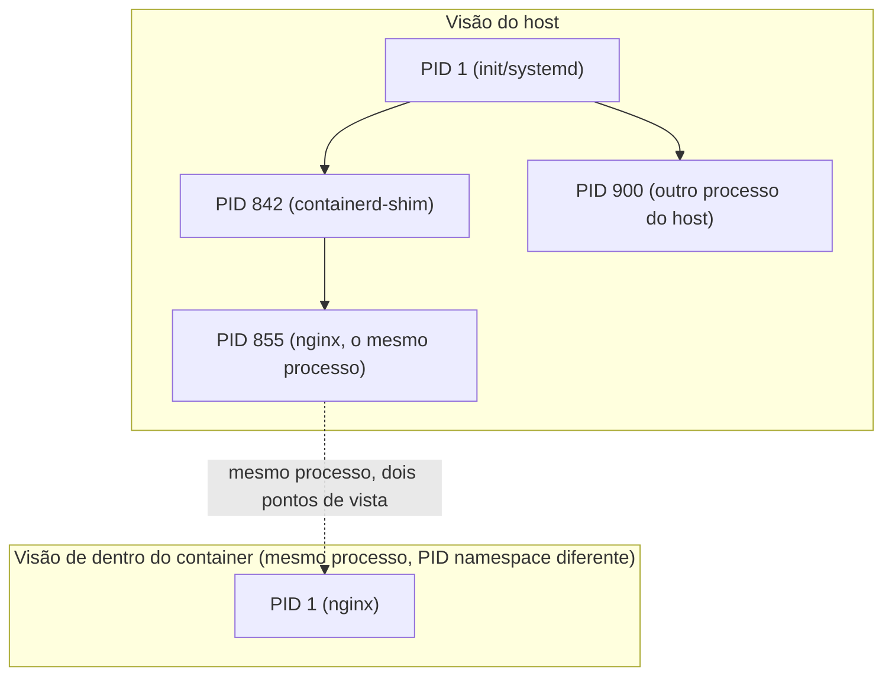

> **Para quem é:** quem já usa `docker run`/`kubectl run` no dia a dia, mas nunca parou para entender o que o kernel realmente faz para isolar um container.

Um container não é uma máquina pequena rodando dentro de outra. É um processo comum, listado na mesma tabela de processos do kernel do host que qualquer outro processo, ao qual o kernel aplica um conjunto de restrições de visibilidade e de recursos antes de deixá-lo rodar. Entender essa frase literalmente, não como uma simplificação didática, é a base para tudo que as páginas seguintes desta seção explicam: namespaces, cgroups, capabilities e os demais mecanismos não criam um ambiente à parte, eles mudam o que um processo específico consegue ver e fazer dentro do mesmo kernel que todos os outros processos do host compartilham.

## Visto do host: um processo como outro qualquer

Rode `docker run -d nginx` e depois `ps aux` no host: o processo `nginx` aparece na lista, com um PID normal do host, ao lado de qualquer outro processo do sistema. Ele tem uma entrada em `/proc/<pid>/` como qualquer processo, e essa entrada é real, não uma simulação; `/proc/<pid>/status`, `/proc/<pid>/cgroup` e `/proc/<pid>/ns/` mostram exatamente o que o kernel sabe sobre esse processo, incluindo a quais namespaces ele pertence e a qual cgroup ele está associado.

O que faz esse processo parecer isolado não é rodar em outro lugar, é o kernel restringir o que ele enxerga através de namespaces: dentro do seu próprio PID namespace, esse mesmo processo do host aparece como PID 1, sem visibilidade de nenhum outro processo do sistema. Os dois lados do diagrama descrevem o mesmo processo, sob duas visões diferentes de um kernel só. As páginas seguintes desta seção detalham cada mecanismo que produz essa diferença de visão; esta página fica só na consequência mais visível dela, o efeito de ser PID 1.

## O que significa ser PID 1 dentro do container

O kernel Linux trata o processo com PID 1 de um namespace de forma diferente dos demais: sinais que teriam ação padrão de terminar o processo (como `SIGTERM`) são ignorados pelo PID 1 a menos que o próprio processo instale um manipulador explícito para eles. Esse comportamento está documentado em `man 7 pid_namespaces`, e explica um sintoma comum: um `docker stop` que demora o tempo total do período de graça e termina em `SIGKILL`, mesmo que a aplicação "devesse" responder a `SIGTERM`. A causa costuma ser que a aplicação nunca foi escrita para rodar como PID 1 e não implementa esse tratamento de sinal, o que ela nunca precisaria fazer rodando como um processo comum fora de um container.

Esse mesmo motivo é a razão de existirem processos como `tini` ou `dumb-init`, usados como `ENTRYPOINT` de uma imagem: eles assumem o papel de PID 1 no lugar da aplicação, encaminham sinais recebidos corretamente para o processo real da aplicação (que passa a rodar como PID 2, com o comportamento normal de sinal) e reaproveitam ("reap") processos zumbis, uma responsabilidade que todo processo PID 1 tem no Linux e que a maioria das aplicações nunca precisou implementar.

## Ciclo de vida: o que acontece quando o PID 1 termina

Quando o processo PID 1 de um namespace termina, por qualquer motivo, o kernel encerra à força (via `SIGKILL`) todos os demais processos que ainda existirem dentro do mesmo PID namespace, comportamento também documentado em `man 7 pid_namespaces`. É por isso que "o container parou" e "o processo principal saiu" são, na prática, a mesma coisa: não existe um container rodando sem o seu processo PID 1 ativo, porque o próprio kernel garante isso ao derrubar o namespace inteiro quando esse processo específico termina. Um container com múltiplos processos internos (uma aplicação e um processo auxiliar, por exemplo) depende inteiramente do processo PID 1 continuar vivo; se ele sair, os demais processos daquele namespace não continuam rodando por conta própria.

## Kernel compartilhado, não emulado

Nenhuma chamada de sistema feita pelo processo dentro do container passa por um kernel diferente: é o mesmo kernel do host que atende, na mesma velocidade, com a mesma versão e os mesmos módulos carregados que qualquer outro processo do host usa. É essa ausência de um segundo kernel que explica por que iniciar um container é quase instantâneo (não existe um boot para esperar) e por que uma vulnerabilidade no kernel do host é, em princípio, uma superfície de ataque compartilhada por todos os containers rodando sobre ele, não isolada por container. A comparação mais completa entre esse modelo e o de uma máquina virtual (que roda seu próprio kernel sobre um hypervisor) fica para quando a página correspondente desta área existir; por ora, a distinção essencial é só esta: container isola visão e recursos dentro de um kernel único; VM isola executando um kernel próprio sobre outro.

## Páginas relacionadas

- [Ciclo de vida de imagens](../image-lifecycle/), para o que acontece antes deste ponto: como uma imagem se torna o sistema de arquivos que esse processo enxerga ao iniciar.

## Referências

- [`namespaces(7)`](https://man7.org/linux/man-pages/man7/namespaces.7.html): visão geral dos tipos de namespace e do modelo de isolamento que fundamenta esta página.
- [`pid_namespaces(7)`](https://man7.org/linux/man-pages/man7/pid_namespaces.7.html): comportamento do PID 1 de um namespace frente a sinais, e o encerramento em cascata dos demais processos quando ele termina.
- [`proc(5)`](https://man7.org/linux/man-pages/man5/proc.5.html): o que `/proc/<pid>/status`, `/proc/<pid>/cgroup` e `/proc/<pid>/ns/` expõem sobre um processo, incluindo um processo em container.
