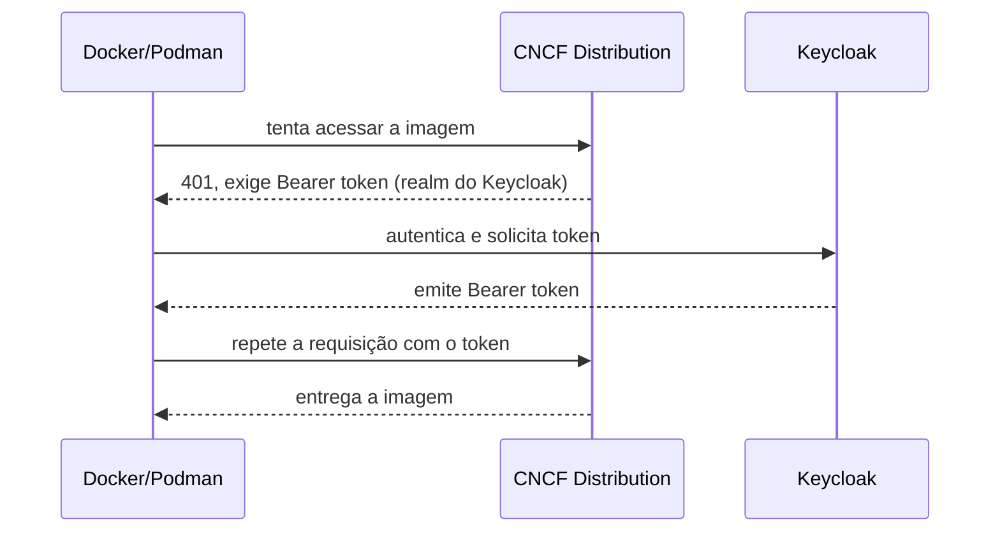

> **Para quem é:** quem já entende o [ciclo de vida de uma imagem](../image-lifecycle/) e precisa decidir onde armazenar e distribuir imagens além de Docker Hub, Quay ou o registry de um provedor de nuvem específico.

A primeira distinção importante não é entre marcas, é entre dois tipos de produto. Um **registry OCI dedicado** tem uma função só: armazenar e distribuir imagens de container e outros artefatos no formato OCI, implementando o protocolo [OCI Distribution Spec](https://github.com/opencontainers/distribution-spec). Um **gerenciador universal de artefatos** também guarda imagens OCI, mas ao lado de pacotes npm, Maven, NuGet, PyPI, charts Helm, arquivos genéricos e, em algumas plataformas, modelos de IA, tudo atrás de um único sistema de permissões e um único ponto de operação. A escolha entre as duas categorias importa mais do que a escolha entre produtos dentro de uma delas: um registry dedicado é mais simples de operar quando o único problema é distribuir imagens; um gerenciador universal se paga quando a organização já precisa resolver o mesmo problema para vários formatos de pacote ao mesmo tempo.

## SaaS integrados a uma forge

Estas opções vêm embutidas na plataforma onde o código já está hospedado, o que reduz a decisão a "usar o que já está disponível" na maioria dos casos.

| Solução | Modelo | Perfil |
| --- | --- | --- |
| Docker Hub | SaaS | Registry público e privado integrado ao ecossistema Docker; ponto de distribuição padrão para imagens de projetos open source |
| GitHub Container Registry (GHCR) | SaaS ou GitHub Enterprise Server | Bom para projetos já hospedados no GitHub e pipelines com GitHub Actions; suporta imagens Docker e OCI |
| GitLab Container Registry | SaaS, GitLab Dedicated ou self-hosted | Registry por projeto, permissões herdadas do GitLab, integração direta com o CI/CD do GitLab |
| Quay.io | SaaS | Registry gerenciado da Red Hat, público ou privado, com scanning integrado |

## Serviços gerenciados por provedor de nuvem

O registry de um provedor de nuvem costuma ser a melhor escolha quando os workloads já rodam naquela mesma nuvem: a integração com IAM, rede privada, service accounts, replicação regional e o serviço de Kubernetes gerenciado do próprio provedor elimina uma camada inteira de configuração manual de credenciais e rede que um registry externo exigiria.

| Provedor | Produto | Observação |
| --- | --- | --- |
| AWS | Amazon ECR | Imagens Docker, OCI e outros artefatos OCI; políticas por repositório via IAM, replicação e pull-through cache |
| Google Cloud | Artifact Registry | Sucessor do antigo GCR; armazena imagens e diversos tipos de pacote, com repositórios locais, remotos e virtuais |
| Microsoft Azure | Azure Container Registry | Integração com Entra ID, AKS, Private Link, geo-replicação e tarefas de build (ACR Tasks) |
| Oracle Cloud | OCI Container Registry (OCIR) | Registry gerenciado integrado ao IAM e aos demais serviços da Oracle Cloud |
| IBM Cloud | IBM Cloud Container Registry | Registry privado gerenciado, distribuído regionalmente, compatível com OCI |
| Alibaba Cloud | Alibaba ACR | Edições compartilhada e empresarial, com recursos de distribuição e aceleração para ambientes maiores |
| Huawei Cloud | SWR | Registry gerenciado integrado ao serviço de Kubernetes da Huawei |
| DigitalOcean | DOCR | Registry privado simples, integrado ao DigitalOcean Kubernetes e ao App Platform |
| Scaleway | Container Registry | Serviço europeu gerenciado, cobrado principalmente por armazenamento e tráfego |
| OVHcloud | Managed Private Registry | Harbor completamente gerenciado pela OVHcloud, para quem quer os recursos do Harbor sem operá-lo |
| Vultr | Vultr Container Registry | Registry gerenciado integrado ao Vultr Kubernetes Engine |

## Self-hosted open source

| Solução | Perfil |
| --- | --- |
| Harbor | Registry OCI completo: UI, projetos, RBAC, OIDC, scanning, assinatura, quotas, proxy cache e replicação; projeto graduado da CNCF |
| CNCF Distribution | O registry básico e leve, antes conhecido como Docker Registry; implementa o protocolo OCI Distribution e o armazenamento, mas com pouca governança pronta |
| Zot | Registry OCI moderno e enxuto, orientado diretamente aos padrões OCI, sem a camada de UI e gestão do Harbor |
| Gitea / Forgejo Registry | O registry OCI fica integrado à própria forge; interessante quando Git, CI e usuários já vivem no Gitea ou no Forgejo |

Harbor e CNCF Distribution representam os dois extremos do mesmo espectro: Harbor resolve autenticação, autorização, UI, scanning e replicação prontos, ao custo de operar mais um sistema com mais partes móveis; Distribution e Zot entregam só o protocolo de distribuição, deixando cada uma dessas decisões para quem opera.

## Plataformas comerciais independentes de cloud

Estas fazem sentido quando o objetivo é algo de nível empresarial sem ficar preso ao registry de um provedor de nuvem específico.

JFrog Artifactory é uma plataforma universal de artefatos: armazena containers, Helm, Maven, npm, PyPI, NuGet, arquivos genéricos e outros formatos, incluindo modelos de IA em edições mais recentes. Faz sentido quando a organização quer centralizar toda a cadeia de binários em uma única plataforma, e pode ser consumido como SaaS ou operado em ambiente privado, dependendo da edição contratada; é normalmente mais complexo e caro que usar só o Harbor ou o registry de uma nuvem, mas resolve um problema maior que armazenar imagens.

Sonatype Nexus Repository é o concorrente tradicional do Artifactory: permite criar repositórios Docker hospedados, repositórios proxy que fazem cache do Docker Hub ou de um registry de nuvem, e repositórios agrupados que expõem vários backends por um único endpoint, além de suportar Maven, npm, PyPI, NuGet e outros formatos. Tem edição comunitária e edição profissional, e é uma opção forte quando o objetivo combina registry de imagens, cache de dependências externas e operação self-hosted em uma plataforma mais tradicional de artifact management.

Cloudsmith é uma plataforma SaaS independente das grandes clouds, funcionando como registry Docker e repositório universal de pacotes, com proxy e cache de upstreams, scanning, políticas e integração com Terraform, APIs e sistemas de CI/CD; é particularmente relevante para organizações multicloud que não querem operar Artifactory ou Nexus.

ProGet é um gerenciador self-hosted de pacotes e containers para Linux e Windows, suportando Docker, NuGet, npm, Maven, PyPI, Chocolatey e PowerShell, com scanning e controle de acesso; tem versão gratuita e edições comerciais, e costuma aparecer como alternativa mais simples ao Nexus e ao Artifactory em ambientes com bastante .NET, NuGet, PowerShell ou Windows.

Mirantis Secure Registry é um registry empresarial para instalação on-premises ou em VPC privada; a geração atual do produto é baseada no Harbor, com suporte, empacotamento e recursos empresariais adicionados pela Mirantis, funcionando como sucessor conceitual do antigo Docker Trusted Registry.

Red Hat Quay pode ser usado como produto self-managed ou como o SaaS Quay.io (já listado acima), voltado a organizações que precisam de registry privado, scanning e governança com suporte comercial, especialmente em ambientes OpenShift ou já integrados ao ecossistema Red Hat.

## Autenticação de um registry mínimo com Keycloak

CNCF Distribution implementa o protocolo OCI Distribution e pode delegar autenticação a um serviço externo de emissão de tokens, em vez de gerenciar usuários e senhas internamente. O Keycloak tem suporte documentado especificamente para atuar como esse servidor de autenticação de um Distribution Registry, usando o fluxo de Bearer token do próprio protocolo OCI:

Esse desenho funciona, mas o resultado continua sendo um registry básico. Depois de resolver autenticação, ainda ficam em aberto: interface web, permissões por projeto, gerenciamento de usuários e contas de robô, integração de scanning (com Trivy, por exemplo), quotas, retenção e coleta de lixo de camadas não referenciadas, replicação entre instâncias, assinatura de imagens e políticas de admissão, escolha de armazenamento (S3 ou filesystem) e alta disponibilidade com backup. A integração entre Distribution e Keycloak está documentada oficialmente pelo próprio Keycloak, mas cobre só a camada de autenticação, não o restante dessa lista.

Harbor já reúne boa parte desses componentes prontos e também pode usar o Keycloak como provedor OIDC; nesse caso, ele cria um segredo específico para uso com `docker login`, porque o Docker CLI não executa o fluxo de redirecionamento de login OIDC de um navegador da forma como uma sessão web faria. Escolher entre montar Distribution com Keycloak manualmente ou usar Harbor com Keycloak como provedor é, na prática, escolher entre aprender cada peça isoladamente ou adotar uma composição já integrada.

## Comparação prática

| Necessidade | Escolha mais natural |
| --- | --- |
| Registry mínimo para poucos serviços | CNCF Distribution ou Zot |
| Registry completo para homelab ou Kubernetes privado | Harbor |
| Git, CI e registry em uma única aplicação leve | Gitea ou Forgejo |
| Já usa GitLab self-hosted | GitLab Container Registry |
| Registry empresarial focado em containers | Red Hat Quay ou Mirantis Secure Registry |
| Containers e todos os tipos de pacote | Nexus, Artifactory, Cloudsmith ou ProGet |
| Não quer operar infraestrutura de registry | Cloudsmith, Quay.io ou o registry da própria nuvem |
| Harbor sem administrar Harbor | OVHcloud Managed Private Registry |
| Workloads só na AWS | Amazon ECR |
| Workloads só no Azure | Azure Container Registry |
| Workloads só no Google Cloud | Artifact Registry |

## Decisão prática para um cluster K3s de laboratório

Para o perfil deste notebook (K3s de laboratório ou homelab, sem exigência de multicloud ou de formatos de pacote além de OCI), a ordem de exploração que mais compensa o tempo investido é: primeiro Harbor, para estudar um registry próximo do que aparece em ambientes corporativos, com OIDC, projetos, RBAC, scanning, proxy cache e replicação já integrados; depois Zot, se o objetivo for algo menor, moderno e estritamente aderente ao padrão OCI, sem a camada de gestão do Harbor; em seguida CNCF Distribution combinado com Keycloak, se o objetivo for aprender em profundidade como autenticação, autorização, armazenamento e o protocolo de registry se encaixam, montando cada peça manualmente; GitLab Container Registry, se o GitLab self-hosted já estiver em uso e adicionar mais uma plataforma não se justificar; e Gitea ou Forgejo, se a preferência for por uma forge mais leve com Git, Actions e registry já integrados.

Harbor não é tão leve quanto um registry sozinho, mas elimina boa parte do trabalho de montar manualmente UI, scanner, gestão de projetos, autenticação e políticas. Distribution ou Zot fazem mais sentido quando o registry é deliberadamente uma peça interna simples, com poucos usuários e uma arquitetura modular, não quando o objetivo é ter tudo pronto o mais rápido possível.

## Referências

- [OCI Distribution Specification](https://github.com/opencontainers/distribution-spec): o protocolo que todo registry OCI (incluindo Distribution, Zot e Harbor) implementa.
- [Harbor — documentação oficial](https://goharbor.io/docs/): projetos, RBAC, OIDC, scanning e replicação.
- [CNCF Distribution — repositório oficial](https://github.com/distribution/distribution): implementação de referência do protocolo OCI Distribution.
- [Zot — documentação oficial](https://zotregistry.dev/): instalação e recursos suportados.
- [Keycloak: Docker Registry v2 authentication](https://www.keycloak.org/securing-apps/docker-api): integração oficial entre Keycloak e um Distribution Registry via Bearer token.
