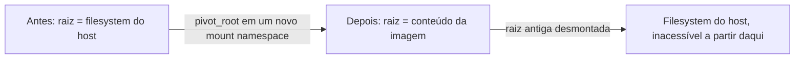
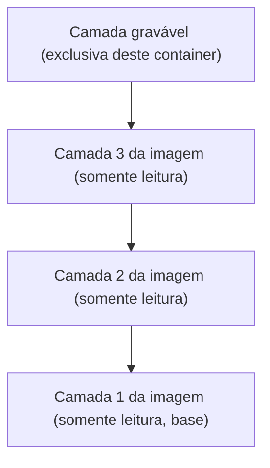

> **Para quem é:** quem já sabe, a partir de [namespaces](../namespaces/), que o mount namespace isola a árvore de pontos de montagem de um processo, e quer entender como um runtime de container usa isso para montar o filesystem que o processo vai enxergar como sua raiz.

O mount namespace, por si só, só garante que operações de montar e desmontar dentro dele não afetam outros namespaces (a não ser que uma montagem seja explicitamente configurada com propagação compartilhada). Ele não decide, sozinho, qual vai ser o conteúdo dessa árvore isolada. Essa parte é papel de outro mecanismo: a chamada de sistema `pivot_root`, combinada com montagens específicas (rootfs somente leitura, `tmpfs`, bind mounts) que o runtime de container monta antes de iniciar o processo da aplicação.

## `pivot_root`: trocando a raiz do filesystem

`pivot_root(2)` troca o filesystem raiz atual do processo por outro já montado em um diretório, movendo a raiz antiga para um ponto de montagem que pode então ser desmontado, tornando-a inacessível ao processo. É essa chamada, executada dentro de um mount namespace novo, que faz o processo de um container enxergar o conteúdo de uma imagem como se fosse `/`, sem visibilidade do filesystem real do host que existia antes da troca.

`chroot(2)`, mais antigo, resolve um problema parecido de um jeito mais fraco: ele muda apenas qual diretório o processo trata como raiz para resolução de caminhos, sem mudar o mount namespace nem desmontar o filesystem anterior. Um processo com privilégio suficiente e um descritor de arquivo aberto antes do `chroot` pode, em certas condições, escapar de volta ao filesystem original; `pivot_root` combinado com um mount namespace próprio fecha essa rota, porque a raiz antiga simplesmente deixa de estar montada e acessível de qualquer forma dentro do namespace.



## Rootfs somente leitura e `tmpfs`

Montar a raiz do container como somente leitura (`--read-only` na maioria dos runtimes) impede que o próprio processo da aplicação modifique os arquivos que vieram da imagem, uma proteção contra um processo comprometido tentar alterar binários ou bibliotecas do próprio container em tempo de execução. Como praticamente toda aplicação real precisa escrever algo (arquivos temporários, sockets Unix, caches), um rootfs somente leitura normalmente é combinado com montagens `tmpfs` explícitas nos diretórios que realmente precisam de escrita: `tmpfs` é um filesystem que vive na memória RAM (ou em swap, se configurado), sem persistir nada em disco, e desaparece por completo quando desmontado ou quando o container termina.

```bash
docker run --read-only --tmpfs /tmp:rw,nosuid,size=100m imagem comando
```

Esse comando monta a raiz do container como somente leitura e cria um `/tmp` gravável em memória por cima dela; qualquer escrita fora de `/tmp` (ou de outro `tmpfs`/volume montado explicitamente) falha, mesmo que o processo dentro do container tenha, em tese, permissão de escrita sobre aquele caminho segundo as permissões Unix do arquivo.

## Copy-on-write e camadas de imagem

Uma imagem de container é composta por várias camadas somente leitura empilhadas (já introduzidas em [ciclo de vida de imagens](../image-lifecycle/) do ponto de vista de tag/digest; aqui o foco é o mecanismo de filesystem por trás delas). Um filesystem em copy-on-write, tipicamente OverlayFS no Linux, empilha essas camadas somente leitura e adiciona uma camada gravável exclusiva do container por cima de todas elas. Quando o processo tenta modificar um arquivo que só existe em uma camada somente leitura inferior, o OverlayFS primeiro copia esse arquivo para a camada gravável (uma operação chamada "copy-up") antes de aplicar a modificação; o arquivo original, na camada de imagem, nunca é alterado.



Esse mecanismo é o que permite vários containers, rodando da mesma imagem base, compartilharem as mesmas camadas somente leitura no disco do host sem duplicar esse conteúdo: cada container só ocupa espaço adicional pela sua própria camada gravável, geralmente pequena se a aplicação escreve pouco fora de volumes explícitos. É também por isso que remover um container (`docker rm`) descarta essa camada gravável e qualquer mudança feita nela; para persistir dados além do ciclo de vida de um container específico, é necessário um volume ou bind mount montado explicitamente, não a camada gravável padrão.

## Bind mounts `:ro`

Um bind mount expõe um diretório ou arquivo já existente (do host, ou de outro lugar) em um caminho dentro do container, sem copiar nenhum dado; é literalmente o mesmo inode aparecendo em dois caminhos diferentes. O sufixo `:ro` (ou a opção equivalente `--mount type=bind,readonly`) monta esse caminho como somente leitura dentro do container, uma restrição aplicada pelo próprio kernel no nível da montagem, que vale independentemente das permissões Unix do arquivo de origem: mesmo que o processo dentro do container tenha, em tese, permissão de escrita sobre o arquivo (por exemplo, por rodar com o mesmo UID do dono), a montagem somente leitura ainda bloqueia a escrita.

```bash
docker run --volume /host/config:/app/config:ro imagem comando
```

**Quando usar:** compartilhar configuração, certificados ou qualquer dado que o container deve ler mas nunca deveria ter permissão de alterar, mesmo que um bug ou uma vulnerabilidade na aplicação tentasse escrever ali.

## Referências

- [`pivot_root(2)`](https://man7.org/linux/man-pages/man2/pivot_root.2.html): a chamada de sistema que troca a raiz do filesystem.
- [`chroot(2)`](https://man7.org/linux/man-pages/man2/chroot.2.html): a chamada de sistema mais antiga e mais limitada, para contraste.
- [`mount_namespaces(7)`](https://man7.org/linux/man-pages/man7/mount_namespaces.7.html): propagação de montagem e isolamento por namespace.
- [OverlayFS (documentação do kernel)](https://docs.kernel.org/filesystems/overlayfs.html): especificação oficial do filesystem em camadas usado pela maioria dos runtimes de container no Linux.
- [`mount(8)`](https://man7.org/linux/man-pages/man8/mount.8.html): opções de montagem, incluindo `bind` e somente leitura.
