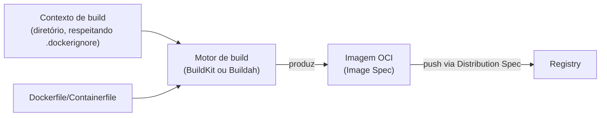

> **Para quem é:** quem já entende as [três especificações OCI](../oci-specifications/) e quer saber como uma imagem é construída a partir de um `Dockerfile`, e como ela circula entre registries sem depender de um cliente completo.

Esta página cobre formato e distribuição: o que descreve uma imagem antes dela existir (`Dockerfile`/`Containerfile`, contexto de build) e como uma imagem já pronta se move entre sistemas (registries, Skopeo). [Ciclo de vida de imagens](../image-lifecycle/) cobre a outra metade do problema, o que acontece depois que a imagem já está publicada: tags, digests, rollout e rollback em produção; esta página linka para lá em vez de repetir esse conteúdo.

## `Dockerfile` e `Containerfile`: mesmo formato, nomes diferentes

`Containerfile` é o nome adotado por ferramentas neutras de fornecedor (Podman, Buildah) para o mesmo formato de instruções (`FROM`, `RUN`, `COPY`, `ENTRYPOINT`, entre outras) que o `Dockerfile` do Docker popularizou; `podman build` e `buildah bud` procuram por um arquivo `Containerfile` primeiro e caem para `Dockerfile` como alternativa se o primeiro não existir, então um projeto pode manter só um dos dois nomes sem perder compatibilidade com nenhuma das ferramentas.

Um ponto frequentemente mal entendido: a sintaxe de instruções do `Dockerfile`/`Containerfile` **não** é parte da OCI Image Spec. A OCI padroniza o formato do resultado de um build (camadas, configuração, manifesto, já detalhados em [OCI Image Specification](../oci-specifications/#oci-image-specification-o-formato-da-imagem)), não a linguagem usada para descrever como chegar até esse resultado. `Dockerfile`/`Containerfile` é um padrão de fato, interpretado por qualquer motor de build compatível; nada impede, em tese, gerar uma imagem OCI válida por outro caminho, como o Buildah imperativo descrito abaixo.

## Contexto de build: o que é enviado ao motor de build

O contexto de build é o conjunto de arquivos (tipicamente todo o diretório indicado ao final do comando, como o `.` em `docker build .`) enviado ao motor de build antes da primeira instrução ser processada; instruções `COPY`/`ADD` só conseguem referenciar arquivos que já fazem parte desse contexto. Um `.dockerignore` (ou `.containerignore`) exclui caminhos dessa transferência, o que importa por dois motivos: performance (um contexto grande demora mais para ser enviado e processado a cada build) e risco de vazamento (arquivos sensíveis dentro do diretório do build, como uma chave privada esquecida, podem acabar dentro do contexto e, de lá, dentro de uma camada da imagem, mesmo que nenhuma instrução `COPY` os referencie explicitamente por nome, caso uma instrução copie um diretório inteiro).



## Motores de build: BuildKit e Buildah

BuildKit é o motor de build usado pelo Docker Engine atual, substituindo o builder clássico mais antigo; processa estágios de um `Dockerfile` multi-stage em paralelo quando não há dependência entre eles, tem cache mais granular por instrução, e suporta segredos de build (`--secret`) que ficam disponíveis durante uma instrução `RUN` específica sem serem persistidos em nenhuma camada da imagem final, ao contrário de simplesmente passar um segredo como `ARG`/`ENV`, que fica gravado no histórico da imagem.

Buildah é a ferramenta de build dedicada do mesmo ecossistema do Podman, daemonless como o próprio Podman. Além de processar um `Containerfile`/`Dockerfile` da forma tradicional, o Buildah permite construir uma imagem de forma imperativa, comando a comando (`buildah from`, `buildah run`, `buildah copy`, `buildah commit`), sem exigir nenhum arquivo de instruções; isso é mais verboso para o caso comum, mas mais programável para pipelines que geram a sequência de build dinamicamente, em vez de escrever um `Dockerfile` estático de antemão.

Tanto BuildKit quanto Buildah produzem imagens compatíveis com a OCI Image Spec; a escolha do motor de build não determina se a imagem resultante funciona com Docker Engine, Podman, containerd ou qualquer outro consumidor compatível com OCI, o mesmo princípio de camadas independentes já estabelecido em [engines e runtimes](../engines-and-runtimes/).

## Tags e digests

O modelo de referência de uma imagem (tag flutuante, tag explícita, digest, os riscos de reprodutibilidade de cada uma) já está detalhado em [ciclo de vida de imagens](../image-lifecycle/#tags-digests-e-reprodutibilidade), incluindo a convenção deste notebook de fixar versão e digest juntos em produção; esta página não repete essa tabela, só reforça que tags e digests são conceitos da Image Spec e da Distribution Spec funcionando juntos: a tag é uma referência mutável mantida pelo registry, o digest é o identificador imutável do conteúdo em si.

## Registries e distribuição

Como um registry recebe e entrega imagens (a Distribution Spec) e o panorama de opções de registry (SaaS, gerenciado por nuvem, self-hosted) já foram tratados em [OCI Distribution Specification](../oci-specifications/#oci-distribution-specification-como-um-registry-fala-com-um-cliente) e em [registries de containers](../container-registries/), respectivamente; esta página não repete esse conteúdo.

## Skopeo: copiar e inspecionar sem um daemon local

Skopeo opera em imagens e manifestos diretamente, sem exigir um daemon de container nem baixar a imagem para o armazenamento local de containers antes de agir. Isso o torna a ferramenta certa para tarefas que giram em torno de mover ou inspecionar imagens, não de executá-las.

```bash
# Inspecionar uma imagem remota sem baixá-la
skopeo inspect docker://docker.io/library/nginx:1.27

# Copiar uma imagem diretamente entre dois registries, sem passar por um host intermediário
skopeo copy docker://origem.example.com/app:1.0 docker://destino.example.com/app:1.0
```

**Quando usar:** espelhar uma imagem entre registries (por exemplo, de um registry público para um espelho interno) sem precisar de um host com Docker ou Podman instalado e espaço em disco suficiente para um `pull`/`push` manual; ou confirmar metadados de uma imagem (arquitetura, digest, camadas) antes de decidir baixá-la de fato.

**Considerações:** os prefixos de transporte (`docker://` para um registry, `containers-storage:` para o armazenamento local de containers, `oci:` para um layout OCI em disco, `dir:` para um diretório simples) definem a origem e o destino de cada operação; `skopeo copy` pode converter entre alguns desses transportes na mesma operação, o que o torna útil também para extrair uma imagem de um registry para um diretório local sem nenhum runtime de container envolvido.

## Referências

- [Podman: Building images](https://docs.podman.io/en/latest/markdown/podman-build.1.html): documentação oficial de `podman build`/`buildah bud` e a resolução `Containerfile`/`Dockerfile`.
- [BuildKit: repositório oficial](https://github.com/moby/buildkit): arquitetura, cache e segredos de build.
- [Buildah: documentação oficial](https://buildah.io/): construção imperativa e via `Containerfile`.
- [Skopeo: documentação oficial](https://github.com/containers/skopeo): referência completa de comandos e transportes suportados.
