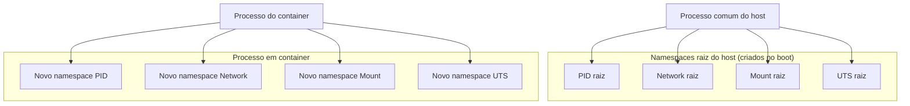

> **Para quem é:** quem já entende, a partir de [um container é um processo](../container-as-a-process/), que um container é um processo comum do host, e quer saber exatamente o mecanismo do kernel que faz esse processo enxergar um sistema diferente do resto do host.

Um namespace envolve um recurso global do kernel (a árvore de processos, a pilha de rede, o conjunto de pontos de montagem, entre outros) de forma que os processos dentro desse namespace enxerguem sua própria instância isolada desse recurso, sem ver nem afetar a instância que existe em outro namespace. Namespaces respondem à pergunta "o que este processo consegue ver?"; eles não limitam quanto de CPU ou memória um processo pode consumir (isso é papel dos [cgroups](../cgroups/)) nem quais operações privilegiadas ele pode realizar (isso é papel das capabilities). Um container comum combina vários namespaces ao mesmo tempo, um por tipo de recurso, para produzir a visão isolada que o processo enxerga.

## Os tipos de namespace e o que cada um isola

O kernel Linux implementa oito tipos de namespace, documentados em conjunto em `man 7 namespaces`. Cada processo pertence a exatamente um namespace de cada tipo; por padrão, todo processo do host pertence aos namespaces "raiz" (o namespace inicial de cada tipo, criado no boot do sistema), e um container substitui a associação a um ou mais desses tipos por um namespace novo, criado especificamente para ele.

| Tipo | Flag do kernel | O que isola |
| --- | --- | --- |
| PID | `CLONE_NEWPID` | A árvore de processos: PIDs e a visibilidade de outros processos, já detalhado em [um container é um processo](../container-as-a-process/#o-que-significa-ser-pid-1-dentro-do-container). |
| Network (NET) | `CLONE_NEWNET` | Interfaces de rede, tabelas de rota, regras de firewall, portas abertas e a pilha de rede como um todo. |
| Mount (MNT) | `CLONE_NEWNS` | A árvore de pontos de montagem visível ao processo; a base do isolamento de filesystem que um container apresenta. |
| UTS | `CLONE_NEWUTS` | Hostname e domainname do sistema, permitindo que um container tenha seu próprio hostname sem alterar o do host. |
| IPC | `CLONE_NEWIPC` | Mecanismos de comunicação entre processos via System V IPC e POSIX message queues (memória compartilhada, semáforos, filas de mensagem). |
| User | `CLONE_NEWUSER` | Mapeamento de UID/GID entre o namespace e o host; denso o suficiente para merecer página própria nesta mesma seção, não aprofundado aqui. |
| Cgroup | `CLONE_NEWCGROUP` | A visão da hierarquia de cgroups que o processo enxerga a partir de sua própria raiz, sem revelar cgroups de outros processos do host. |
| Time | `CLONE_NEWTIME` | Os relógios monotônico e de boot (não o relógio de parede), permitindo que um container tenha sua própria contagem de tempo de atividade, independente da do host. |

Rede, mount e UTS são os três namespaces mais imediatamente visíveis no uso comum de containers: são eles que fazem `ip addr` dentro de um container mostrar interfaces diferentes do host, `mount`/`df` mostrarem um filesystem diferente, e `hostname` retornar um nome diferente do host. Um container tipicamente cria um namespace novo para cada um dos oito tipos, mas isso não é obrigatório: uma ferramenta pode optar por compartilhar um namespace específico com o host (por exemplo, `--network host` no Docker reutiliza o namespace de rede do host em vez de criar um novo), abrindo mão do isolamento correspondente por um motivo específico (performance de rede, ou a necessidade de enxergar interfaces do host diretamente).



## Inspecionar namespaces com `lsns`

```bash
lsns
# Lista todos os namespaces do host, com tipo, número de processos e o comando associado

lsns --type net
# Filtra só namespaces de rede
```

**Quando usar:** ver quantos namespaces de cada tipo existem no host e quais processos pertencem a cada um, um primeiro passo de diagnóstico antes de investigar um processo específico.

**Considerações:** `lsns` lê as informações diretamente de `/proc`, sem exigir privilégio especial para ver os namespaces do próprio usuário; ver namespaces de processos de outros usuários costuma exigir root. A coluna `NPROCS` mostra quantos processos compartilham aquele namespace, útil para identificar rapidamente se um namespace é exclusivo de um único processo (como o PID namespace típico de um container) ou compartilhado por muitos (como o namespace raiz do host).

## Entrar em um namespace existente com `nsenter`

```bash
# Descobrir o PID de um processo em container, a partir do host
ps aux | grep nginx

# Entrar no namespace de rede e de mount desse processo
sudo nsenter --target <PID> --net --mount ip addr
```

**Quando usar:** inspecionar o namespace de um processo já em execução (um container específico, por exemplo) sem precisar de uma ferramenta de container instalada, útil para diagnosticar um problema de rede ou de mount de dentro do próprio namespace isolado.

**Considerações:** `nsenter` precisa do PID do processo alvo e de privilégio suficiente para entrar em namespaces de outro processo (normalmente root, exceto ao entrar em um namespace do próprio usuário). As flags (`--net`, `--mount`, `--pid`, `--uts`, `--ipc`) escolhem quais namespaces do processo alvo adotar para o novo comando; sem nenhuma flag de tipo, `nsenter` adota todos os namespaces do processo alvo.

## Criar novos namespaces com `unshare`

```bash
unshare --pid --mount-proc --fork bash
# Abre um shell em um novo namespace PID; dentro dele, `ps aux` só mostra o próprio shell e seus filhos
```

**Quando usar:** demonstrar isolamento de namespace na prática, sem precisar de um runtime de container. Esse comando específico funciona mesmo sem privilégio de root e mesmo dentro de um ambiente já isolado (um container ou sandbox `bwrap`), porque `unshare --pid` sem `--user` ainda exige que o processo já tenha permissão suficiente sobre o PID namespace atual, o que um processo não privilegiado tem por padrão.

**Considerações:** `--fork` é necessário junto de `--pid`, porque o processo que chama `unshare` já existe fora do novo namespace; sem `--fork`, o comando substituiria o processo atual sem nunca entrar de fato no novo namespace PID como seu primeiro membro. `--mount-proc` remonta `/proc` dentro do novo namespace, sem o que `ps` continuaria lendo o `/proc` antigo e mostraria os processos do namespace pai, um erro comum ao demonstrar isolamento de PID pela primeira vez.

## Referências

- [`namespaces(7)`](https://man7.org/linux/man-pages/man7/namespaces.7.html): visão geral dos oito tipos de namespace e das flags `CLONE_NEW*` correspondentes.
- [`network_namespaces(7)`](https://man7.org/linux/man-pages/man7/network_namespaces.7.html): o que um namespace de rede isola.
- [`mount_namespaces(7)`](https://man7.org/linux/man-pages/man7/mount_namespaces.7.html): a árvore de pontos de montagem por namespace.
- [`uts_namespaces(7)`](https://man7.org/linux/man-pages/man7/uts_namespaces.7.html): hostname e domainname por namespace.
- [`ipc_namespaces(7)`](https://man7.org/linux/man-pages/man7/ipc_namespaces.7.html): isolamento de System V IPC e POSIX message queues.
- [`cgroup_namespaces(7)`](https://man7.org/linux/man-pages/man7/cgroup_namespaces.7.html): a visão da hierarquia de cgroups por namespace.
- [`time_namespaces(7)`](https://man7.org/linux/man-pages/man7/time_namespaces.7.html): isolamento dos relógios monotônico e de boot.
- [`lsns(1)`](https://man7.org/linux/man-pages/man1/lsns.1.html), [`nsenter(1)`](https://man7.org/linux/man-pages/man1/nsenter.1.html) e [`unshare(1)`](https://man7.org/linux/man-pages/man1/unshare.1.html): páginas de manual completas dos três utilitários usados nesta página.
