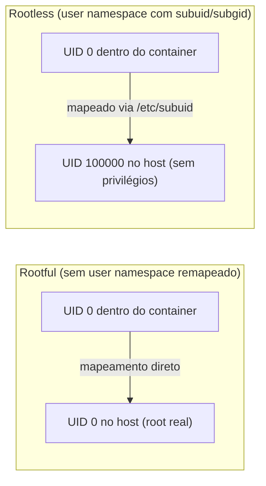

> **Para quem é:** quem já entende os [tipos de namespace](../namespaces/) em geral e quer saber, especificamente, o que muda quando um processo roda como "root" dentro de um container.

Um user namespace mapeia um intervalo de UIDs e GIDs de dentro do namespace para um intervalo (possivelmente diferente) de UIDs e GIDs no host. Esse mapeamento é o que decide se o UID 0 ("root") dentro de um container corresponde ao UID 0 real do host, com todos os privilégios que isso implica, ou a um UID comum, sem privilégio nenhum fora do próprio namespace.

## Como o mapeamento funciona

O mapeamento é declarado em arquivos como `/etc/subuid` e `/etc/subgid`, que reservam a cada usuário do host um intervalo de UIDs/GIDs "subordinados" que ele tem permissão de mapear para dentro de um namespace que ele cria. Ferramentas como `newuidmap`/`newgidmap` (ou o próprio runtime de container, internamente) aplicam esse mapeamento ao criar o user namespace. Uma vez mapeado, um processo com UID 0 dentro do namespace é, do ponto de vista do host, apenas mais um processo rodando com o UID subordinado correspondente, sem qualquer privilégio adicional sobre arquivos, processos ou recursos que pertencem a esse UID fora do namespace.



## Rootless vs. rootful na prática

No modo **rootful**, tradicionalmente o padrão do Docker Engine, o daemon (`dockerd`) roda como root, e um container, salvo configuração explícita em contrário (`userns-remap` no daemon), não tem nenhum user namespace remapeado: o UID 0 dentro do container é o UID 0 real do host. Qualquer processo com acesso ao socket do Docker consegue, na prática, pedir ao daemon para criar um container montando qualquer caminho do host e rodando como root dentro dele, o que equivale a acesso root ao host inteiro. É exatamente por isso que o AGENTS.md deste repositório proíbe montar o socket do Docker ou do Podman sem autorização explícita: o socket em si já é a superfície de risco, não apenas o container em execução.

No modo **rootless**, o padrão do Podman (que não depende de nenhum daemon rodando como root) e uma opção configurável do Docker, cada usuário cria seus próprios containers usando o próprio user namespace, com UID 0 dentro do container mapeado para um UID comum, sem privilégio, no host, definido pelo intervalo reservado em `/etc/subuid`. Um processo que escapasse do isolamento de namespace (por uma falha do kernel ou do runtime, por exemplo) encontraria, do outro lado, apenas os privilégios desse UID comum, não os de root, uma redução real da superfície de dano de um comprometimento bem-sucedido.

## O que "root dentro do container" significa em cada modo

No rootful, "root dentro do container" é literalmente root, contido apenas pelo que capabilities e seccomp (tratados na próxima página) ainda restringem; a garantia de que ações potencialmente perigosas foram bloqueadas depende inteiramente desses dois mecanismos, sem uma segunda camada de contenção por trás deles. No rootless, "root dentro do container" já nasce sem privilégio nenhum fora do próprio namespace, independentemente de qualquer capability estar habilitada ou não: mesmo que o processo tivesse todas as capabilities concedidas, ele ainda esbarraria no fato de que, para o kernel do host, esse UID mapeado nunca foi root de verdade. Rootless não substitui capabilities e seccomp, mas soma uma camada de contenção adicional e independente delas.

## Comparando as duas flags mais comuns na prática

```bash
# Podman: cria um user namespace de verdade, mapeando o UID do host para o mesmo número dentro do container
podman run --userns=keep-id --volume "$(pwd):/workspace" imagem comando

# Docker (daemon rootful, sem userns-remap): só escolhe o UID do processo, sem remapear namespace
docker run --user "$(id -u):$(id -g)" --volume "$(pwd):/workspace" imagem comando
```

`--userns=keep-id` cria um user namespace de verdade (o comportamento rootless padrão do Podman), mas em vez de mapear o UID do usuário do host para um UID subordinado qualquer, mapeia especificamente para o **mesmo número** de UID dentro do container. Isso resolve um problema prático comum de bind mount: arquivos criados dentro do container, em um diretório montado a partir do host, ficam com o dono correto no host (o mesmo usuário que rodou o comando), em vez de pertencerem a um UID subordinado estranho ao editor de código ou ao Git do host.

`--user "$(id -u):$(id -g)"` no Docker resolve um problema parecido de um jeito mais limitado: sem `userns-remap` configurado no daemon, essa flag só escolhe qual UID o processo roda dentro do container, sem criar um user namespace remapeado. O processo não roda como root, o que já reduz o que ele pode fazer contra o próprio filesystem do container, mas o UID usado é o UID real do host, no mesmo espaço de identificadores, não um UID isolado por um mapeamento como o do Podman; a contenção real, nesse caminho, continua vindo do daemon do Docker em si e de flags adicionais de segurança (`--cap-drop=ALL`, `--security-opt=no-new-privileges`, `--read-only`), não de um user namespace próprio.

A Compose Specification tem um campo `userns_mode` para controlar esse comportamento por serviço; o detalhamento desse campo, junto do restante da Compose Specification, fica para a próxima fase desta trilha, que trata do ecossistema de ferramentas em torno do formato de imagem.

## Referências

- [`user_namespaces(7)`](https://man7.org/linux/man-pages/man7/user_namespaces.7.html): especificação completa do mapeamento de UID/GID e do modelo de privilégio de um user namespace.
- [`subuid(5)`](https://man7.org/linux/man-pages/man5/subuid.5.html) e [`subgid(5)`](https://man7.org/linux/man-pages/man5/subgid.5.html): formato dos arquivos que reservam intervalos de UID/GID subordinados por usuário.
- [Podman: Rootless containers](https://github.com/containers/podman/blob/main/docs/source/markdown/podman-run.1.md.in): documentação oficial das opções de user namespace do `podman run`, incluindo `--userns=keep-id`.
- [Docker: Isolate containers with a user namespace](https://docs.docker.com/engine/security/userns-remap/): documentação oficial de `userns-remap` no Docker Engine.
