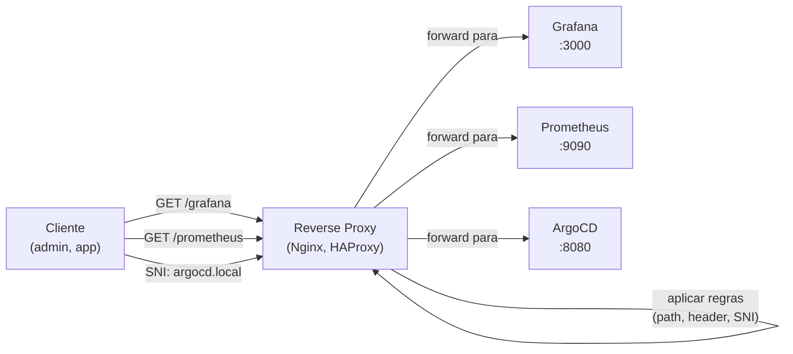

> **Para quem é:** quem precisa entender como um reverse proxy roteia requests para serviços internos.

Um **reverse proxy** senta na frente de serviços e intercepta requests, decidindo para onde encaminhar. Diferente de um forward proxy (que senta entre cliente e internet), um reverse proxy fica entre cliente e servidores internos.

## Visão de alto nível

```yaml
Forward proxy (VPN, proxy pessoal):
  Cliente → [Forward proxy] → Internet
  (cliente controla, servidor não vê quem é)

Reverse proxy (load balancer, API gateway):
  Cliente → [Reverse proxy] → Servidores internos
  (servidor vê o reverse proxy como cliente)
```

## O que um reverse proxy faz



## Métodos de roteamento

### 1. Path-based routing

Roteia baseado em path da URL:

```yaml
GET /grafana → proxy para Grafana:3000
GET /prometheus → proxy para Prometheus:9090
GET /argocd → proxy para ArgoCD:8080

Configuração Nginx:
location /grafana/ {
  proxy_pass http://grafana-svc:3000/;
}

location /prometheus/ {
  proxy_pass http://prometheus-svc:9090/;
}
```

**Trade-off:** aplicação precisa suportar subpath; difícil com apps que presumem raiz (`/`).

### 2. Host-based routing (virtual hosts)

Roteia baseado no header `Host` ou `SNI` (TLS):

```yaml
Host: grafana.cluster.local → proxy para Grafana:3000
Host: prometheus.cluster.local → proxy para Prometheus:9090
SNI: argocd.cluster.local → proxy para ArgoCD:8080

Configuração Nginx:
server {
  server_name grafana.cluster.local;
  proxy_pass http://grafana-svc:3000;
}

server {
  server_name prometheus.cluster.local;
  proxy_pass http://prometheus-svc:9090;
}
```

**Trade-off:** exige múltiplos domínios/certificados ou wildcard; mais naturalmente compatível com aplicações.

### 3. SNI-based routing (para HTTPS)

Lê o TLS ClientHello para extrair o domínio solicitado **antes** de desencriptar:

```yaml
Cliente conecta a 127.0.0.1:443
  TLS ClientHello contém: SNI = grafana.cluster.local
Proxy lê SNI, roteia para Grafana:3000
  (sem desencriptar a conexão inteira)
```

**Vantagem:** funciona mesmo com HTTPS puro, sem headers HTTP.

## Fluxo de requisição

```yaml
1. Cliente → reverse proxy (HTTP/HTTPS)
2. Reverse proxy:
   a. Lê header Host / SNI
   b. Consulta regra de roteamento
   c. Identifica backend (Grafana, Prometheus, etc.)
   d. Cria conexão nova para backend
   e. Encaminha request
3. Backend responde
4. Reverse proxy encaminha resposta ao cliente
5. Cliente recebe (parece que veio direto do backend)
```

## Implementações comuns

| Proxy | Melhor para | Dificuldade |
| --- | --- | --- |
| **Nginx** | path + host routing, HTTPS | Média (config via .conf) |
| **HAProxy** | ultra-high performance, multi-protocol | Alta (sintaxe específica) |
| **Traefik** | Kubernetes nativo, auto-discovery | Baixa (CRDs) |
| **Apache Reverse** | compatibilidade, extensões | Média (mod_proxy) |

## Certificados em split-horizon

Para HTTPS com múltiplos domínios internos:

**Opção A: Wildcard**
```yaml
*.cluster.local
→ único certificado, cobre grafana.cluster.local, prometheus.cluster.local, etc.
```

**Opção B: SAN (Subject Alternative Names)**
```yaml
Certificado com SANs:
  - grafana.cluster.local
  - prometheus.cluster.local
  - argocd.cluster.local
```

**Opção C: Cert-manager (recomendado)**
```yaml
cert-manager emite certs automaticamente por domínio
Traefik integra com cert-manager
Certificados renovam automaticamente
```

## Performance e trade-offs

| Aspecto | Vantagem | Desvantagem |
| --- | --- | --- |
| **Latência** | mínima (~1-5ms por hop) | hop extra vs. acesso direto |
| **Throughput** | pode balancear entre múltiplos backends | limitado pela proxy |
| **Complexity** | centraliza roteamento (uma fonte de verdade) | ponto de falha (mas mitígavel com HA) |
| **Segurança** | pode validar/filtrar requests | exigência de TLS termine na proxy |

## Quando usar reverse proxy

- ✅ **Múltiplos serviços internos:** consolidar em um ponto de entrada
- ✅ **Split-horizon DNS:** serviços internos não expostos
- ✅ **Load balancing:** distribuir carga entre múltiplas réplicas
- ✅ **Authentication/authorization:** validar credenciais centralmente
- ❌ **Conexões TCP puras:** proxy HTTP/HTTPS, não TCP genérico (use HAProxy)
- ❌ **WebSocket com overhead:** pode adicionar latência

## Tópicos relacionados

- [Split-horizon DNS](./split-horizon-dns/): domínios internos vs. externos
- [CoreDNS setup](../../guides/tasks/networking/setup-coredns-internal/): task guide
- [Reverse proxy setup](../../guides/tasks/networking/setup-reverse-proxy-localhost/): task guide

## Fontes e leitura adicional

- [Nginx — Proxy Pass](https://nginx.org/en/docs/http/ngx_http_proxy_module.html#proxy_pass): documentação oficial.
- [HAProxy — Configuration Manual](https://www.haproxy.org/): detalhes de configuração.
- [Traefik — Routing](https://doc.traefik.io/traefik/routing/overview/): roteamento em Traefik.
