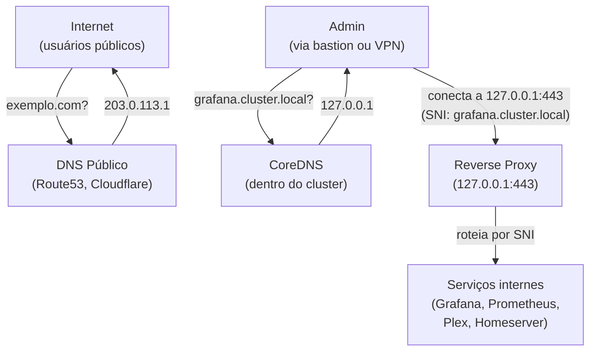

> **Para quem é:** operadores de clusters que querem resolver nomes de serviços internos sem expor portas publicamente.

**Split-horizon DNS** significa que um mesmo domínio resolve diferente dependendo se a consulta vem de **dentro** (rede interna) ou de **fora** (internet).

## O problema que split-horizon resolve

```
Exemplo: seu cluster roda Grafana
- Acesso interno: grafana.cluster.local → 10.0.0.5:3000
- Acesso externo: grafana.example.com → 203.0.113.1 (público, com auth)

Sem split-horizon:
  admin@laptop → kubectl port-forward :3000
  (manual, tedioso, quebra quando laptop reconecta)

Com split-horizon:
  admin@laptop → ssh bastion
  bastion → grafana.cluster.local:443 (reverse proxy resolve internamente)
  (automático, permanente)
```

## Arquitetura



## Conceitos

### DNS público vs. interno

- **DNS público** (Route53, Cloudflare, etc.): aponta para IP público (WAF, load balancer)
- **DNS interno** (CoreDNS no cluster): aponta para `127.0.0.1` (localhost)

### Por que `127.0.0.1`?

Porque o reverse proxy roda **no mesmo host** onde o admin está fazendo a consulta (ex.: bastion, VPN gateway, laptop com SSH tunnel).

```
Fluxo:
  admin@laptop conecta via SSH ao bastion
  bastion resolve grafana.cluster.local → 127.0.0.1
  bastion roteia 127.0.0.1:443 (SNI: grafana) → pod Grafana no cluster
```

### SNI (Server Name Indication)

O reverse proxy usa **SNI** (TLS extension) para rotear requests de diferentes domínios internos pela mesma porta (443):

```
Cliente conecta a 127.0.0.1:443, informa SNI: grafana.cluster.local
Reverse proxy vê SNI, roteia para pod Grafana

Cliente conecta a 127.0.0.1:443, informa SNI: prometheus.cluster.local
Reverse proxy vê SNI, roteia para pod Prometheus

(múltiplos serviços, uma porta)
```

## Quando usar split-horizon

- ✅ **Serviços internos:** Grafana, Prometheus, ArgoCD, etc.
- ✅ **Homelab/produção privada:** acesso via VPN ou bastion
- ✅ **Zero downtime para admin:** sem `kubectl port-forward` manual
- ❌ **Serviços públicos:** já estão em DNS público (WAF/LB)
- ❌ **Múltiplas redes separadas:** exigiria múltiplos DNS (mais complexo)

## Comparação: com/sem split-horizon

| Aspecto | Sem split-horizon | Com split-horizon |
| --- | --- | --- |
| **Acesso a Grafana** | `kubectl port-forward :3000` | `curl https://grafana.cluster.local` |
| **Conexão** | Manual, via kubectl | Automática, via DNS |
| **Porta** | Aleatória (30000+) | 443 (padrão HTTPS) |
| **Múltiplos serviços** | Precisa de múltiplos port-forwards | Uma porta (SNI roteia) |
| **Downtime em reconexão SSH** | Quebra, precisa redo | Automático, sem queda |
| **Segurança** | Expõe porta no host | Isolado em 127.0.0.1 |

## Componentes necessários

1. **CoreDNS:** resolve nomes internos (rodando no cluster ou fora)
2. **Reverse proxy:** roteia por SNI (Nginx, HAProxy, Traefik, etc.)
3. **Certificados:** TLS para cada domínio interno (ou wildcard)
4. **Rota de acesso:** SSH tunnel, VPN, ou direto (se no bastion)

## Tópicos relacionados

- [Reverse proxy basics](./reverse-proxy-basics/): como reverse proxy roteia
- [CoreDNS setup interno](../../guides/tasks/networking/setup-coredns-internal/): task guide
- [Reverse proxy localhost](../../guides/tasks/networking/setup-reverse-proxy-localhost/): task guide

## Fontes e leitura adicional

- [DNS — Authoritative vs. Recursive](https://www.cloudflare.com/en-gb/learning/dns/dns-server-types/): tipos de DNS.
- [TLS SNI (Server Name Indication)](https://en.wikipedia.org/wiki/Server_Name_Indication): como identificar domínio em HTTPS.
- [Nginx — Virtual Hosts](https://nginx.org/en/docs/http/server_names.html): como Nginx roteia por domínio.
