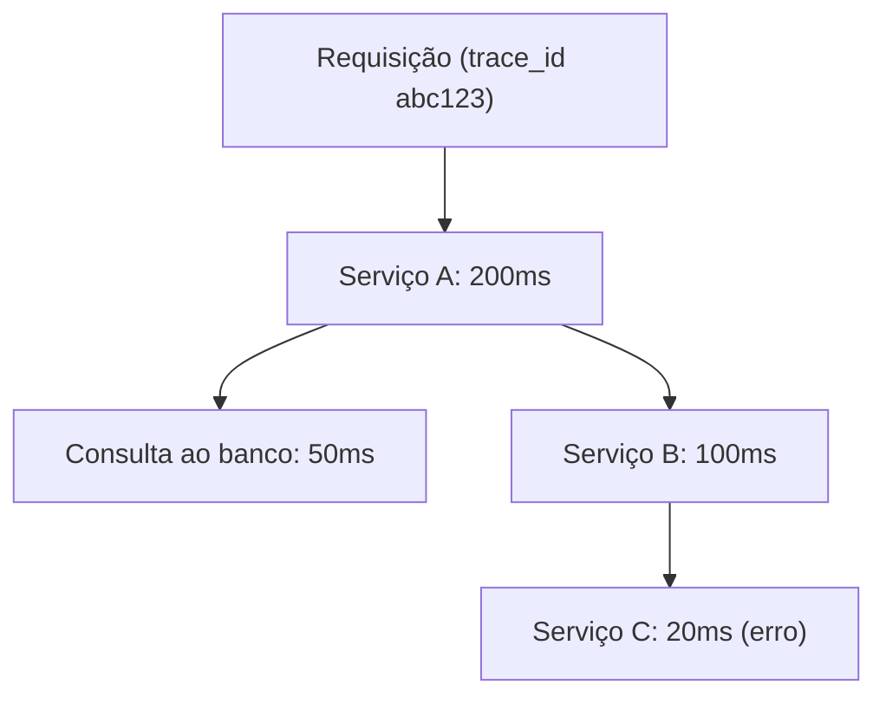

> **Para quem é:** operadores com múltiplos serviços que se chamam entre si e precisam localizar onde o tempo de uma requisição é gasto, quando métricas agregadas por serviço não bastam para isso.

Este notebook não inclui, por enquanto, um guia de instalação para uma stack de tracing; os procedimentos em `guides/tasks/observability/` cobrem métricas (Prometheus) e logs (Loki, via Alloy). Esta página existe para explicar o modelo mental de tracing e ajudar a decidir se e quando vale a pena adicioná-lo, como terceiro sinal, à observabilidade descrita em [métricas, logs e traces](../metrics-logs-and-traces/).

## O problema que um trace resolve

Uma métrica de latência por serviço responde "o serviço B está lento", mas não responde por quê quando o serviço B, por sua vez, depende de uma consulta ao banco de dados e de uma chamada ao serviço C. Sem um identificador comum amarrando essas chamadas, investigar uma requisição lenta significa correlacionar logs de serviços diferentes manualmente, tentando reconstruir a ordem e a duração de cada etapa a partir de timestamps aproximados.

Um trace resolve isso atribuindo um identificador único a cada requisição (o `trace_id`) e registrando cada etapa da sua execução como um span, com início, duração e uma referência ao span pai que a originou. O conjunto de spans de um mesmo `trace_id` reconstrói o caminho completo da requisição através de todos os serviços que ela atravessou, com a duração exata de cada etapa.



Nesse exemplo, uma métrica isolada de latência do serviço A mostraria 200ms sem indicar que boa parte desse tempo foi gasto esperando o serviço C, e uma métrica isolada de erro no serviço C não indicaria qual requisição de nível superior foi afetada. O trace conecta as duas informações.

## OpenTelemetry como padrão de instrumentação

OpenTelemetry não é um sistema de armazenamento ou visualização de traces; é uma especificação aberta, com SDKs para várias linguagens, que padroniza como uma aplicação gera spans, métricas e logs e como esses dados são exportados. A aplicação é instrumentada uma única vez contra o SDK do OpenTelemetry, e o destino dos dados (Jaeger, ou qualquer outro backend compatível com o protocolo OTLP) é uma decisão de configuração do exportador, não do código da aplicação. Essa separação entre instrumentação e backend é o principal motivo para adotar OpenTelemetry mesmo quando o backend inicial é um único sistema: trocar de backend depois não exige reinstrumentar a aplicação.

Instrumentar uma operação manualmente com o SDK Python do OpenTelemetry ilustra o padrão comum a praticamente todas as linguagens suportadas:

```python
from opentelemetry import trace

tracer = trace.get_tracer(__name__)

with tracer.start_as_current_span("operation") as span:
    span.set_attribute("user.id", 123)
    # o código executado dentro deste bloco é registrado como parte do span
```

## Jaeger como backend

Jaeger é um sistema completo de tracing: recebe spans (via agente local ou diretamente via SDK), armazena em um backend configurável (memória para testes, Elasticsearch ou Cassandra para produção) e oferece uma interface para explorar traces individuais e comparar latências entre execuções. Ele pode receber spans diretamente do próprio SDK do Jaeger (instrumentação acoplada a esse backend específico) ou, de forma mais comum atualmente, receber spans exportados via OTLP a partir de aplicações instrumentadas com OpenTelemetry, sem acoplamento entre a instrumentação e o backend escolhido.

Para uma exploração rápida em ambiente de desenvolvimento, o próprio projeto Jaeger publica uma imagem "all-in-one" que roda o coletor, o armazenamento em memória e a interface em um único processo. Ela não deve ser usada em produção, porque o armazenamento em memória é descartado a cada reinício e não escala além de volumes pequenos de teste.

## Amostragem

Registrar 100% das requisições como traces completos tem um custo de armazenamento proporcional ao volume total de tráfego, que cresce rápido em serviços com alto throughput. A amostragem reduz esse custo descartando uma fração das requisições antes de exportá-las como trace, mantendo apenas uma amostra estatisticamente representativa. Uma configuração de amostragem probabilística no Jaeger, por exemplo, aceita um parâmetro entre 0 e 1 representando a fração de traces mantidos:

```yaml
sampler:
  type: probabilistic
  param: 0.1
```

Esse `param: 0.1` mantém aproximadamente 10% das requisições como traces completos. Ambientes de desenvolvimento e teste, com volume de tráfego baixo, normalmente não precisam de amostragem (mantendo 100%); ambientes de produção com volume alto costumam amostrar entre 1% e 10%, ajustando o valor conforme o custo de armazenamento observado na prática, não como um número fixo universal.

## Quando adicionar tracing

Tracing se justifica quando a aplicação já é distribuída entre múltiplos serviços que se chamam em cadeia, e quando métricas agregadas por serviço não são suficientes para localizar a origem de uma latência ou de uma falha que atravessa vários deles. Não é a prioridade inicial de observabilidade de um cluster pequeno ou de uma aplicação monolítica, onde métricas e logs (veja [a stack de observabilidade](../logs-and-metrics/)) já respondem à maioria das perguntas operacionais sem o custo adicional de instrumentar cada serviço com spans.

## Páginas relacionadas

- [Métricas, logs e traces](../metrics-logs-and-traces/)
- [A stack de observabilidade, Prometheus, Loki e Grafana](../logs-and-metrics/)

## Referências

- [Jaeger (documentação oficial)](https://www.jaegertracing.io/docs/): instalação, arquitetura e backends de armazenamento suportados.
- [OpenTelemetry (documentação oficial)](https://opentelemetry.io/docs/): especificação, SDKs por linguagem e conceitos de instrumentação.
- [OpenTelemetry Protocol Specification](https://github.com/open-telemetry/opentelemetry-specification): especificação técnica do protocolo OTLP usado para exportar spans.
