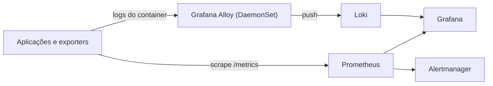

> **Para quem é:** quem já entende a diferença entre métricas, logs e traces (veja [métricas, logs e traces](../metrics-logs-and-traces/)) e quer saber por que este notebook padroniza em Prometheus, Loki e Grafana para implementar essa observabilidade.

Prometheus, Loki e Grafana resolvem três problemas complementares e específicos: coletar métricas, centralizar logs e visualizar os dois. Nenhum dos três substitui os outros; a combinação existe porque cada ferramenta foi desenhada para um tipo de dado diferente, com um modelo de armazenamento otimizado para esse tipo específico.

## Como os três componentes se conectam

O Prometheus coleta métricas por pull, como detalhado em [arquitetura do Prometheus](../prometheus-architecture/): ele consulta periodicamente um endpoint `/metrics` exposto pelas próprias aplicações e pelos exporters do cluster (`node_exporter`, `kube-state-metrics`). O Grafana Alloy, um coletor de telemetria que roda como DaemonSet em cada nó, lê os logs de todos os Pods do nó e os envia ao Loki, já anexando os labels do Kubernetes (namespace, Pod, container) que identificam a origem de cada linha. O Grafana não coleta nada por conta própria: ele se conecta ao Prometheus e ao Loki como fontes de dados e consulta os dois para montar dashboards e alertas visuais.



Essa separação explica por que o Loki não indexa o conteúdo completo de cada linha de log, ao contrário de um sistema como Elasticsearch: ele indexa apenas os labels associados a cada fluxo de logs (por exemplo, `namespace`, `pod`, `container`), e busca o texto dentro desse fluxo apenas no momento da consulta. Isso reduz drasticamente o custo de armazenamento e indexação em troca de buscas de texto livre mais lentas do que em um sistema totalmente indexado, uma troca deliberada para o caso de uso de um cluster de porte pequeno a médio, onde a maioria das consultas já começa filtrando por namespace ou Pod.

## Linguagens de consulta

O Prometheus usa PromQL para consultar métricas, e o Loki usa LogQL, uma linguagem deliberadamente parecida com PromQL na sintaxe de seleção por labels, para consultar logs. Essa semelhança não é coincidência: permite que quem já sabe escrever uma seleção de série no Prometheus (`{namespace="monitoring"}`) aplique o mesmo raciocínio ao selecionar um fluxo de logs no Loki (`{namespace="monitoring"}`), estendendo a consulta com filtros de texto ou expressões regulares sobre o conteúdo da linha quando necessário.

Um alerta de exemplo baseado em métricas, disparando quando os Pods de um workload reiniciam com frequência anormal:

```yaml
- alert: PodRestartingTooOften
  expr: rate(kube_pod_container_status_restarts_total[15m]) > 0.1
  for: 5m
  annotations:
    summary: "Pod {{ $labels.pod }} reiniciando com frequência anormal"
```

Um alerta equivalente baseado em logs, disparando quando a taxa de linhas de erro de um `job` ultrapassa um limite:

```yaml
- alert: ErrorsIncreasing
  expr: |
    sum by (job) (rate({level="error"} [5m])) > 10
  for: 5m
```

Os dois exemplos seguem o mesmo formato de `PrometheusRule` porque o Loki também expõe suas próprias regras de alerta através do mesmo mecanismo; a diferença está apenas na expressão avaliada. O comportamento de severidade, roteamento e runbook por trás de qualquer um dos dois é o mesmo descrito em [alertas acionáveis](../alerting/).

## Retenção e custo

Prometheus e Loki competem pelo mesmo tipo de recurso finito (disco e memória) por razões diferentes: a retenção do Prometheus é limitada principalmente pelo volume de séries temporais ativas (cardinalidade), enquanto a retenção do Loki é limitada principalmente pelo volume bruto de texto de log gerado pelo cluster. Um cluster com poucas aplicações mas com logs verbosos pode justificar uma retenção de Loki menor que a de Prometheus, ou o inverso, dependendo de qual dos dois domina o custo de armazenamento observado na prática. Os critérios para decidir esses valores, e o problema de cardinalidade que afeta ambos, estão em [retenção e cardinalidade](../retention/).

## Instalação

A instalação de cada componente é um procedimento independente, na ordem em que normalmente fazem sentido em um cluster novo: [instalar o Prometheus stack](../../../guides/tasks/observability/install-prometheus-stack/) primeiro, porque ele já inclui o Alertmanager e um Grafana pré-configurado como parte do chart `kube-prometheus-stack`; depois [instalar o Loki](../../../guides/tasks/observability/install-loki/); e por fim [coletar logs com o Alloy](../../../guides/tasks/observability/collect-logs-with-alloy/), apontando o destino da coleta para o Loki recém-instalado. Cada um desses guias inclui sua própria seção de validação; não é necessário validar a stack inteira de uma vez, porque um componente com defeito não impede a instalação nem a validação dos demais.

## Páginas relacionadas

- [Métricas, logs e traces](../metrics-logs-and-traces/)
- [Arquitetura do Prometheus](../prometheus-architecture/)
- [Retenção e cardinalidade](../retention/)
- [Alertas acionáveis](../alerting/)

## Referências

- [Prometheus (documentação oficial)](https://prometheus.io/docs/): guia completo de instalação, PromQL e conceitos.
- [Loki (documentação oficial)](https://grafana.com/docs/loki/latest/): guia completo de instalação, LogQL e conceitos.
- [Grafana (documentação oficial)](https://grafana.com/docs/grafana/): guia completo de fontes de dados, dashboards e alertas.
