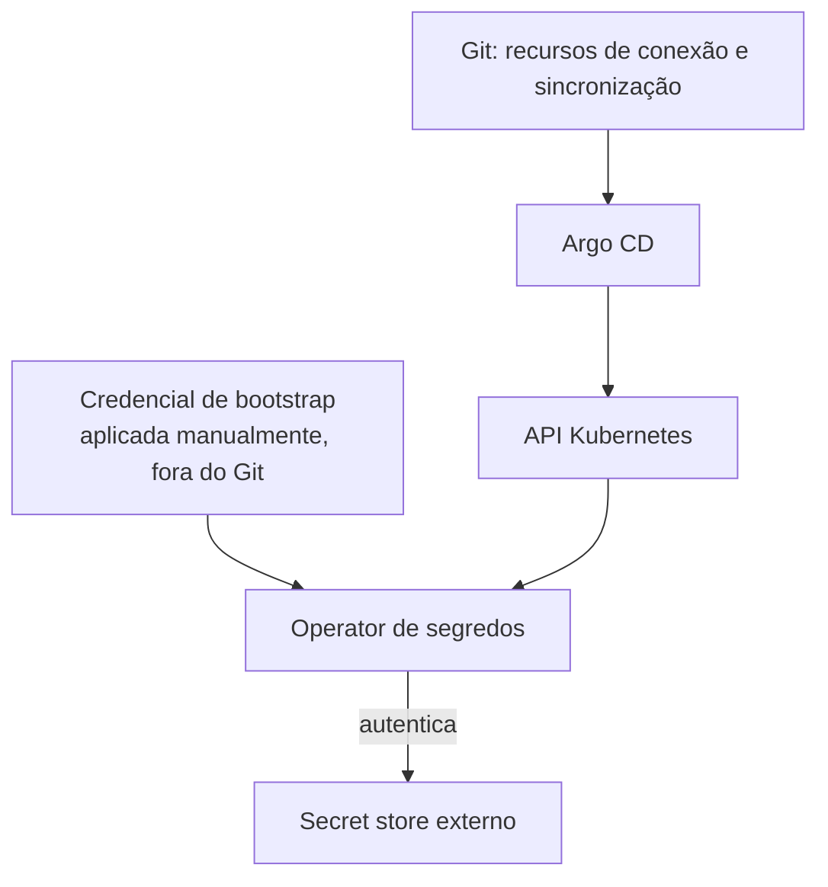

> **Para quem é:** quem está montando o fluxo GitOps de segredos e se depara com a pergunta "mas como o operator autentica na primeira vez?".

Toda estratégia de segredos que depende de um serviço externo (Vault, OpenBao, Infisical) tem um problema recursivo: o operator que sincroniza segredos precisa de uma credencial para se autenticar nesse serviço, e essa credencial de bootstrap não pode, ela mesma, ser buscada do mesmo serviço — é a semente da confiança, não um segredo gerenciado por ela.

## Como funciona

Esse é o mesmo problema já descrito no notebook para o [OpenBao](../../../guides/tasks/secrets/install-openbao/): o operador precisa de material criptográfico inicial fora do fluxo automatizado para abrir o próprio armazenamento ou autenticar-se nele pela primeira vez.

A credencial de bootstrap é tipicamente uma Machine Identity, um AppRole, ou um token de curta duração com escopo mínimo — nunca a credencial administrativa completa do serviço externo. Ela é aplicada uma única vez, manualmente, e documentada fora do repositório GitOps.

## Alternativas

Para reduzir a superfície do bootstrap, prefira métodos de autenticação nativos do Kubernetes quando disponíveis (Kubernetes Auth do Vault/OpenBao, que usa a identidade do ServiceAccount em vez de uma credencial estática adicional) — isso elimina a necessidade de gerenciar e rotacionar uma credencial de bootstrap separada, ao custo de configuração adicional (TokenReview, roles).

## Quando o bootstrap manual é aceitável

Em clusters pequenos ou pessoais, uma credencial de bootstrap (Universal Auth, AppRole) aplicada manualmente uma única vez é um trade-off razoável — simples de entender, documentar e rotacionar.

## Quando evitar

Em ambientes com múltiplos operadores humanos ou exigências de auditoria rigorosas, prefira autenticação nativa do Kubernetes para eliminar a credencial estática de bootstrap por completo.

## Decisões que isso implica

A credencial de bootstrap nunca deve ser commitada, mesmo criptografada — ela é o que protege as demais chaves de criptografia. Documente onde ela está guardada (gerenciador de senhas, cofre físico) como parte do procedimento de [recuperação do gerenciamento de segredos](../../../operations/disaster-recovery/recover-secret-management/).

## Páginas relacionadas

- [Bootstrap do gerenciamento de segredos](../../../guides/tasks/secrets/bootstrap-secret-management/)
- [Estratégias de recuperação](../recovery-strategies/)
- [Instalar o Infisical](../../../guides/tasks/secrets/install-infisical/) (já usa este mesmo padrão)

## Referências

- [HashiCorp Vault — AppRole Auth Method](https://developer.hashicorp.com/vault/docs/auth/approle): descreve o padrão de credencial de bootstrap usado por Vault e OpenBao.
