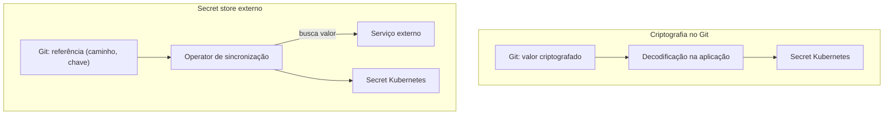

> **Para quem é:** quem já entende [segredos no Git](../secrets-in-git/) e precisa escolher entre criptografia local e um serviço externo.

As duas famílias de estratégia resolvem "não versionar segredos em claro" de formas fundamentalmente diferentes, com implicações operacionais distintas.

## Como funciona

**Criptografia no Git** (SOPS, Sealed Secrets) mantém o segredo criptografado dentro do próprio repositório. A decodificação acontece no momento da aplicação — SOPS tipicamente via um passo de decodificação antes do `kubectl apply` ou integração com Argo CD; Sealed Secrets via um controller no cluster que decifra automaticamente ao aplicar o `SealedSecret`.

**Secret store externo** (OpenBao, Infisical, ou qualquer backend suportado pelo External Secrets Operator) mantém o valor fora do Git por completo. O repositório contém apenas uma referência declarativa — projeto, caminho, chave — e um operator busca o valor real no momento da sincronização.

## Alternativas

Um híbrido é possível: usar SOPS para segredos de infraestrutura simples e um secret store externo para segredos de aplicação com rotação frequente. Isso adiciona uma segunda ferramenta a manter — só vale a complexidade quando os dois cenários realmente têm necessidades diferentes.

## Quando usar criptografia no Git

Ambientes pequenos ou pessoais, sem necessidade de rotação automatizada frequente, e que preferem não operar mais um serviço (Vault/OpenBao/Infisical) além do cluster.

## Quando usar um secret store externo

Quando a rotação de credenciais precisa ser auditável e centralizada, quando várias equipes ou automações precisam de acesso controlado por política em vez de por chave compartilhada, ou quando a fonte de verdade dos segredos já existe fora do cluster por outro motivo (ex.: a mesma plataforma serve outros sistemas, não apenas Kubernetes).

## Decisões que isso implica

Nenhuma das duas famílias elimina o [problema do bootstrap](../bootstrap-problem/) — mesmo um secret store externo precisa de uma credencial inicial para o operator se autenticar nele.

## Páginas relacionadas

- [SOPS vs. Sealed Secrets](../sops-vs-sealed-secrets/)
- [External Secrets](../external-secrets/)
- [OpenBao e Vault](../openbao-and-vault/)

## Referências

- [External Secrets Operator](https://external-secrets.io/latest/): documentação oficial do operator e dos backends suportados.
