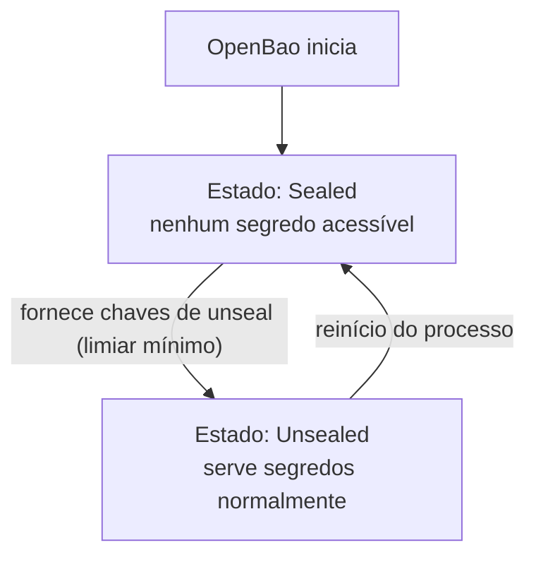

> **Para quem é:** quem está avaliando se vale a pena rodar um secret store dedicado (OpenBao) em vez de usar Infisical ou criptografia no Git.

OpenBao é um fork open source do HashiCorp Vault, criado depois que o Vault mudou de licença para BSL. Ambos compartilham a mesma arquitetura central: um cofre de segredos com controle de acesso granular, auditoria e, criticamente, um mecanismo de **unseal**.

## Como funciona

Um cofre OpenBao/Vault armazena seus dados criptografados em repouso. Para servir qualquer segredo, ele precisa primeiro ser "unsealed" — receber material criptográfico (chaves de unseal, geradas na inicialização) que permite decifrar sua própria chave mestra. Sem esse material, nem um administrador com acesso root ao host consegue ler os dados armazenados.

Esse mecanismo é o motivo pelo qual rodar um secret store dentro do próprio cluster que ele protege cria uma dependência circular interessante: se o cluster reinicia e o OpenBao precisa ser unsealed novamente, e as chaves de unseal só existem... dentro do cluster, a recuperação trava. As chaves de unseal (ou uma configuração de auto-unseal usando uma chave de nuvem externa) precisam existir fora do domínio de falha que o próprio OpenBao protege.

## Alternativas

Um serviço gerenciado externamente (Infisical hospedado, ou um Vault/OpenBao fora do cluster) evita o problema de unseal recursivo — a disponibilidade do secret store não depende da disponibilidade do cluster que ele protege.

## Quando usar OpenBao dentro do cluster

Quando há requisito de manter o secret store totalmente autogerenciado, dentro do mesmo ambiente, e a equipe está disposta a resolver explicitamente o problema de unseal (auto-unseal via KMS de nuvem, ou um procedimento manual bem documentado).

## Quando evitar

Em um cluster de nó único sem uma solução de auto-unseal externa, um OpenBao interno adiciona um ponto de falha recursivo real — a perda do host derruba o cofre e as chaves de unseal, se também armazenadas só ali. Considere o Infisical (hospedado) ou criptografia no Git como alternativas mais simples nesse cenário.

## Decisões que isso implica

Se optar por OpenBao, a localização das chaves de unseal deve ser decidida e documentada como parte do procedimento de [recuperação do gerenciamento de segredos](../../../operations/disaster-recovery/recover-secret-management/) antes de armazenar qualquer segredo real nele.

## Páginas relacionadas

- [Instalar o OpenBao](../../../guides/tasks/secrets/install-openbao/)
- [O problema do bootstrap](../bootstrap-problem/)
- [Estratégias de recuperação](../recovery-strategies/)

## Referências

- [OpenBao — documentação oficial](https://openbao.org/docs/): arquitetura, unseal e configuração do projeto.
- [Vault — Seal/Unseal](https://developer.hashicorp.com/vault/docs/concepts/seal): explica o mecanismo de unseal compartilhado pela base de código com o OpenBao.
