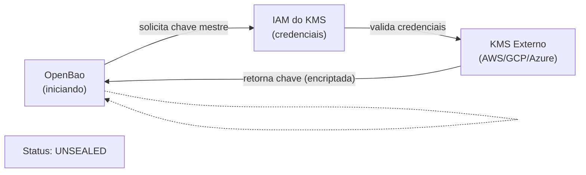

> **Para quem é:** operadores que têm OpenBao rodando e precisam eliminar o passo manual de unseal toda vez que o servidor reinicia.

OpenBao começa cada reinicialização no estado **sealed** — as chaves de criptografia estão encriptadas, e nenhuma operação é possível até que alguém forneça a chave de unseal. Isto é seguro, mas operacionalmente custoso: requer intervenção manual ou um serviço acessível 24/7 com a chave.

**Auto-unseal** resolve isto usando um serviço KMS (Key Management Service) externo — AWS KMS, Google Cloud KMS, Azure Key Vault, ou similar — para armazenar a chave mestre. Na inicialização, OpenBao conversa com o KMS, recupera a chave, e desencripta automaticamente.

## O problema que auto-unseal resolve

```
Cenário sem auto-unseal:
  1. OpenBao reinicia (crash, update, failover)
  2. Status: SEALED (nenhuma leitura/escrita possível)
  3. Admin precisa: ssh → bao operator unseal → colar chave
  4. Demora: minutos de downtime, intervenção manual

Cenário com auto-unseal:
  1. OpenBao reinicia
  2. Conversa com KMS externo: "preciso desencriptar a chave mestre"
  3. KMS valida permissões (IAM) e retorna: ✅
  4. OpenBao desencripta automaticamente
  5. Status: UNSEALED em segundos, sem intervenção
```

## Como funciona



## Fluxo técnico

1. **Inicialização:** OpenBao detecta que está sealed
2. **Autenticação:** OpenBao apresenta credenciais ao KMS (role IAM, service account, etc.)
3. **Validação:** KMS valida que as credenciais têm permissão para acessar a chave
4. **Recuperação da chave:** KMS retorna a chave mestre (armazenada de forma encriptada)
5. **Desencriptação:** OpenBao desencripta a chave e inicia operações

## Providers suportados

OpenBao suporta vários KMS:

| Provider | Como | Detalhes |
| --- | --- | --- |
| AWS KMS | IAM role (recomendado) ou access key/secret | Integrado com EC2, ECS, IRSA em K3s |
| Google Cloud KMS | Service account JSON | Integrado com GKE, Cloud Run |
| Azure Key Vault | Managed Identity ou service principal | Integrado com AKS, App Service |
| HashiCorp Cloud | HCP Vault Cloud | Serviço gerenciado (não gratuito) |
| Kubernetes Secret | ConfigMap/Secret no cluster | Only for dev/test (não é "externo") |

## Trade-offs

### ✅ Vantagens

- **Zero downtime:** reinicializações não exigem intervenção
- **Simples operacionalmente:** sem guardar chaves de unseal em papel/vault pessoal
- **Segurança aprimorada:** chave mestre não está em disco local
- **Multi-cloud:** mesma OpenBao pode usar KMS diferentes por ambiente

### ❌ Desvantagens

- **Dependência do KMS:** se KMS cair, OpenBao fica sealed
- **Custos:** KMS geralmente é serviço pago (ex.: AWS KMS ~$1/mês por chave)
- **Complexidade inicial:** setup de IAM/credenciais é mais envolvido
- **Segurança da credencial:** credencial de acesso ao KMS precisa estar segura (não hardcoded)

## Quando usar

- ✅ **Produção:** clusters que precisam de uptime máximo
- ✅ **Multi-réplica:** se tem múltiplos OpenBao em HA, auto-unseal é essencial
- ✅ **Cloud:** já está usando AWS/GCP/Azure (KMS é natural)
- ❌ **Dev/test:** complexidade não vale a pena
- ❌ **Single-node sem HA:** unseal manual é aceitável

## Alternativas

- **Shamir keys + unsealer service:** dividir chave em N partes (Shamir) e ter um microserviço "unsealer" que as reúne. Menos seguro, mas sem dependência de KMS
- **Sealed Secrets do K3s:** para secrets de aplicação (não para OpenBao em si)
- **Manual unseal:** simplesmente aceitar a intervenção (válido para dev)

## Tópicos relacionados

- [OpenBao e Vault](./openbao-and-vault/): fundamentos de OpenBao
- [OpenBao em modo HA](./openbao-high-availability/): múltiplas réplicas com auto-unseal
- [Configurar OpenBao com auto-unseal](../../guides/tasks/secrets/configure-openbao-auto-unseal/): task guide passo-a-passo
- [Secrets management overview](./overview/): comparação de 4 estratégias

## Fontes e leitura adicional

- [OpenBao — Auto Unseal](https://openbao.org/docs/concepts/seal): documentação oficial.
- [AWS KMS — Key Management](https://docs.aws.amazon.com/kms/): para setup com AWS.
- [Google Cloud KMS](https://cloud.google.com/docs/security/key-management-deep-dive): para setup com GCP.
