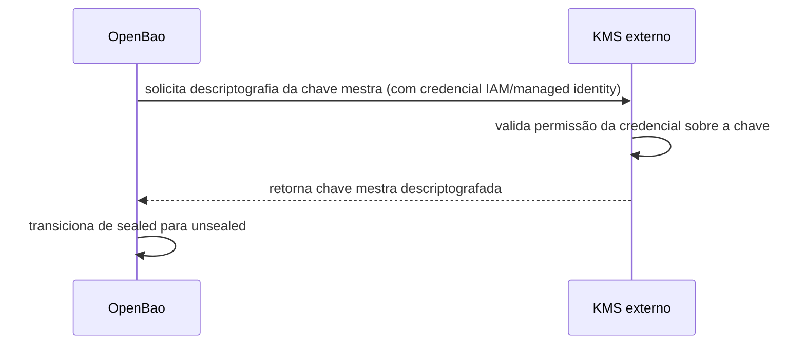

> **Para quem é:** operadores que já têm o [OpenBao rodando](../openbao-and-vault/) e querem eliminar o passo manual de unseal a cada reinicialização do servidor.

Como descrito em [OpenBao e Vault](../openbao-and-vault/), cada reinicialização do OpenBao começa no estado sealed: a chave mestra está protegida, e nenhuma leitura ou escrita é possível até que o número mínimo de chaves de unseal seja apresentado. Isso é o comportamento de segurança esperado, mas tem um custo operacional real quando alguém precisa executar esse passo manualmente toda vez que o processo reinicia, seja por um crash, uma atualização, ou um failover.

**Auto-unseal** substitui a apresentação manual das chaves de unseal por uma chamada automática a um serviço de gerenciamento de chaves (KMS) externo ao próprio OpenBao, tipicamente um provedor de nuvem (AWS KMS, Google Cloud KMS, Azure Key Vault). Na inicialização, o OpenBao se autentica nesse serviço, solicita a operação de descriptografia da sua chave mestra e conclui o unseal sem que um humano precise intervir.

## Como funciona

O OpenBao nunca envia sua chave mestra ao KMS em texto claro para armazenamento; a relação é inversa. A chave mestra fica armazenada localmente, já criptografada por uma chave gerenciada pelo KMS externo. Na inicialização, o OpenBao envia essa chave mestra criptografada ao KMS e solicita a operação de descriptografia; o KMS valida que a identidade que fez a chamada (uma role IAM, uma managed identity, ou credencial equivalente) tem permissão para usar aquela chave específica, e retorna o resultado descriptografado. O OpenBao usa esse resultado para transicionar de sealed para unsealed, sem que a chave de descriptografia do KMS jamais saia do serviço que a gerencia.

Essa dependência do KMS é o ponto central a entender antes de adotar auto-unseal: ela não elimina a necessidade de proteger material criptográfico crítico, apenas move essa responsabilidade do operador humano (guardando chaves de unseal) para o controle de acesso do provedor de nuvem (a política IAM que autoriza a credencial do OpenBao a usar aquela chave específica no KMS). Se essa credencial for comprometida ou mal configurada, o efeito é equivalente a expor as chaves de unseal originais.

## Alternativas

Dividir a chave mestra em partes via Shamir Secret Sharing e reunir o número mínimo delas manualmente a cada reinicialização, como descrito em [OpenBao e Vault](../openbao-and-vault/#como-funciona), é o modo padrão sem auto-unseal. Ele evita a dependência de um KMS externo e de custos recorrentes associados a ele, ao custo de exigir um operador disponível (ou um procedimento bem ensaiado) toda vez que o processo reinicia.

## Quando usar auto-unseal

Auto-unseal se justifica em produção, onde reinicializações não planejadas não podem depender da disponibilidade de um operador humano, e especialmente em topologias com múltiplas réplicas (veja [OpenBao em modo de alta disponibilidade](../openbao-high-availability/)), onde cada réplica precisa se unsealar de forma independente e simultânea para participar da eleição de líder. Também se justifica quando o ambiente já opera em uma nuvem com um serviço de KMS gerenciado disponível, tornando a integração uma configuração adicional em vez de uma nova peça de infraestrutura.

## Quando evitar

Em ambientes de desenvolvimento, teste, ou em um cluster de nó único sem exigência de alta disponibilidade, o unseal manual é uma escolha aceitável: mais simples de entender, sem custo recorrente do KMS, e sem introduzir uma dependência externa cuja indisponibilidade impediria o próprio unseal do OpenBao. Avalie também que a credencial usada para autenticar no KMS precisa, ela mesma, ser protegida com o mesmo cuidado dado a um segredo crítico; hardcodá-la em um manifesto ou script anularia o ganho de segurança do auto-unseal.

## Decisões que isso implica

Adotar auto-unseal transfere o risco de indisponibilidade do "operador não está disponível para inserir a chave" para "o KMS externo não está acessível". Documente essa dependência como parte do procedimento de [recuperação do gerenciamento de segredos](../../../operations/disaster-recovery/recover-secret-management/), incluindo qual credencial autentica no KMS e onde ela está protegida.

## Páginas relacionadas

- [OpenBao e Vault](../openbao-and-vault/)
- [OpenBao em modo de alta disponibilidade](../openbao-high-availability/)
- [Configurar OpenBao com auto-unseal](../../../guides/tasks/secrets/configure-openbao-auto-unseal/)

## Referências

- [OpenBao: Seal/Unseal](https://openbao.org/docs/concepts/seal/): documentação oficial dos mecanismos de seal, incluindo auto-unseal via KMS externo.
- [AWS Key Management Service](https://docs.aws.amazon.com/kms/): documentação oficial do serviço usado como um dos backends de auto-unseal.
- [Google Cloud KMS](https://cloud.google.com/kms/docs): documentação oficial do serviço usado como um dos backends de auto-unseal.
