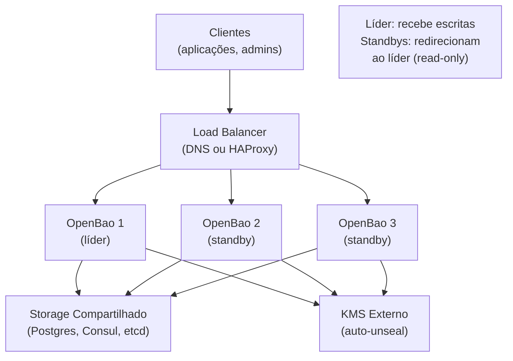

> **Para quem é:** operadores que querem OpenBao redundante — múltiplas instâncias sem perda de acesso a secrets.

Um OpenBao único é um **SPOF** (single point of failure): se cai, nenhum secret é acessível. Em produção, é comum rodar múltiplas réplicas com storage compartilhado (Postgres, Consul, etc.), permitindo failover automático.

## Arquitetura de HA



## Conceitos-chave

### Líder vs. Standby

- **Líder:** única instância que executa escritas (rotação de secrets, concessão de tokens)
- **Standbys:** réplicas que podem ler (retornam dados do storage) mas redirecionam escritas ao líder

### Eleição de líder

Se o líder cai, os standbys elegem um novo líder automaticamente (similar a Raft em etcd). Downtime é de segundos.

### Storage compartilhado

Todas as réplicas apontam para o mesmo backend de storage (Postgres, Consul, etc.). O storage é a fonte de verdade.

```yaml
Bao1 escreve secret X em Postgres
Bao2 lê secret X de Postgres (mesmo valor)
Líder cai → Bao2 vira líder → continua escrevendo em Postgres
```

## Topologias recomendadas

| Topologia | Réplicas | Quando usar |
| --- | --- | --- |
| Single-node | 1 | Dev/test (sem HA) |
| 2 réplicas | 2 | Redundância simples; perda de 1 = continua |
| 3 réplicas | 3 | Recomendado para produção; perda de 1 = quorum ok |
| 5+ réplicas | 5+ | Escala grande; múltiplas regiões/AZs |

**Regra:** sempre número ímpar para eleição de líder (quorum = floor(N/2)+1).

## Storage backends para HA

OpenBao suporta:

| Backend | Melhor para | Trade-offs |
| --- | --- | --- |
| Consul | HA nativa (Consul já é distribuído) | Componente extra para gerenciar |
| PostgreSQL | Já temos DBA | Requer configuração de replicação no Postgres |
| etcd | Kubernetes (já temos etcd) | Acoplamento com K3s |
| S3 + DynamoDB | AWS-only | Serverless, sem gerenciar infra |
| MySQL | Compatibilidade | Similar a Postgres |

## Fluxo operacional

```yaml
1. Inicializar primeira réplica (Bao1)
   - Gera chaves de unseal
   - Cria primeiro secret (ex.: database password)
   - Status: LEADER, UNSEALED

2. Adicionar segunda réplica (Bao2)
   - Apontar para mesmo storage (Postgres/Consul)
   - Auto-unseal via KMS
   - Status: STANDBY, UNSEALED
   - Bao2 pode ler todos os secrets que Bao1 criou

3. Teste de failover
   - Derrubar Bao1
   - Bao2 detecta perda, vira LEADER em ~10 seg
   - Clientes reconectam ao LB, agora recebem Bao2
   - Continua funcionando

4. Bao1 volta online
   - Rejunta ao cluster como STANDBY
   - Sincroniza com Bao2 via storage
   - Pronto para failover reverso
```

## Auto-unseal em HA

Cada réplica se unseala independentemente via KMS:

```yaml
Bao1, Bao2, Bao3 reiniciam
  ↓
Todas comunicam ao KMS
  ↓
KMS valida IAM de cada um (mesma role/service account)
  ↓
Todas desencriptam e UNSEALED em paralelo
  ↓
Bao1 eleita líder (eleição rápida)
  ↓
Cluster HA pronto em ~5 seg
```

## Quando usar HA

- ✅ **Produção:** zero downtime exigido
- ✅ **Multi-AZ/região:** distribuição geográfica
- ✅ **Cargas críticas:** muitas aplicações dependem de OpenBao
- ❌ **Dev/test:** simplicidade mais importante
- ❌ **Single datacenter:** sem benefício de AZ distintos

## Trade-offs vs. single-node

| Aspecto | Single-node | HA |
| --- | --- | --- |
| **Downtime possível** | Sim (segundos a minutos) | Não (failover automático) |
| **Complexidade** | Baixa (1 serviço) | Alta (múltiplos serviços + storage) |
| **Custo** | Baixo | Médio-Alto (3+ máquinas, storage gerenciado) |
| **Operação** | Manual (unseal, backups) | Automática (auto-unseal, replicação) |

## Tópicos relacionados

- [OpenBao auto-unseal](./openbao-auto-unseal/): eliminar unseal manual
- [OpenBao e Vault](./openbao-and-vault/): fundamentos
- [Configurar OpenBao com HA](../../guides/tasks/secrets/configure-openbao-high-availability/): task guide
- [Secrets management overview](./overview/): comparação de estratégias

## Fontes e leitura adicional

- [OpenBao — High Availability](https://openbao.org/docs/concepts/ha): arquitetura de HA.
- [OpenBao — Storage Backends](https://openbao.org/docs/configuration/storage): backends suportados.
- [Consul — Consistency Model](https://www.consul.io/docs/internals/consensus): se usar Consul como storage.
