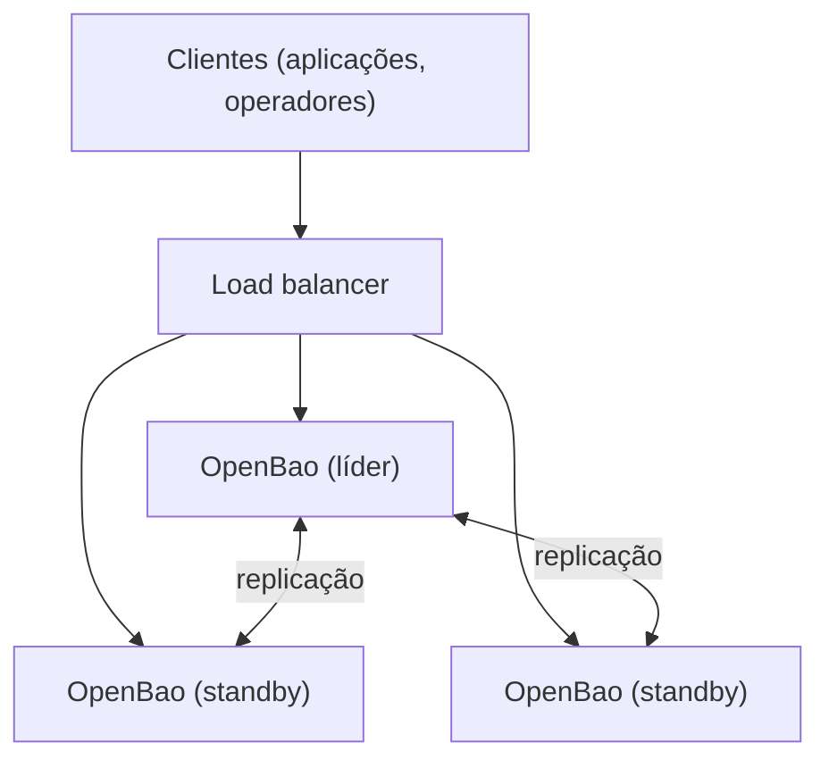

> **Para quem é:** operadores que já rodam OpenBao e precisam eliminar a perda total de acesso a segredos quando a única instância cai.

Uma instância única de OpenBao é um ponto único de falha: se o processo para, por crash, atualização ou qualquer outro motivo, nenhum segredo fica acessível até que ela volte. O modo de alta disponibilidade resolve isso rodando múltiplas réplicas que compartilham o mesmo estado, permitindo que uma assuma o papel de líder automaticamente quando a anterior falha.

## Como funciona

Em um cluster HA, apenas uma réplica é o **líder** a qualquer momento; é ela que processa as escritas (emissão de novas credenciais, rotação, alterações de política). As demais réplicas são **standbys**: podem atender leituras a partir do mesmo estado replicado, mas redirecionam qualquer escrita recebida para o líder atual. A eleição do líder segue o mesmo modelo de consenso Raft usado pelo etcd do próprio K3s (veja [arquitetura do K3s](../../clusters/k3s-architecture/)); quando o líder para de responder, as réplicas restantes elegem uma nova entre si em segundos, sem intervenção manual, desde que o número de réplicas disponíveis ainda satisfaça o quorum mínimo.

O quorum é o número mínimo de réplicas que precisa concordar para eleger um líder ou confirmar uma escrita, calculado como `floor(N/2) + 1` para um total de `N` réplicas. Esse cálculo é o motivo pelo qual topologias de HA usam sempre um número ímpar de réplicas: três réplicas toleram a perda de uma sem perder quorum (quorum = 2); cinco toleram a perda de duas (quorum = 3). Duas réplicas não oferecem vantagem sobre três, porque perder qualquer uma delas já derruba o quorum (que seria 2 de 2), eliminando o benefício de tolerância a falhas que justifica operar HA.

Cada réplica precisa passar pelo próprio processo de unseal antes de participar do cluster; em uma topologia HA, isso normalmente é combinado com [auto-unseal via KMS externo](../openbao-auto-unseal/), porque exigir a apresentação manual de chaves de unseal em cada réplica, a cada reinicialização, elimina boa parte do ganho de disponibilidade automática que a própria HA deveria proporcionar.

## Armazenamento compartilhado

Todas as réplicas de um cluster HA precisam enxergar o mesmo estado, o que exige um backend de armazenamento compartilhado entre elas. O caminho recomendado atualmente pelo próprio OpenBao é o **Integrated Storage**, baseado em Raft: cada réplica participa diretamente do consenso e mantém sua própria cópia replicada dos dados, sem depender de um serviço de armazenamento externo adicional. A alternativa mais estabelecida antes do Integrated Storage era usar o **Consul** como backend externo, que também implementa Raft internamente e serve como fonte de verdade compartilhada para as réplicas do OpenBao.

## Alternativas

Para uma topologia sem exigência de disponibilidade contínua, uma instância única (sem HA) é a opção mais simples de operar, aceitando que uma reinicialização causa uma janela de indisponibilidade até o processo voltar e ser unsealed novamente, como descrito em [OpenBao e Vault](../openbao-and-vault/).

## Quando usar HA

HA se justifica quando aplicações em produção dependem do OpenBao para operar (autenticação, credenciais de banco de dados emitidas dinamicamente, e outras integrações que falham sem acesso ao cofre) e uma indisponibilidade, mesmo breve, tem impacto real. Também se justifica em topologias distribuídas entre múltiplas zonas de disponibilidade, onde a perda de uma zona inteira não deve derrubar o acesso a segredos.

## Quando evitar

Em ambientes de desenvolvimento, teste, ou clusters pessoais de nó único, a complexidade adicional de operar múltiplas réplicas, um mecanismo de auto-unseal e um load balancer à frente delas raramente se justifica frente ao benefício. Uma instância única com backup regular de configuração e um procedimento documentado de unseal manual é suficiente nesse contexto.

## Decisões que isso implica

Habilitar HA sem também habilitar auto-unseal reduz boa parte do ganho de disponibilidade automática, porque uma reinicialização de qualquer réplica ainda exige intervenção manual antes que ela volte a participar do cluster. Trate as duas decisões (HA e auto-unseal) como uma unidade ao planejar uma topologia de produção.

## Páginas relacionadas

- [OpenBao e Vault](../openbao-and-vault/)
- [OpenBao auto-unseal com KMS externo](../openbao-auto-unseal/)
- [Configurar OpenBao em alta disponibilidade](../../../guides/tasks/secrets/configure-openbao-high-availability/)

## Referências

- [OpenBao: High Availability](https://openbao.org/docs/internals/high-availability/): documentação oficial do modelo de líder, standbys e eleição.
- [OpenBao: Integrated Storage](https://openbao.org/docs/internals/integrated-storage/): documentação oficial do backend de armazenamento baseado em Raft.
