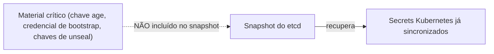

> **Para quem é:** quem já escolheu uma estratégia de segredos e precisa garantir que ela sobrevive a uma [reconstrução completa do cluster](../../../operations/disaster-recovery/rebuild-single-node-cluster/).

Um snapshot do etcd recupera os Secrets Kubernetes que já existiam no cluster, mas não recupera automaticamente a capacidade de decifrar ou sincronizar novos segredos depois de uma reconstrução — isso depende de material que, por design, fica fora do cluster.

## Como funciona

Cada estratégia de segredos tem seu próprio "material crítico" que precisa ser protegido separadamente:

| Estratégia | Material crítico a proteger fora do cluster |
| --- | --- |
| SOPS + age | Chave privada age |
| Sealed Secrets | Par de chaves do controller (backup automatizável, mas precisa ser verificado) |
| External Secrets Operator | Credencial do `SecretStore` para o backend externo |
| OpenBao (interno) | Chaves de unseal (ou configuração de auto-unseal) |
| Infisical | Credencial da Machine Identity de bootstrap |

## Alternativas

Sem uma cópia externa do material crítico, a única "recuperação" possível é recriar segredos do zero — aceitável apenas se todos os valores puderem ser reemitidos (ex.: credenciais rotacionáveis por uma API externa), nunca para segredos que não podem ser regenerados.

## Quando o material crítico precisa de tratamento especial

Sempre. Trate a chave age, a credencial de bootstrap ou as chaves de unseal com o mesmo cuidado usado para o token do K3s (veja [backup do etcd](../../../operations/backups/backup-k3s-etcd/)) — um gerenciador de senhas ou cofre físico, nunca um commit, mesmo em um repositório privado.

## Decisões que isso implica

Documente explicitamente, para a estratégia escolhida, onde o material crítico está guardado e quem tem acesso a ele — essa decisão é parte do procedimento de [recuperação do gerenciamento de segredos](../../../operations/disaster-recovery/recover-secret-management/).

## Páginas relacionadas

- [Recuperar o gerenciamento de segredos](../../../operations/disaster-recovery/recover-secret-management/)
- [Proteger chaves age](../../../operations/backups/protect-age-keys/)
- [O problema do bootstrap](../bootstrap-problem/)

## Referências

- [K3s — Backup and Restore](https://docs.k3s.io/datastore/backup-restore): confirma o que um snapshot do etcd inclui e não inclui.
