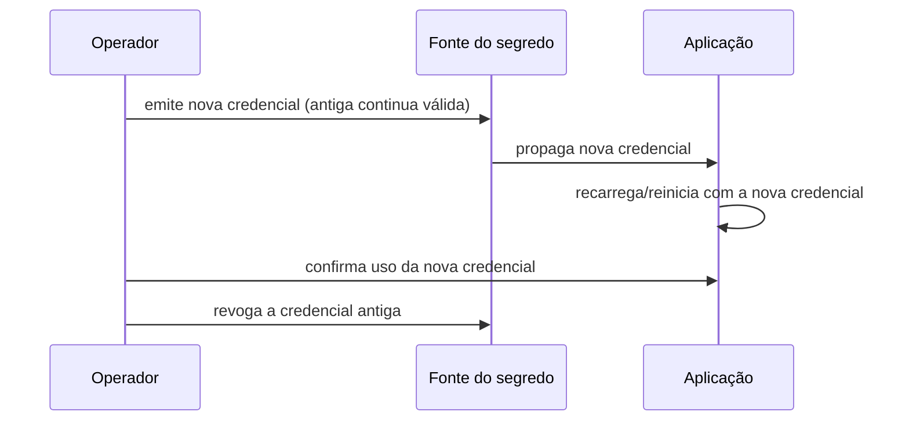

> **Para quem é:** quem precisa planejar a troca periódica ou emergencial de uma credencial já em uso por aplicações.

Trocar o valor de um segredo é fácil — o difícil é fazer isso sem causar indisponibilidade e sem deixar a credencial antiga utilizável.

## Como funciona

Uma rotação segura tem, no mínimo, quatro etapas: emitir a nova credencial sem invalidar a antiga, propagar a nova credencial para todos os consumidores, confirmar que todos os consumidores já usam a nova credencial, e só então revogar a antiga.

Pular a ordem — revogar a antiga antes de confirmar a propagação da nova — é a causa mais comum de indisponibilidade durante uma rotação "de rotina".

## Alternativas

Para credenciais de curtíssima duração (tokens que expiram em minutos, como os emitidos por autenticação dinâmica do Vault/OpenBao), a rotação é automática e contínua — não há uma "operação de rotação" distinta, o que elimina boa parte do risco descrito acima.

## Quando rotacionar

Em um cronograma regular (definido pela política de segurança do ambiente), imediatamente após a saída de alguém com acesso à credencial, ou imediatamente após suspeita de exposição (log acidental, commit indevido).

## Quando não improvisar

Nunca revogue uma credencial de produção antes de confirmar que a substituta já está em uso — verifique logs de autenticação ou métricas de erro antes de considerar a rotação concluída.

## Páginas relacionadas

- [Rotacionar um segredo de aplicação](../../../guides/tasks/secrets/rotate-application-secret/)
- [Configurar o token da Cloudflare](../../../guides/tasks/secrets/configure-cloudflare-token/)

## Referências

- [OWASP — Secrets Management Cheat Sheet](https://cheatsheetseries.owasp.org/cheatsheets/Secrets_Management_Cheat_Sheet.html): reúne práticas recomendadas de rotação e ciclo de vida de credenciais.
