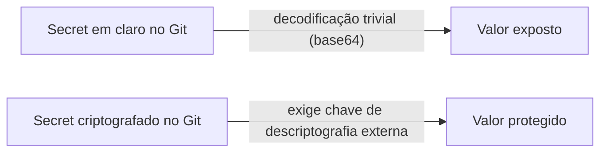

> **Para quem é:** quem está decidindo se pode versionar segredos no repositório GitOps deste notebook, e sob qual condição.

Um manifesto `Secret` do Kubernetes codifica seus valores em base64 — não criptografa. Qualquer pessoa com acesso de leitura ao repositório Git pode decodificar o valor com um único comando. Versionar um `Secret` em texto claro é equivalente a versionar a senha em um arquivo `.txt`.

## Como funciona

O GitOps pede que todo estado desejado esteja no Git, o que cria uma tensão aparente com segredos. A resolução não é abrir mão do GitOps para segredos — é garantir que o que entra no Git seja **criptografado**, não o valor em claro.

SOPS (com age) e Sealed Secrets resolvem isso de formas diferentes: SOPS criptografa os valores de um arquivo YAML/JSON usando uma chave assimétrica, mantendo a estrutura legível; Sealed Secrets criptografa o `Secret` inteiro usando a chave pública de um controller que roda no cluster de destino, e só esse controller consegue decifrá-lo.

## Alternativas

Não versionar o segredo (aplicá-lo manualmente, fora do Git) evita o risco de exposição, mas sacrifica reprodutibilidade — ninguém consegue recriar o cluster do zero sem uma etapa manual documentada à parte. Veja [o problema do bootstrap](../bootstrap-problem/) para quando esse trade-off é aceitável.

Um secret store externo (OpenBao, Infisical) remove o segredo do Git por completo — o repositório contém apenas a referência (qual caminho, qual projeto), não o valor. Veja [criptografia versus secret store](../encryption-vs-secret-store/) para a comparação completa.

## Quando usar criptografia no Git (SOPS/Sealed Secrets)

Quando o ambiente não tem (ou não quer manter) um serviço externo de segredos, e a equipe já está confortável gerenciando chaves de descriptografia com cuidado equivalente a uma credencial administrativa.

## Quando evitar

Se múltiplas pessoas ou automações precisam de rotação frequente e auditoria centralizada, um secret store externo tende a escalar melhor do que arquivos criptografados espalhados pelo repositório.

## Decisões que isso implica

A chave de descriptografia (age) ou a chave privada do controller (Sealed Secrets) nunca é versionada — sua perda é equivalente a perder acesso a todos os segredos protegidos por ela. Veja [proteger chaves age](../../../operations/backups/protect-age-keys/).

## Páginas relacionadas

- [Configurar SOPS com age](../../../guides/tasks/secrets/configure-sops-with-age/)
- [Instalar o Sealed Secrets](../../../guides/tasks/secrets/install-sealed-secrets/)
- [Criptografia versus secret store](../encryption-vs-secret-store/)

## Referências

- [SOPS — Mozilla](https://github.com/getsops/sops): documentação oficial do formato e uso do SOPS.
- [Sealed Secrets — Bitnami](https://github.com/bitnami-labs/sealed-secrets): documentação oficial do controller e do formato `SealedSecret`.
