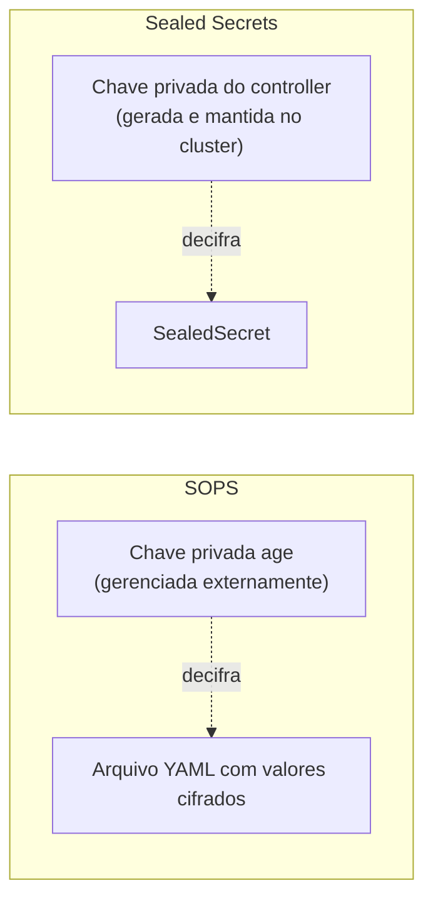

> **Para quem é:** quem decidiu usar [criptografia no Git](../encryption-vs-secret-store/) e precisa escolher entre SOPS e Sealed Secrets.

Ambos criptografam segredos antes do commit, mas com modelos de chave e integração diferentes.

## Como funciona

**SOPS** com o backend **age** criptografa valores individuais dentro de um arquivo YAML/JSON, mantendo chaves e estrutura legíveis — só os valores viram texto cifrado. A chave privada age fica fora do Git, tipicamente em um gerenciador de segredos ou arquivo local protegido; qualquer pessoa ou automação com essa chave pode decifrar. Veja [configurar SOPS com age](../../../guides/tasks/secrets/configure-sops-with-age/).

**Sealed Secrets** criptografa o `Secret` inteiro usando a chave pública de um controller específico que roda no cluster de destino. Só esse controller, com sua chave privada, consegue decifrar — o arquivo `SealedSecret` resultante só tem utilidade no cluster para o qual foi selado. Veja [instalar o Sealed Secrets](../../../guides/tasks/secrets/install-sealed-secrets/).

| Critério | SOPS + age | Sealed Secrets |
| --- | --- | --- |
| Onde a chave de decifra vive | Fora do cluster, gerenciada por quem versiona | Dentro do cluster, no controller |
| Portabilidade entre clusters | Alta — a mesma chave decifra em qualquer lugar | Baixa — selado para um controller/cluster específico |
| Integração com Argo CD | Requer um passo adicional de decodificação (plugin ou hook) | Nativa via CRD `SealedSecret`, reconciliado normalmente |
| Rotação da chave | Manual, reversível reencriptando os arquivos | Suportada pelo controller, com rotação periódica automática |
| Backup crítico | A chave privada age | O par de chaves do controller |

## Alternativas

Um [secret store externo](../encryption-vs-secret-store/) evita o problema de gerenciar uma chave de criptografia local por completo, ao custo de depender de um serviço adicional.

## Quando usar SOPS

Quando a portabilidade entre ambientes é importante (a mesma chave funciona em múltiplos clusters) ou quando a equipe já usa SOPS para outros fins (arquivos de configuração fora do Kubernetes).

## Quando usar Sealed Secrets

Quando a integração nativa com o modelo de reconciliação do Kubernetes/Argo CD é prioridade, e não há necessidade de portar os segredos cifrados entre clusters diferentes.

## Decisões que isso implica

Qualquer uma das duas escolhas exige backup da chave privada correspondente — sem ela, os segredos cifrados no Git são irrecuperáveis. Veja [proteger chaves age](../../../operations/backups/protect-age-keys/) e o procedimento equivalente de backup do par de chaves do Sealed Secrets controller.

## Páginas relacionadas

- [Configurar SOPS com age](../../../guides/tasks/secrets/configure-sops-with-age/)
- [Usar SOPS com Argo CD](../../../guides/tasks/secrets/use-sops-with-argocd/)
- [Instalar o Sealed Secrets](../../../guides/tasks/secrets/install-sealed-secrets/)

## Referências

- [SOPS — Mozilla](https://github.com/getsops/sops): documentação oficial do formato e dos backends de criptografia suportados.
- [age — FiloSottile](https://github.com/FiloSottile/age): especificação e implementação da ferramenta de criptografia assimétrica usada com SOPS.
- [Sealed Secrets — Bitnami](https://github.com/bitnami-labs/sealed-secrets): documentação oficial do controller, CRD e rotação de chaves.
