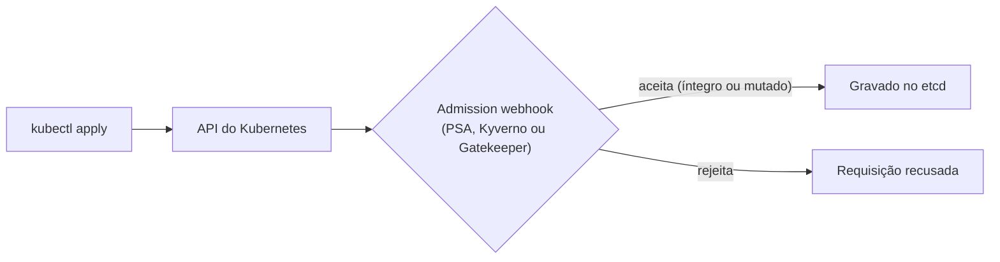

> **Para quem é:** operadores que precisam impedir que manifests inseguros ou fora de padrão cheguem a rodar no cluster, em vez de depender de revisão manual.

Um cluster Kubernetes aceita, por padrão, qualquer manifest que passe pela validação de esquema da API. Nada impede que um Pod suba como root, sem limites de recursos, com `hostNetwork` habilitado ou com uma `NetworkPolicy` que libera todo o tráfego. Essas condições não são erros de sintaxe: são manifests tecnicamente válidos que violam expectativas de segurança e operação. Policy enforcement resolve esse problema inserindo uma etapa de validação (e, em alguns casos, de modificação) entre o `kubectl apply` e a gravação do recurso no etcd, usando o mecanismo de admission webhooks da API do Kubernetes.



As três abordagens mais usadas para isso são o Pod Security Admission, o Kyverno e o OPA/Gatekeeper. Elas não competem pelo mesmo espaço: diferem em quanto controle oferecem, em que linguagem as políticas são escritas e em se conseguem apenas rejeitar recursos ou também modificá-los antes de aceitá-los.

## Pod Security Admission: o piso mínimo nativo

O Pod Security Admission (PSA) é um admission controller embutido no Kubernetes desde a versão 1.25, criado para substituir o antigo PodSecurityPolicy (removido do projeto). Ele não usa uma linguagem de política customizada nem exige a instalação de nada: funciona rotulando um namespace com um dos três níveis definidos pela [Pod Security Standards](https://kubernetes.io/docs/concepts/security/pod-security-standards/): `privileged` (sem restrições), `baseline` (bloqueia as configurações mais claramente inseguras, como privilégios elevados ou acesso a namespaces do host) e `restricted` (aplica as práticas recomendadas de hardening de Pods, como exigir `runAsNonRoot` e remover capabilities Linux por padrão).

```bash
kubectl label namespace default \
  pod-security.kubernetes.io/enforce=baseline
```

Esse rótulo instrui o `kube-apiserver` a rejeitar, na etapa de admissão, qualquer Pod criado no namespace `default` que viole o nível `baseline`. A validação cobre apenas o `PodSpec`: campos como `securityContext`, `hostNetwork`, `hostPID` e capabilities. O PSA não valida labels obrigatórias, não valida outros tipos de recurso (Deployments, Services, Ingress) além do que se reflete no Pod resultante, e não modifica manifests para corrigi-los. Essa limitação é intencional: o PSA cobre o caso comum de segurança de Pods com zero instalação e zero curva de aprendizado, e deixa para outras ferramentas qualquer regra que não caiba nos três níveis pré-definidos.

## Kyverno: políticas como manifests Kubernetes

O Kyverno estende o mesmo mecanismo de admission webhook, mas define políticas como recursos Kubernetes nativos (`ClusterPolicy` ou `Policy`, com escopo de namespace), escritos em YAML e usando a mesma sintaxe de seletores e padrões que já aparece em outros manifests do cluster. Isso elimina a necessidade de aprender uma linguagem de política separada: uma equipe que já lê `Deployments` e `NetworkPolicies` consegue ler uma `ClusterPolicy` do Kyverno sem treinamento adicional.

```yaml
apiVersion: kyverno.io/v1
kind: ClusterPolicy
metadata:
  name: require-non-root
spec:
  validationFailureAction: Enforce
  rules:
    - name: check-runAsNonRoot
      match:
        any:
          - resources:
              kinds:
                - Pod
      validate:
        message: "Pods devem definir runAsNonRoot: true"
        pattern:
          spec:
            securityContext:
              runAsNonRoot: true
```

O campo `validationFailureAction: Enforce` faz o Kyverno rejeitar a requisição quando o Pod não corresponde ao padrão definido em `validate.pattern`; com `Audit`, a violação é registrada mas o recurso é aceito, o que é útil para medir o impacto de uma política antes de torná-la obrigatória. Além de validar, o Kyverno pode mutar recursos (por exemplo, injetar automaticamente uma `NetworkPolicy` padrão em todo namespace novo) e gerar novos recursos a partir de um evento (`generate`), algo que o Pod Security Admission não faz. Essa combinação faz do Kyverno a opção mais indicada quando as regras necessárias vão além de segurança de Pods, mas ainda são expressáveis como comparação de campos e padrões, sem exigir lógica condicional complexa.

## OPA/Gatekeeper: política como código

O Open Policy Agent (OPA) é um motor de política de propósito geral, não específico do Kubernetes: a mesma engine é usada para validar requisições de API, decisões de autorização em microsserviços e outros contextos fora de clusters. O Gatekeeper é o componente que integra o OPA ao Kubernetes como admission webhook, empacotando políticas em CRDs (`ConstraintTemplate` e `Constraint`).

Políticas no Gatekeeper são escritas em Rego, a linguagem de consulta do OPA, desenhada para expressar regras sobre dados estruturados. Rego permite lógica condicional, agregação e referências a dados externos que o Kyverno, com sua sintaxe de padrões, não expressa com a mesma naturalidade: por isso o Gatekeeper é a escolha mais indicada quando a política reflete um requisito de compliance específico (PCI-DSS, HIPAA) com regras que dependem de múltiplas condições combinadas, ou quando o mesmo conjunto de políticas Rego precisa ser reaproveitado fora do cluster. O custo dessa flexibilidade é a curva de aprendizado: Rego é uma linguagem declarativa com uma sintaxe própria, e escrever políticas corretas nela exige mais tempo de adaptação do que escrever um padrão YAML no Kyverno.

## Escolhendo entre as três

A tabela resume as diferenças estruturais entre as três abordagens; a decisão prática raramente é "qual delas é melhor" e quase sempre é "qual delas cobre a próxima regra que falta".

| Aspecto | Pod Security Admission | Kyverno | OPA/Gatekeeper |
| --- | --- | --- | --- |
| Instalação | Nativa, nenhuma | Requer instalar o controller | Requer instalar o controller |
| Linguagem de política | Nenhuma (3 níveis fixos) | YAML (padrões e seletores) | Rego |
| Escopo de validação | Apenas `PodSpec` | Qualquer recurso Kubernetes | Qualquer recurso Kubernetes |
| Muta recursos | Não | Sim | Limitado (webhook de mutação separado, menos usado) |
| Gera novos recursos | Não | Sim | Não |
| Curva de aprendizado | Nenhuma | Baixa | Alta |

Na prática, essas três camadas não são mutuamente exclusivas. Um ponto de partida razoável é habilitar o Pod Security Admission em nível `baseline` (ou `restricted`, se o cluster tolerar a restrição adicional) em todos os namespaces, o que já elimina as configurações de Pod mais claramente inseguras sem exigir nenhuma instalação. A partir daí, o Kyverno cobre regras adicionais específicas do cluster, como exigir labels obrigatórias, limitar `imagePullPolicy` ou injetar uma `NetworkPolicy` padrão em namespaces novos. O OPA/Gatekeeper entra apenas quando surge uma exigência de compliance que não se expressa como um padrão simples, porque o custo de manter políticas em Rego só se justifica quando a alternativa mais simples não é suficiente.

## Validação

Depois de aplicar uma política, confirme que ela está ativa e se comportando como esperado antes de assumir que o cluster está protegido. Para o Pod Security Admission, o rótulo do namespace é a própria fonte da verdade:

```bash
kubectl get namespace default \
  -o jsonpath='{.metadata.labels}'
```

Para Kyverno e Gatekeeper, tentar criar deliberadamente um recurso que viola a política é a forma mais direta de confirmar que a rejeição funciona:

```bash
kubectl run test-root --image=nginx --restart=Never
```

Se a política estiver ativa e em modo de aplicação, o comando deve falhar com uma mensagem referenciando a política ou constraint violada (por exemplo, `admission webhook "validate.kyverno.svc-fail" denied the request`), não um erro genérico de sintaxe. A ausência de rejeição pode indicar que a política está em modo de auditoria (`Audit` no Kyverno, `dryrun` no Gatekeeper), que o webhook não está respondendo, ou que o namespace usado no teste está fora do escopo do `match` da política; verificar os logs do controller (`kyverno` ou `gatekeeper-controller-manager`, em `kube-system` ou no namespace de instalação) ajuda a diferenciar esses casos.

## Páginas relacionadas

- [Configurar network policies (procedimento)](../../guides/tasks/networking/configure-network-policies/)

## Referências

- [Pod Security Standards (Kubernetes)](https://kubernetes.io/docs/concepts/security/pod-security-standards/): especificação oficial dos três níveis (`privileged`, `baseline`, `restricted`).
- [Kyverno (documentação oficial)](https://kyverno.io/docs/): guia de instalação, tipos de política e exemplos.
- [OPA/Gatekeeper (documentação oficial)](https://open-policy-agent.github.io/gatekeeper/website/docs/): guia de instalação, `ConstraintTemplate`, `Constraint` e Rego.
