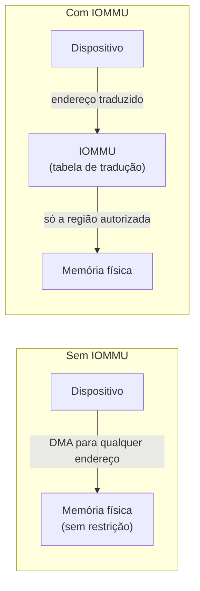
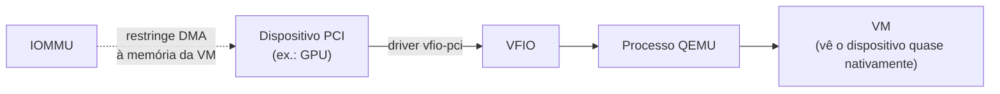

> **Para quem é:** quem já entende [DMA](../../computing-fundamentals/interrupts-dma-and-the-syscall-path/#dma-acesso-direto-à-memória) e [tradução de endereço via MMU](../../computing-fundamentals/how-cpus-execute-instructions/) e quer saber o que protege o host quando um dispositivo físico é passado diretamente para uma VM.

[Interrupções, DMA e o caminho completo de uma syscall](../../computing-fundamentals/interrupts-dma-and-the-syscall-path/#dma-acesso-direto-à-memória) descreveu DMA como o dispositivo transferindo dados diretamente de ou para uma região de memória que a CPU indicou, sem detalhar o que impede um dispositivo defeituoso ou comprometido de apontar para uma região de memória arbitrária em vez de respeitar a região que lhe foi indicada. Esta página fecha essa lacuna: o IOMMU é a peça de hardware que resolve exatamente esse problema, e é também a peça que torna possível, ou impossível, passar um dispositivo PCI real diretamente para uma VM QEMU/KVM.

## O problema: DMA sem controle é acesso irrestrito à memória

Um dispositivo com capacidade de DMA, por definição, escreve e lê memória do sistema diretamente, sem passar pela CPU a cada byte. Sem nenhum mecanismo de controle entre o dispositivo e o barramento de memória, esse acesso é irrestrito: o dispositivo pode, por erro de programação, falha de hardware, ou firmware malicioso, direcionar uma transferência DMA para qualquer endereço físico do sistema, incluindo memória do kernel ou de outros processos que nada têm a ver com aquele dispositivo. Esse é exatamente o mesmo problema que a MMU resolve para processos em espaço de usuário, impedir que um processo acesse memória fora do que lhe foi alocado, traduzindo endereços virtuais para endereços físicos permitidos, mas aplicado a dispositivos de hardware em vez de processos.

## IOMMU: uma MMU para dispositivos

O IOMMU (Input-Output Memory Management Unit) é, na prática, o equivalente da MMU aplicado a dispositivos: uma unidade de hardware que intercepta os endereços que um periférico usa em uma transferência DMA e os traduz para endereços físicos permitidos, segundo uma tabela de tradução que o sistema operacional configura. Um dispositivo sob controle do IOMMU não enxerga memória física diretamente: ele opera sobre um espaço de endereços que o IOMMU traduz e restringe, do mesmo jeito que um processo em modo usuário opera sobre endereços virtuais que a MMU traduz e restringe.

Intel VT-d e AMD-Vi são as duas implementações de hardware equivalentes desse mecanismo, uma por fabricante de CPU; o conceito e o propósito são os mesmos, mudando apenas o nome comercial e detalhes de habilitação na BIOS/UEFI e no kernel. Sem uma das duas presente e habilitada, nenhum dos usos descritos a seguir é possível.

## Grupos de IOMMU

Na prática, o IOMMU não isola dispositivos individualmente: ele isola **grupos** de dispositivos, conjuntos que precisam ser tratados como uma unidade porque compartilham o mesmo caminho de acesso ao barramento PCIe, por exemplo todos os dispositivos atrás da mesma ponte PCIe ou de um mesmo controlador. Dois dispositivos no mesmo grupo de IOMMU não podem ser isolados um do outro pelo hardware disponível: se um deles for passado para uma VM, o outro precisa ir junto, mesmo que só um dos dois seja realmente necessário no guest.

Esse comportamento é o motivo prático mais comum pelo qual passthrough de um dispositivo específico, uma GPU, por exemplo, às vezes obriga a mover outros dispositivos aparentemente não relacionados do mesmo grupo, uma placa de som integrada à GPU, uma porta USB adicional na mesma ponte, junto para a VM, mesmo que o objetivo original fosse só a GPU. Verificar o agrupamento de IOMMU de um sistema (listando `/sys/kernel/iommu_groups/` no Linux) antes de planejar um passthrough evita descobrir essa limitação só depois de já ter tentado configurar tudo.

## VFIO: a ligação prática com QEMU/KVM

VFIO (Virtual Function I/O) é o framework do kernel Linux que expõe um dispositivo PCI, isolado por um grupo de IOMMU, como um driver de espaço de usuário seguro, o mecanismo que [QEMU e KVM](../qemu-and-kvm/) usam para passar esse dispositivo diretamente para dentro de uma VM. Em vez do dispositivo ser controlado pelo driver normal do kernel do host, ele é vinculado ao driver genérico `vfio-pci`, que o mantém disponível para ser atribuído a um processo QEMU específico; a partir desse ponto, o guest dentro da VM enxerga e controla o dispositivo físico quase como se estivesse rodando diretamente sobre o hardware, com o IOMMU garantindo que o DMA da VM não escape para fora da memória alocada a ela.

O caso de uso mais comum que leva alguém a precisar entender IOMMU na prática, fora de um contexto de infraestrutura corporativa, é justamente esse: passar uma GPU dedicada para uma VM Windows ou Linux rodando sobre QEMU/KVM em um homelab ou desktop, para jogos ou uma aplicação que exige acesso quase nativo ao hardware gráfico, algo que a emulação de vídeo padrão de uma VM não oferece.

## Páginas relacionadas

- [Interrupções, DMA e o caminho completo de uma syscall](../../computing-fundamentals/interrupts-dma-and-the-syscall-path/): a explicação de DMA que esta página assume como conhecida.
- [Como a CPU executa instruções](../../computing-fundamentals/how-cpus-execute-instructions/): a MMU e a tradução de endereço para processos, o paralelo direto do que o IOMMU faz para dispositivos.
- [QEMU e KVM](../qemu-and-kvm/): o hypervisor que consome um dispositivo exposto via VFIO para passthrough.

## Referências

- [VFIO — documentação do kernel Linux](https://docs.kernel.org/driver-api/vfio.html): arquitetura do framework e do driver `vfio-pci`.
- [Intel — Virtualization Technology for Directed I/O (VT-d)](https://www.intel.com/content/www/us/en/support/articles/000090164/processors.html): visão oficial da implementação Intel do IOMMU.
- [AMD-Vi / AMD I/O Virtualization Technology](https://www.amd.com/en/technologies/virtualization): visão oficial da implementação AMD do IOMMU.
- [PCI passthrough via OVMF — Arch Wiki](https://wiki.archlinux.org/title/PCI_passthrough_via_OVMF): guia prático amplamente usado pela comunidade para configurar grupos de IOMMU e VFIO em um passthrough real.
