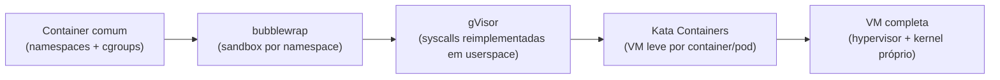

> **Para quem é:** quem já entende [container vs. VM](../vms-vs-containers/) como os dois extremos e quer saber o que existe entre eles, sem se aprofundar em nenhuma tecnologia específica.

Container e VM não são as duas únicas opções; várias tecnologias ocupam pontos intermediários desse espectro, trocando força de isolamento por overhead de forma diferente da escolha binária original. Esta página mapeia esse espectro brevemente; o aprofundamento de cada tecnologia individual fica fora do escopo.

## MicroVMs: Firecracker

Firecracker é um VMM (monitor de máquina virtual) de código aberto criado pela AWS para os serviços Lambda e Fargate, construído sobre KVM. Ele reduz o conjunto de dispositivos emulados a apenas cinco (`virtio-net`, `virtio-block`, `virtio-vsock`, console serial e um controlador de teclado mínimo), o que reduz tanto a superfície de ataque quanto o overhead de cada instância; até a escrita deste texto, a documentação oficial cita inicialização em torno de 125ms e overhead de memória abaixo de 5 MiB por microVM, uma ordem de grandeza mais próxima de um container do que de uma VM tradicional, mantendo o isolamento de ter um kernel convidado próprio por trás do KVM.

## Sandboxes de processo: gVisor

gVisor, criado pelo Google, segue um caminho diferente: em vez de rodar um kernel convidado separado sobre um hypervisor, ele intercepta as chamadas de sistema do processo confinado e as atende por conta própria, através de um componente chamado Sentry, um "kernel de aplicação" rodando em espaço de usuário, escrito em Go. As chamadas não chegam ao kernel real do host; um componente separado, o Gofer, medeia o acesso a filesystem via um protocolo próprio, já que o Sentry roda com acesso direto ao filesystem já restringido. `runsc`, o runtime OCI do gVisor, integra tudo isso ao Docker e ao Kubernetes como qualquer outro runtime. O resultado é uma camada de isolamento mais forte que namespaces/seccomp sozinhos, sem o overhead fixo de uma VM completa, ao custo de reimplementar (não repassar) a superfície de syscalls que a aplicação usa, o que pode expor incompatibilidades com chamadas de sistema menos comuns.

## `bubblewrap`: revisão rápida

`bubblewrap` já foi apresentado em [observando containers de fora](../../containers/observing-containers/#bubblewrap-isolamento-leve-sem-engine-de-container): um sandbox leve baseado nos mesmos namespaces do Linux, sem daemon nem formato de imagem. No espectro desta página, ele fica mais próximo do lado "container comum" que do lado gVisor/Kata: usa exatamente os mesmos mecanismos de isolamento já cobertos na trilha de containers (namespaces e cgroups), só que declarados por linha de comando em vez de por um runtime completo.

## Containers rodando dentro de VMs leves: Kata Containers

Kata Containers inverte a lógica de um container comum: em vez de compartilhar o kernel do host, cada container (ou Pod) roda dentro de sua própria VM leve, usando QEMU ou o próprio Firecracker como VMM por trás. O runtime (`kata-runtime`) é compatível com a especificação OCI, funcionando como substituto direto de `runc` para quem quer o isolamento de VM (kernel próprio por instância) mantendo a interface e as ferramentas já usadas para operar containers. O custo dessa troca aparece tanto em tempo de início quanto em memória: relatos de benchmark citam algo entre 100ms e 300ms para iniciar um Kata Container, contra a faixa de dezenas de milissegundos de um container comum, e um piso de memória bem mais alto por instância; confirme números atuais na documentação oficial antes de dimensionar capacidade com base neles.

## Referências

- [Firecracker — site oficial](https://firecracker-microvm.github.io/): modelo de dispositivos mínimo e números de performance.
- [gVisor — documentação oficial](https://gvisor.dev/docs/): arquitetura completa do Sentry, do Gofer e do `runsc`.
- [Kata Containers — documentação de arquitetura](https://kata-containers.github.io/kata-containers/design/architecture/): design oficial, hypervisors suportados e integração via `shimv2`.
