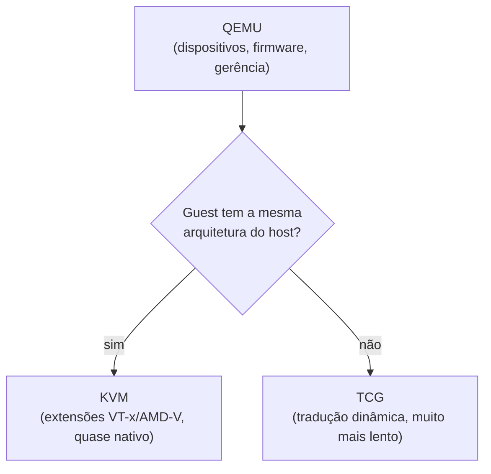
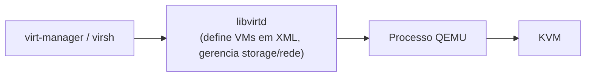

> **Para quem é:** quem já entende [máquina virtual vs. container](../vms-vs-containers/) no nível conceitual e quer saber, na prática, o que é QEMU, o que é KVM e como as duas peças se encaixam para rodar uma VM completa.

[Máquinas virtuais vs. containers](../vms-vs-containers/) já estabeleceu que uma VM roda seu próprio kernel sobre hardware virtualizado por um hypervisor, citando o KVM de passagem como o hypervisor mais comum em infraestrutura self-hosted. Esta página abre essa citação: o que o KVM de fato faz, por que ele quase sempre aparece ao lado do QEMU e não sozinho, e como as duas peças se combinam com [microVMs](../microvms-and-sandboxes/#microvms-firecracker) e com a camada de gerência que a maioria dos usuários toca na prática, `libvirt`/`virt-manager`.

## Dois motores diferentes: TCG e KVM

QEMU pode rodar uma máquina virtual de duas formas fundamentalmente diferentes, e a diferença entre elas explica praticamente todo o resto desta página.

Em modo de emulação pura, QEMU usa o TCG (Tiny Code Generator), um tradutor dinâmico de instruções: ele lê as instruções da arquitetura de CPU convidada, uma a uma, e as traduz em tempo real para instruções equivalentes da arquitetura do host. Esse mecanismo é o que permite rodar uma VM com uma arquitetura de CPU completamente diferente da do host, por exemplo emular um sistema ARM inteiro sobre um host x86_64, algo impossível para o KVM. O custo dessa flexibilidade é desempenho: cada instrução convidada passa por tradução antes de executar, o que torna o TCG uma ou duas ordens de magnitude mais lento que executar a mesma carga diretamente no hardware.

KVM (Kernel-based Virtual Machine) é um módulo do kernel Linux que expõe diretamente as extensões de virtualização de hardware da CPU (Intel VT-x ou AMD-V) para um processo em espaço de usuário. Quando o host e o guest compartilham a mesma arquitetura de CPU, o KVM permite que a maior parte das instruções do guest execute diretamente no processador físico, sem tradução, com a CPU alternando entre modo host e modo guest por meio de instruções de hardware dedicadas para isso. O resultado é desempenho próximo do nativo, tipicamente dentro de uma margem de alguns pontos percentuais da execução direta no host, muito diferente da penalidade pesada da tradução via TCG.

QEMU e KVM não competem entre si: QEMU sozinho, usando TCG, é um emulador completo mas lento; KVM sozinho é só um módulo de kernel que expõe extensões de virtualização, sem interface de usuário nem dispositivos virtuais próprios. A combinação comum, e a que a maioria das instalações de virtualização em Linux usa por padrão, é QEMU como processo de espaço de usuário que emula os dispositivos periféricos da VM (disco, rede, vídeo, USB) enquanto delega a execução da CPU e da memória ao KVM sempre que a arquitetura do guest permite. Nessa combinação, QEMU continua presente mesmo quando o KVM está ativo: ele fornece o modelo de dispositivos, o firmware de boot e a interface de gerência, mesmo não sendo mais ele quem executa cada instrução do guest.

## `libvirt` e `virt-manager`: a camada de gerência

QEMU e KVM, por si só, expõem uma interface de linha de comando extensa (`qemu-system-x86_64` com dezenas de flags) e nenhuma abstração de mais alto nível para tarefas comuns como definir uma VM de forma persistente, gerenciar seu ciclo de vida ou configurar redes e storage compartilhados entre várias VMs. `libvirt` é a camada que resolve isso: um daemon (`libvirtd`) e uma API que abstraem QEMU/KVM (e outros hypervisors, como Xen ou VMware ESXi, atrás da mesma interface), definindo VMs como XML declarativo, gerenciando pools de armazenamento, redes virtuais e snapshots de forma consistente independentemente do hypervisor por trás.

`virt-manager` é a interface gráfica mais comum sobre `libvirt`, e `virsh` é a interface de linha de comando equivalente. Na prática, a maioria dos usuários que rodam QEMU/KVM em um desktop ou em um homelab nunca invoca `qemu-system-x86_64` diretamente: eles criam e gerenciam VMs por `virt-manager` ou `virsh`, e é `libvirt` quem monta e executa o comando QEMU completo por trás, com todas as flags necessárias, a partir da definição XML da VM.

## O formato de disco `qcow2`

QEMU suporta várias formas de armazenamento para o disco virtual de uma VM, da mais simples (uma imagem bruta, `raw`, byte a byte idêntica ao conteúdo do disco) a formatos próprios com recursos adicionais. `qcow2` (QEMU Copy-On-Write, versão 2) é o formato mais usado na prática, por reunir várias vantagens sobre uma imagem bruta:

- **alocação fina** (thin provisioning): o arquivo `qcow2` cresce conforme dados reais são escritos, em vez de reservar o tamanho total declarado do disco desde a criação, o que evita desperdiçar espaço do host com blocos que a VM nunca chegou a usar;
- **snapshots internos**: o formato suporta pontos de recuperação armazenados dentro do próprio arquivo, sem depender de um mecanismo de snapshot externo do sistema de arquivos do host;
- **encadeamento de camadas** (backing files): uma imagem `qcow2` pode declarar outra como base somente leitura, armazenando só as diferenças, um padrão útil para criar várias VMs a partir de uma imagem base comum sem duplicar o conteúdo idêntico entre elas;
- **compressão opcional** por cluster, às custas de mais processamento ao escrever.

O custo dessas vantagens é uma camada adicional de indireção em cada acesso a disco comparada a uma imagem `raw`, que pode se traduzir em alguma perda de desempenho de I/O dependendo da carga; para cargas sensíveis a latência de disco, avalie `raw` sobre um volume dedicado como alternativa, mantendo `qcow2` como o padrão razoável para a maioria dos usos de laboratório e homelab.

## Quando usar QEMU "puro" em vez de uma microVM

[MicroVMs e sandboxes de processo](../microvms-and-sandboxes/) já cobriu Firecracker, gVisor e Kata Containers como pontos intermediários entre um container comum e uma VM completa, todos otimizados para inicializar rapidamente e isolar uma única carga de trabalho, frequentemente orquestrada por um sistema como Kubernetes. QEMU/KVM via `libvirt`/`virt-manager` continua sendo a resposta certa quando o caso de uso é uma VM de propósito geral, de longa duração, administrada como uma máquina completa (um desktop virtual, um servidor de testes com um sistema operacional diferente do host, um ambiente Windows para uma aplicação específica): exatamente o oposto do perfil de inicialização rápida e vida curta que justifica uma microVM. Kata Containers, aliás, já usa QEMU como um dos VMMs possíveis por trás, então a escolha entre "QEMU puro" e "QEMU via Kata" não é entre duas tecnologias diferentes, mas entre dois modelos de operação sobre a mesma base.

## Páginas relacionadas

- [Máquinas virtuais vs. containers](../vms-vs-containers/): a comparação conceitual da qual esta página detalha o lado da VM.
- [MicroVMs e sandboxes de processo](../microvms-and-sandboxes/): o espectro de isolamento entre container comum e VM completa, incluindo Kata Containers, que usa QEMU como VMM.
- [IOMMU e passthrough de dispositivos](../iommu-and-device-passthrough/): como passar um dispositivo PCI real, como uma GPU, diretamente para uma VM QEMU/KVM.

## Referências

- [QEMU — documentação oficial](https://www.qemu.org/docs/master/): referência completa de dispositivos, formatos de disco e modos de execução.
- [KVM — documentação oficial do kernel Linux](https://docs.kernel.org/virt/kvm/index.html): arquitetura do módulo de kernel e das extensões de virtualização de hardware.
- [libvirt — documentação oficial](https://libvirt.org/docs.html): definição de domínios em XML, pools de armazenamento e redes virtuais.
- [QEMU — QCOW2 image format](https://qemu.readthedocs.io/en/latest/interop/qcow2.html): especificação do formato de disco `qcow2`.
