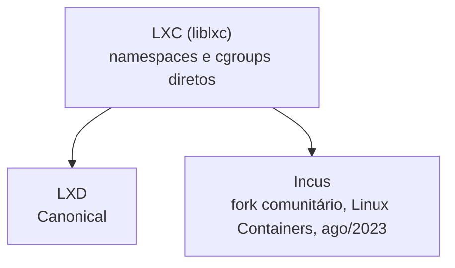

> **Para quem é:** quem já entende os [containers de aplicação](../../containers/container-as-a-process/) (um processo, imutável, efêmero) e quer saber o que muda em um container que roda um sistema completo, com init e múltiplos serviços, como uma VM leve.

Um **container de sistema** roda um init completo (`systemd`, na maioria das distribuições atuais) e, a partir dele, quantos serviços a imagem base tiver: `cron`, `syslog`, um servidor SSH, múltiplos daemons, exatamente como uma instalação Linux tradicional dentro de uma VM. Isso o distingue de um **container de aplicação** (o modelo Docker/Podman/OCI já coberto na trilha de containers), desenhado para empacotar um processo só, sem init, tratado como efêmero e substituível, não como um sistema a administrar e atualizar in-place.

## LXC: a base de baixo nível

LXC (Linux Containers) é o conjunto de ferramentas e biblioteca (`liblxc`) que usa namespaces e cgroups diretamente para criar containers, um projeto anterior ao Docker (por volta de 2008), mantido por engenheiros que também contribuíram boa parte do trabalho original de namespaces e cgroups no kernel. LXC sozinho é uma camada de baixo nível: cria e gerencia containers via linha de comando ou API C, sem um daemon central, sem API REST, sem gerenciamento de imagens ou clustering.

## LXD → Incus: o fork comunitário

LXD nasceu como a camada de gerenciamento sobre o LXC: um daemon com API REST, gerenciamento de imagens, armazenamento e rede abstraídos, e suporte a clustering entre hosts, desenvolvido pela Canonical. Em agosto de 2023, depois de a Canonical exigir que todo contribuidor do LXD assinasse um CLA (Contributor License Agreement) transferindo os direitos do código para a empresa e mover o projeto para fora da governança comunitária do Linux Containers, parte da equipe original do LXD (incluindo Stéphane Graber, um dos mantenedores históricos) criou o Incus como um fork comunitário, sob a mesma organização Linux Containers; o fork se tornou membro oficial do projeto Linux Containers em 7 de agosto de 2023.

Até a escrita deste texto, os dois projetos continuam ativos separadamente: LXD sob governança exclusiva da Canonical, Incus sob a organização comunitária Linux Containers, com boa parte dos mantenedores históricos do LXD hoje concentrados no Incus. Confirme o estado atual de cada projeto (atividade de desenvolvimento, adoção por distribuições, direção de cada um) diretamente nas fontes oficiais antes de adotar qualquer um dos dois, já que essa divisão é relativamente recente e pode evoluir.

## `systemd-nspawn`

`systemd-nspawn` é o gerenciador de containers incluído no próprio `systemd`, disponível por padrão em qualquer distribuição que já use `systemd` como init, sem instalar nenhum pacote adicional. Ele inicializa um container leve a partir de uma árvore de diretórios ou imagem, rodando um init completo dentro do namespace criado; `machinectl`, também parte do `systemd`, gerencia esses containers depois de iniciados (listar, parar, entrar em uma sessão). É a opção mais direta para testar rapidamente uma imagem de outra distribuição, ou para depurar um ambiente isolado, sem depender de LXC/Incus nem de uma VM completa.

## Diferença para containers de aplicação

Um container de aplicação é construído para ser substituído, não atualizado: uma nova versão da imagem substitui o container inteiro, o estado que precisa sobreviver fica em um volume externo, e orquestradores como o Kubernetes tratam a unidade como descartável ("cattle", não "pet"). Um container de sistema é administrado como uma VM leve: pacotes são atualizados in-place dentro dele (`apt upgrade` rodando de dentro do container, por exemplo), o container tem uma identidade persistente e configuração acumulada ao longo do tempo, e não existe (nem faz sentido existir) uma "imagem" versionada e imutável da forma como uma imagem OCI funciona.

## Casos de uso reais

Containers de sistema se justificam para replicar rapidamente um ambiente de teste de uma distribuição completa sem o custo de boot e memória de uma VM, para rodar uma aplicação legada que já assume múltiplos serviços coexistindo sob um único init (um `cron`, um `syslog` e a aplicação em si, sem refatoração para o modelo de um processo por container), ou para hospedagem de múltiplos ambientes isolados em um único host físico em um laboratório pessoal, como alternativa mais leve a várias VMs completas quando todos os ambientes já rodam Linux.

## Referências

- [LXC — documentação oficial](https://linuxcontainers.org/lxc/introduction/): arquitetura da biblioteca de baixo nível.
- [Incus — introdução oficial](https://linuxcontainers.org/incus/): histórico do projeto e sua relação com o LXD.
- [Incus: A new fork of Canonical's LXD 'containervisor' — The Register](https://www.theregister.com/2023/08/04/incus_lxd_fork/): cobertura contemporânea do fork, com a data e o contexto do CLA da Canonical.
- [`systemd-nspawn(1)`](https://www.freedesktop.org/software/systemd/man/latest/systemd-nspawn.html): página de manual oficial, opções e modelo de uso.
- [`machinectl(1)`](https://www.freedesktop.org/software/systemd/man/latest/machinectl.html): gerenciamento de containers `systemd-nspawn` já em execução.
