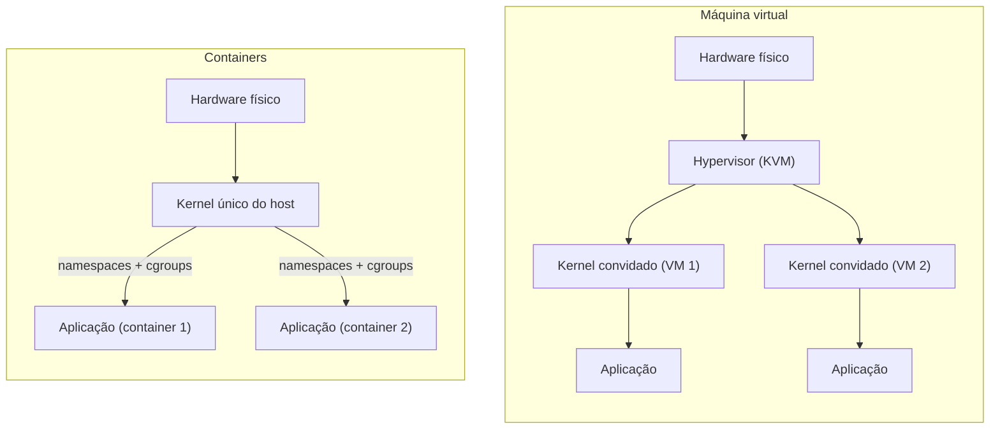

> **Para quem é:** quem já entende, a partir de [um container é um processo](../../containers/container-as-a-process/), que um container compartilha o kernel do host, e quer a comparação completa com o modelo de máquina virtual.

[Um container é um processo](../../containers/container-as-a-process/#kernel-compartilhado-não-emulado) fechava com uma distinção resumida em uma frase: "container isola visão e recursos dentro de um kernel único; VM isola executando um kernel próprio sobre outro", prometendo a comparação completa para quando esta página existisse. Esta é essa página, retomando a mesma conclusão pelo lado oposto: em vez de partir do container e chegar à VM, parte da VM para mostrar exatamente o que ela isola que um container não isola, e ao mesmo custo de quê.

## Hypervisor vs. kernel compartilhado

Uma máquina virtual roda seu próprio kernel completo, sobre hardware virtualizado ou paravirtualizado por um **hypervisor** (KVM, integrado ao kernel Linux, é o hypervisor tipo 1 mais comum em infraestrutura self-hosted). O hypervisor apresenta a cada VM uma visão de hardware (CPU, memória, disco, rede) independente das demais VMs no mesmo host físico, e o kernel convidado dentro da VM não sabe, a não ser que seja informado explicitamente (paravirtualização), que está rodando sobre hardware virtualizado em vez de físico.

Um container, como já detalhado na trilha de containers desta seção, não tem kernel próprio nem hypervisor: todos os containers de um host, e o próprio host, compartilham o mesmo kernel, com [namespaces](../../containers/namespaces/) e [cgroups](../../containers/cgroups/) produzindo a visão isolada e os limites de recursos, sem nenhuma camada de virtualização de hardware entre o processo confinado e o kernel real.

## O que cada modelo isola de fato

| Aspecto | Máquina virtual | Container |
| --- | --- | --- |
| Kernel | Próprio, por VM | Compartilhado com o host e com os demais containers |
| Isolamento de hardware | Virtualizado ou paravirtualizado pelo hypervisor | Nenhum; acesso direto ao kernel real do host |
| Superfície de ataque entre instâncias | Limitada ao hypervisor, se o kernel convidado for comprometido | O kernel do host inteiro, se um mecanismo de isolamento falhar |
| Diversidade de sistema operacional convidado | Qualquer SO suportado pelo hypervisor (Windows sobre host Linux, por exemplo) | Só binários compatíveis com o kernel do host (Linux sobre host Linux) |

## Custo por instância

Uma VM precisa inicializar um kernel completo e, tipicamente, um processo de init próprio antes de qualquer aplicação começar a rodar, o que custa segundos a dezenas de segundos de boot e um piso de memória alocada (mesmo com técnicas de overcommit do hypervisor) medido em centenas de megabytes, independentemente de quão pequena seja a aplicação real dentro dela. Um container não tem esse boot: como [já estabelecido](../../containers/container-as-a-process/), iniciar um container é criar um processo e aplicar isolamento a ele, não inicializar um sistema operacional inteiro, então o custo por instância se aproxima do custo real da própria aplicação, sem o piso adicional de um kernel e um init completos. Essa diferença de custo é o que permite rodar dezenas ou centenas de containers em um host onde caberiam poucas VMs equivalentes, a chamada densidade de instâncias por host.

## Superfície de ataque

Comprometer uma aplicação dentro de uma VM e, a partir daí, alcançar o host físico exige, em geral, duas etapas: primeiro comprometer o kernel convidado daquela VM, depois encontrar uma falha de escape do próprio hypervisor, uma superfície de ataque historicamente pequena e intensamente escrutinada. Comprometer uma aplicação dentro de um container e alcançar o host exige, em geral, só uma etapa: uma falha no próprio kernel do host, o mesmo kernel que o container já usa diretamente para toda chamada de sistema. Essa diferença de uma camada a menos é o motivo pelo qual mecanismos que adicionam uma segunda camada de contenção a um container (sandboxes como `bubblewrap`, já visto na trilha de containers, ou tecnologias que interceptam chamadas de sistema, ou executam o container dentro de uma microVM) existem: eles tentam recuperar parte da separação que uma VM tem por padrão, sem pagar o custo total de boot e memória de uma VM completa.

## Quando cada um é a resposta certa

Uma VM se justifica quando o requisito é isolamento forte entre cargas de trabalho de diferentes origens de confiança rodando no mesmo hardware físico (multi-tenant com inquilinos não confiáveis entre si), quando a carga de trabalho precisa de um sistema operacional diferente do host, ou quando a customização de kernel por carga de trabalho é um requisito real, não hipotético. Um container se justifica quando as cargas de trabalho já compartilham compatibilidade de kernel (Linux sobre Linux, o caso comum de qualquer cluster Kubernetes/K3s), quando densidade e velocidade de inicialização importam mais que isolamento máximo por instância, e quando o modelo de confiança já assume que tudo rodando no mesmo host pertence à mesma organização ou ao mesmo nível de confiança. Nenhum dos dois modelos substitui o outro de forma universal; a maioria dos ambientes de produção reais usa os dois juntos, VMs como unidade de isolamento entre clientes ou ambientes, containers como unidade de empacotamento e densidade dentro de cada VM.

## Páginas relacionadas

- [Um container é um processo](../../containers/container-as-a-process/), a página que esta conclui do lado oposto.
- [Namespaces do kernel](../../containers/namespaces/) e [cgroups](../../containers/cgroups/), os mecanismos que produzem isolamento sem hypervisor.

## Referências

- [KVM — documentação oficial do kernel Linux](https://docs.kernel.org/virt/kvm/index.html): arquitetura do hypervisor integrado ao kernel Linux.
- [QEMU — documentação oficial](https://www.qemu.org/docs/master/): a camada de emulação de hardware comumente usada junto ao KVM.
- [`namespaces(7)`](https://man7.org/linux/man-pages/man7/namespaces.7.html): referência já citada na trilha de containers, para o mecanismo de isolamento sem hypervisor.
