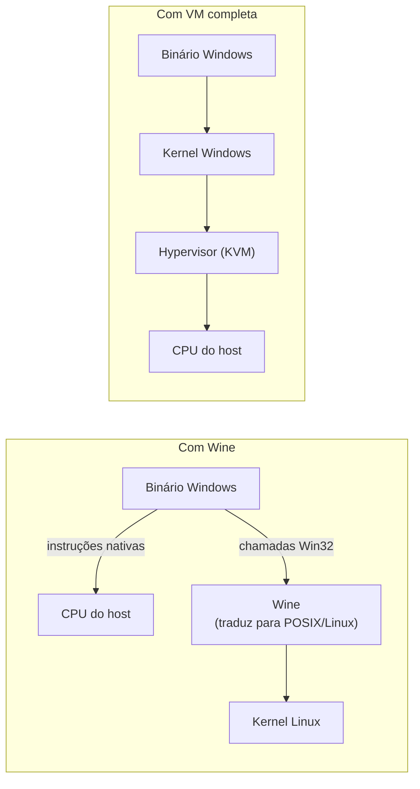

> **Para quem é:** quem já entende a diferença entre [emulação e virtualização acelerada](../qemu-and-kvm/) e quer saber por que Wine e Bottles não se encaixam em nenhuma das duas categorias, apesar de resolverem um problema parecido, rodar software Windows em Linux.

As páginas anteriores desta trilha tratam de isolamento e virtualização: uma VM roda um sistema operacional convidado completo sobre hardware emulado ou virtualizado. Wine resolve um problema vizinho, mas fundamentalmente diferente: rodar um binário Windows em Linux sem emular hardware nenhum e sem que exista, em nenhum momento, um kernel Windows em execução. Entender essa diferença é o que permite decidir corretamente entre Wine/Bottles e uma VM completa via [QEMU/KVM](../qemu-and-kvm/) para um caso de uso real.

## Tradução de API, não emulação de hardware

Um binário Windows compilado para x86_64 contém instruções de máquina nativas daquela arquitetura, as mesmas instruções que um processador Intel ou AMD executa diretamente, independentemente de o sistema operacional por baixo ser Windows ou Linux. O que torna um binário Windows incompatível com Linux não é a arquitetura de CPU, mas a interface: ele espera chamar a API Win32 (`CreateFileW`, `RegOpenKeyEx`, e milhares de outras funções do ecossistema Windows) e receber de volta um comportamento específico dessa API, uma API que o kernel Linux não implementa.

Wine intercepta essas chamadas e as traduz para equivalentes do POSIX/Linux: uma chamada Win32 de abertura de arquivo é convertida na chamada de sistema Linux equivalente, uma chamada de registro do Windows é atendida por uma estrutura de dados própria do Wine que simula esse registro, e assim por diante para milhares de funções da API. O binário Windows continua sendo executado diretamente pelo processador do host, sem tradução de instrução por instrução: só as chamadas à API do sistema operacional passam pela camada de tradução do Wine. É por isso que, em CPUs da mesma arquitetura, o overhead de rodar uma aplicação sob Wine é tipicamente pequeno comparado ao de emulação completa, próximo do desempenho nativo para a maior parte das aplicações. Essa mesma característica é também o limite do modelo: como não há tradução de instrução, um binário Windows compilado para ARM não roda sob Wine em um host x86, nem o inverso, exatamente o oposto da emulação via TCG do QEMU, que traduz instrução por instrução e por isso funciona entre arquiteturas diferentes, ao custo de ser muito mais lenta.

## Prefix: um `C:\` isolado por aplicação

Wine organiza o ambiente de cada instalação em um **prefix**, um diretório que contém uma estrutura de arquivos e um registro simulados, equivalentes ao que uma instalação Windows real teria em `C:\`, incluindo `Program Files`, `System32` simulado e as chaves de registro que a aplicação espera encontrar. Cada prefix é isolado dos demais: uma aplicação instalada em um prefix não enxerga o que está instalado em outro, o que permite manter versões diferentes de bibliotecas Windows (DLLs), configurações de registro conflitantes, ou até versões diferentes do próprio Wine, uma por aplicação, sem que uma interfira na outra. Esse isolamento por prefix é o que possibilita, por exemplo, rodar duas aplicações que exigem versões incompatíveis da mesma dependência lado a lado no mesmo host.

## DXVK e VKD3D: Direct3D sobre Vulkan

Jogos e aplicações gráficas Windows tipicamente usam Direct3D, a API gráfica proprietária da Microsoft, que não existe nativamente em Linux. DXVK traduz chamadas Direct3D 9/10/11 para Vulkan, a API gráfica multiplataforma de baixo nível; VKD3D faz o equivalente para Direct3D 12. Essas duas camadas são o que permite que jogos Windows atinjam desempenho gráfico competitivo sob Wine, traduzindo a API gráfica da mesma forma que o Wine traduz o restante da API Win32, em vez de reimplementar Direct3D do zero ou depender de um driver gráfico proprietário da Microsoft, que não existe para Linux.

## Bottles: gerência de prefixes, runners e dependências

Usar Wine diretamente exige gerenciar manualmente prefixes, escolher qual versão do Wine (chamada de **runner**) usar para cada aplicação, e instalar dependências comuns (bibliotecas de runtime do Visual C++, .NET, fontes) que muitas aplicações Windows esperam encontrar já presentes. Bottles é uma interface gráfica que empacota essa gerência: cada "bottle" (garrafa) corresponde a um prefix isolado, com um runner específico associado e um conjunto de dependências instaláveis por template, sem exigir que o usuário edite variáveis de ambiente ou rode comandos `winetricks` manualmente para cada uma. Bottles não substitui o Wine, é construído sobre ele: toda a tradução de API descrita acima continua sendo feita pelo Wine: Bottles só organiza e simplifica o que, de outra forma, seria gerenciado por linha de comando.

## Wine/Bottles vs. VM completa: critério de decisão

Wine/Bottles e uma VM completa via [QEMU/KVM](../qemu-and-kvm/) resolvem o mesmo problema de alto nível, rodar software Windows em um host Linux, mas com trade-offs opostos, e a escolha certa depende do caso específico:

| Critério | Wine/Bottles | VM completa (QEMU/KVM) |
| --- | --- | --- |
| Desempenho | Próximo do nativo, sem overhead de virtualização de hardware | Overhead de virtualização, geralmente pequeno com KVM, mas presente |
| Compatibilidade de driver | Limitada ao que o Wine/DXVK/VKD3D traduzem; drivers Windows nativos não rodam | Total: drivers Windows reais rodam dentro do guest |
| Anti-cheat de jogos | Muitos sistemas anti-cheat de kernel detectam ou recusam rodar sob Wine deliberadamente | Depende de detecção de virtualização pelo anti-cheat, variável por jogo |
| Isolamento do sistema convidado | Nenhum: a aplicação roda sob o mesmo kernel Linux do host, sem um Windows completo por trás | Total: um kernel Windows completo, isolado pelo hypervisor |
| Backup/portabilidade do ambiente | Um prefix é uma pasta; copiável e versionável facilmente | Uma imagem de disco completa, maior, mas também um artefato único |
| Compatibilidade de aplicação | Alta para a maioria das aplicações comuns e muitos jogos, mas não garantida; algumas aplicações nunca funcionam corretamente | Praticamente garantida, é um Windows real |

Na prática, Wine/Bottles se justifica quando a aplicação é compatível (verificável previamente em bases de compatibilidade da comunidade), quando desempenho importa mais do que compatibilidade total, e quando não há dependência de um driver ou anti-cheat que exija um Windows real. Uma VM completa se justifica quando a aplicação usa recursos de sistema que o Wine não traduz corretamente, quando há dependência de um driver de hardware específico do Windows, ou quando o jogo/aplicação ativamente detecta e recusa rodar sob camadas de compatibilidade.

## Alternativas e contexto

CrossOver, da CodeWeaves, é um produto comercial baseado no mesmo motor Wine, com suporte pago e integração adicional; não é uma tecnologia diferente, é uma distribuição comercial do mesmo projeto. Para virtualização full-stack em vez de um hypervisor operado diretamente via `libvirt`, Proxmox VE e VMware são alternativas com camadas de gerência e clustering próprias, fora do escopo desta trilha, que trata de conceitos, não de uma plataforma de virtualização completa.

## Fora do escopo desta página

Suporte a jogos via Proton (a camada de compatibilidade da Valve para o Steam Play, construída sobre Wine com patches e integrações próprias) é mencionado aqui só como contexto: Proton usa exatamente os mesmos mecanismos descritos acima, Wine para tradução de API e DXVK/VKD3D para gráficos, mas empacotados e mantidos pela Valve especificamente para o catálogo da Steam, um assunto próprio que esta página não aprofunda.

## Páginas relacionadas

- [QEMU e KVM](../qemu-and-kvm/): a alternativa de VM completa, com isolamento total mas overhead maior.
- [Máquinas virtuais vs. containers](../vms-vs-containers/): o modelo de isolamento que uma VM completa oferece e que Wine/Bottles não tenta replicar.

## Referências

- [WineHQ — documentação oficial](https://gitlab.winehq.org/wine/wine/-/wikis/home): arquitetura do Wine, compatibilidade de aplicações e o AppDB de compatibilidade reportada pela comunidade.
- [Bottles — documentação oficial](https://docs.usebottles.com/): conceito de bottle, runners e dependências gerenciadas.
- [DXVK — repositório oficial](https://github.com/doitsujin/dxvk): tradução de Direct3D 9/10/11 para Vulkan.
- [VKD3D-Proton — repositório oficial](https://github.com/HansKristian-Work/vkd3d-proton): tradução de Direct3D 12 para Vulkan.
