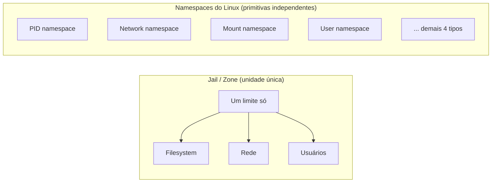

> **Para quem é:** quem já entende [namespaces do Linux](../../containers/namespaces/) e quer saber que o problema de isolar múltiplos ambientes em um único kernel já tinha solução em produção anos antes do Linux ter uma resposta equivalente.

FreeBSD Jails e Solaris Zones resolveram, cada um à sua forma, o mesmo problema central que os namespaces do Linux resolvem hoje, isolar múltiplos ambientes rodando sobre um único kernel, anos antes do Linux ter uma resposta equivalente. Entender os dois ajuda a ver o que é decisão de design específica do Linux e o que é um problema mais antigo e mais geral de sistemas operacionais Unix.

## FreeBSD Jails

O mecanismo de jail foi desenvolvido em 1999 por Poul-Henning Kamp, encomendado por um provedor de hospedagem compartilhada que precisava separar os ambientes de clientes diferentes no mesmo servidor físico; entrou no FreeBSD 4.0, lançado em 14 de março de 2000. Isso é anterior ao primeiro namespace do Linux (o mount namespace, incorporado ao kernel 2.4.19 em 2002) por pelo menos dois anos, e décadas anterior aos oito tipos de namespace que o Linux tem hoje.

Segundo o próprio FreeBSD Handbook, um jail parte do conceito de `chroot(2)` (que só restringe acesso ao filesystem) e o expande, virtualizando três recursos ao mesmo tempo: o filesystem, o conjunto de usuários e a pilha de rede. Um processo comprometido dentro de um jail encontra uma superfície de escape bem menor que um processo dentro de um `chroot` simples, porque as três dimensões de isolamento precisam ser contornadas juntas, não só uma.

## Solaris Zones

Solaris Zones foi introduzida no Solaris 10 (2005). O modelo se organiza em torno de uma **zona global** (a instância do sistema operacional rodando diretamente sobre o hardware, com controle administrativo sobre todas as demais) e uma ou mais **zonas não-globais**, cada uma uma instância isolada dedicada a um conjunto específico de aplicações. Segundo a documentação oficial da Oracle, o isolamento de processos entre zonas é forte o suficiente para que "mesmo um processo rodando com credenciais de root não consiga ver ou afetar atividade em outras zonas", uma garantia mais explícita do que o modelo Linux costuma declarar por padrão (onde root dentro de um namespace ainda depende de user namespaces configurados corretamente para ter a mesma garantia, como já visto em [user namespaces](../../containers/user-namespaces/)).

Uma variante, a **kernel zone**, roda seu próprio kernel separado, podendo inclusive rodar uma versão diferente do Solaris da zona global; isso a aproxima conceitualmente mais do modelo de [máquina virtual](../vms-vs-containers/) do que do modelo de container com kernel compartilhado, uma distinção que o próprio ecossistema Solaris trata como uma escolha explícita entre dois tipos de zona, não uma característica única e uniforme de "zonas" no geral.

## Semelhanças e diferenças conceituais com o modelo Linux

A semelhança central é a mesma em todos os três: um único kernel, compartilhado, com um mecanismo do próprio sistema operacional decidindo o que cada ambiente isolado consegue ver e afetar, sem a camada de hypervisor de uma VM. A diferença estrutural mais importante está em como cada modelo compõe esse isolamento.

Um jail ou uma zona (não-kernel) empacota filesystem, rede e usuários como uma única unidade de isolamento, ativada ou desativada em conjunto; não existe, no modelo original de nenhum dos dois, a opção de isolar só a rede de um processo enquanto ele continua vendo o filesystem do host, por exemplo. O modelo Linux trata cada dimensão de isolamento como um [tipo de namespace independente](../../containers/namespaces/), que um processo pode adotar seletivamente: um container pode compartilhar o namespace de rede do host (`--network host`) enquanto ainda tem seu próprio mount namespace, uma composição que o modelo monolítico de jail/zone não oferece da mesma forma granular.

## O que o ecossistema Linux herdou dessas ideias

Jails e Zones provaram, em produção, anos antes do Linux ter um mecanismo equivalente completo, que isolar múltiplos ambientes sobre um único kernel compartilhado era viável e seguro o suficiente para hospedagem multi-cliente. O caminho do Linux até os namespaces atuais foi incremental, começando pelo mount namespace em 2002 e só completando o conjunto com user namespaces em 2013 (kernel 3.8); nesse intervalo, projetos como o OpenVZ (um patch de kernel Linux fora da árvore principal, anterior aos namespaces nativos) já ofereciam isolamento parecido ao de um jail/zone, adaptando o mesmo conceito básico de compartimentalização para o Linux antes que o kernel principal tivesse suporte nativo a ele. LXC, coberto na página anterior desta trilha, nasceu diretamente sobre os namespaces nativos assim que ficaram disponíveis, mas o problema que ele resolve, e o vocabulário usado para descrevê-lo, já estava bem estabelecido pelos sistemas Unix que vieram antes.

## Referências

- [FreeBSD Handbook: Jails](https://docs.freebsd.org/en/books/handbook/jails/): documentação oficial, incluindo a comparação explícita com `chroot`.
- [FreeBSD jail — Wikipedia](https://en.wikipedia.org/wiki/FreeBSD_jail): histórico de criação, com referências à autoria de Poul-Henning Kamp.
- [Introduction to Oracle Solaris Zones](https://docs.oracle.com/cd/E53394_01/html/E54762/zones.intro-2.html): documentação oficial da Oracle, incluindo o modelo de zona global/não-global e kernel zones.
- [`namespaces(7)`](https://man7.org/linux/man-pages/man7/namespaces.7.html): já citada na trilha de containers, referência para a cronologia de introdução de cada tipo de namespace no Linux.
