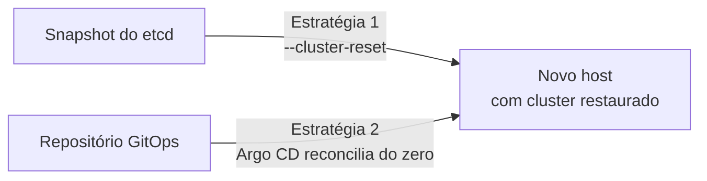

> **Pré-requisitos:** snapshot do etcd (ou repositório GitOps, se optar por reconstrução via Git), token do K3s original, novo host preparado.
> **Versões testadas:** K3s v1.36.1+k3s1.

Um cluster de nó único não tem failover: a perda do host físico (disco, hardware, provedor) exige reconstruir o cluster inteiro em uma nova máquina. Esta página cobre as duas estratégias possíveis; escolha uma antes de começar, conforme [ordem de recuperação](../../backups/backup-and-recovery/#ordem-de-recuperação). Misturar as duas estratégias no mesmo processo produz um estado inconsistente.



## Estratégia 1: restaurar do snapshot do etcd

Recupera o estado exato registrado no último snapshot, incluindo recursos que não estavam declarados no Git.

1. [Preparar um servidor Debian](../../../guides/tasks/host/prepare-debian-server/) na nova máquina, com o mesmo hostname e, se possível, o mesmo IP do host original (simplifica `tls-san` e DNS).
2. [Instalar o K3s](../../../guides/tasks/kubernetes/install-first-k3s-server/) até o ponto de gerar `config.yaml`, sem iniciar o serviço no fluxo normal.
3. [Restaurar o snapshot do etcd](../restore-k3s-etcd/) usando `--cluster-reset` no lugar da inicialização padrão.
4. Validar nós, Pods de sistema e Applications do Argo CD.

**Quando usar:** quando o snapshot é recente o suficiente para o RPO aceito, e é importante recuperar também o estado que não estava declarado no Git (recursos criados manualmente, por exemplo).

## Estratégia 2: reconstruir via GitOps

Cria um cluster novo e deixa o Argo CD reconciliar o estado a partir do Git: não recupera nada que não estava declarado.

1. [Preparar um servidor Debian](../../../guides/tasks/host/prepare-debian-server/) na nova máquina.
2. Seguir a [sequência de implantação completa do blueprint](../../../guides/blueprints/k3s-single-node-gitops/implementation/) do zero: K3s, Gateway API, cert-manager, Argo CD.
3. No bootstrap GitOps, [conectar o mesmo repositório](../../../guides/tasks/gitops/connect-git-repository/) e [aplicar a Application raiz](../../../guides/tasks/gitops/create-root-application/) já usada antes.
4. Restaurar dados de volumes persistentes separadamente (fora do escopo do etcd/Git); veja [backup e recuperação](../../backups/backup-and-recovery/) para a matriz de ativos.

**Quando usar:** quando o repositório GitOps está atualizado, o snapshot do etcd está indisponível ou desatualizado, ou quando reconstruir do zero é preferível a herdar um estado potencialmente inconsistente do snapshot.

## Validação (ambas as estratégias)

> **Executar em:** o novo host.

```yaml
k3s kubectl get nodes
k3s kubectl get pods --all-namespaces
k3s kubectl get applications.argoproj.io --namespace argocd
```

Siga a checklist completa de [validar o cluster](../../../guides/tasks/kubernetes/validate-k3s-cluster/) e a [validação do blueprint](../../../guides/blueprints/k3s-single-node-gitops/validation/) antes de considerar a reconstrução concluída.

## Troubleshooting

Se optar pela estratégia via Git e algumas Applications não sincronizarem, confirme que a ordem de dependências (CRDs antes de recursos que os usam) foi respeitada; veja [criar a Application raiz](../../../guides/tasks/gitops/create-root-application/) para o comportamento esperado do App-of-Apps.

## Próximo passo

Depois de validado, atualize o DNS/endpoint externo se o IP do novo host mudou, e registre o incidente e a duração real da reconstrução como evidência de RTO no [roteiro de restore drill](../../backups/backup-and-recovery/#roteiro-de-restore-drill).

## Fontes e leitura adicional

- [K3s — Backup and Restore](https://docs.k3s.io/datastore/backup-restore): referência da estratégia de restauração via snapshot.
- [Cluster bootstrapping — Argo CD](https://argo-cd.readthedocs.io/en/stable/operator-manual/cluster-bootstrapping/): referência da estratégia de reconstrução via GitOps.
