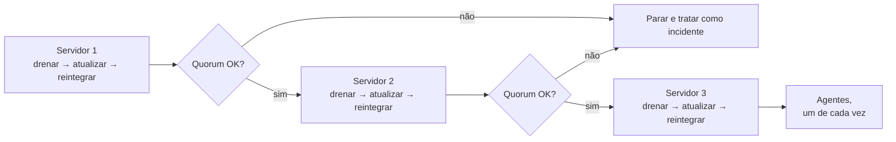

import ScriptHelper from '../../../../components/ScriptHelper.astro';
import cordonAndDrainScript from '../../../../scripts/cordon-and-drain-node.sh?raw';
import upgradeK3sServerScript from '../../../../scripts/upgrade-k3s-server.sh?raw';
import upgradeK3sAgentScript from '../../../../scripts/upgrade-k3s-agent.sh?raw';

> **Pré-requisitos:** kubeconfig administrativo, acesso root a cada nó, cluster saudável (todos os nós `Ready`, quorum de servidores intacto) e um snapshot recente do etcd copiado para fora do host.
> **Versões testadas:** K3s v1.36.1+k3s1.

Em um cluster com múltiplos servidores, a atualização não precisa interromper o cluster inteiro: cada nó é drenado, atualizado e reintegrado individualmente, enquanto os demais continuam servindo tráfego. Isso só funciona se os nós forem atualizados um de cada vez, na ordem correta (servidores antes de agentes), com o quorum verificado entre cada etapa; atualizar vários nós em paralelo elimina exatamente a margem de segurança que esse procedimento existe para garantir.



## Antes de começar

Confirme que o cluster está em condição saudável antes de iniciar: `kubectl get nodes` deve mostrar todos os nós `Ready`, sem nenhum servidor já indisponível. Crie e copie um snapshot recente do etcd (veja [backup do etcd](../../backups/backup-k3s-etcd/)) e mantenha-o acessível fora do host, para o caso de a atualização precisar de uma recuperação. Leia também as notas de versão do release alvo e confirme a compatibilidade com os componentes já instalados (cert-manager, Argo CD, Longhorn).

K3s segue a [política de version skew do Kubernetes](https://kubernetes.io/releases/version-skew-policy/): não pule versões minor (atualize `v1.34 → v1.35 → v1.36`, não diretamente `v1.34 → v1.36`), e evite manter servidores em versões minor diferentes por mais tempo do que o necessário para completar o rolling upgrade. Durante a janela de transição, com alguns servidores já atualizados e outros ainda na versão anterior, o cluster continua funcional: essa é justamente a condição que torna a atualização sem downtime possível, mas ela deve ser temporária, não um estado prolongado.

## Atualizar um servidor

Repita esta sequência para cada servidor, um de cada vez, aguardando o nó voltar a `Ready` e o quorum se manter antes de seguir para o próximo.

### Drenar o servidor

<ScriptHelper
  runWhere="estação administrativa com kubeconfig"
  script={cordonAndDrainScript}
  fields={[
    { var: 'K3S_NODE_NAME', label: 'Nome do servidor a atualizar' },
  ]}
/>

### Atualizar o K3s no servidor

Depois que o `drain` terminar e os workloads tiverem saído do nó, conecte-se a ele por SSH e execute a atualização:

<ScriptHelper
  runUser="root"
  runWhere="o servidor em atualização"
  script={upgradeK3sServerScript}
  fields={[
    { var: 'K3S_VERSION', label: 'Versão exata do K3s que será instalada' },
  ]}
/>

### Reintegrar e validar

> **Executar em:** estação administrativa com kubeconfig.

```bash
kubectl wait --for=condition=Ready "node/${K3S_NODE_NAME}" --timeout=300s
kubectl uncordon "${K3S_NODE_NAME}"
kubectl get nodes
```

Confirme que todos os servidores aparecem `Ready` (incluindo os que ainda não foram atualizados) antes de prosseguir para o próximo. Se o quorum não se recompuser dentro de alguns minutos, pare e trate como incidente antes de tocar em outro servidor; veja [falha e recuperação em multinode](../disaster-recovery/multinode-scenarios/).

## Atualizar um agente

Depois que **todos** os servidores estiverem na versão alvo, repita um processo equivalente para cada agente. Agentes não participam do quorum do etcd, então a ordem entre eles é menos crítica, mas atualizar um de cada vez continua reduzindo o impacto de uma falha durante a atualização.

<ScriptHelper
  runWhere="estação administrativa com kubeconfig"
  script={cordonAndDrainScript}
  fields={[
    { var: 'K3S_NODE_NAME', label: 'Nome do agente a atualizar' },
  ]}
/>

<ScriptHelper
  runUser="root"
  runWhere="o agente em atualização"
  script={upgradeK3sAgentScript}
  fields={[
    { var: 'K3S_VERSION', label: 'Versão exata do K3s que será instalada' },
  ]}
/>

```bash
kubectl wait --for=condition=Ready "node/${K3S_NODE_NAME}" --timeout=300s
kubectl uncordon "${K3S_NODE_NAME}"
```

## Validação final

> **Executar em:** estação administrativa com kubeconfig.

```bash
kubectl get nodes -o wide
kubectl get pods --all-namespaces
```

Todos os nós devem reportar a versão alvo em `kubectl get nodes -o wide` (coluna `KUBELET-VERSION`) e nenhum Pod deve estar fora de `Running`/`Completed` sem explicação. Confirme também que Argo CD, Traefik e demais componentes de plataforma se recuperaram normalmente.

## Troubleshooting

Se um `drain` travar por muito tempo, algum Pod pode estar demorando a encerrar; aumente o período de graça em vez de forçar a remoção:

```bash
kubectl drain "${K3S_NODE_NAME}" \
  --ignore-daemonsets \
  --delete-emptydir-data \
  --grace-period=300
```

Se um servidor não voltar a `Ready` depois de atualizado, `journalctl -u k3s -n 100 --no-pager` no próprio nó normalmente indica a causa; incompatibilidade de versão com um CRD instalado é uma causa comum. Não force a atualização de outro nó enquanto o anterior não estiver saudável.

Perda de quorum durante o procedimento não deveria acontecer se os nós forem atualizados um de cada vez, com verificação de saúde entre cada etapa. Se acontecer mesmo assim, pare o procedimento imediatamente e siga [falha e recuperação em multinode](../disaster-recovery/multinode-scenarios/#perda-de-quorum-crítico) em vez de tentar reverter manualmente um único servidor: restaurar às pressas, sem seguir o procedimento de restauração de etcd, é a forma mais comum de transformar uma atualização problemática em uma perda de dados maior.

## Próximo passo

- [Manutenção nó a nó](../../maintenance/node-maintenance/): rotinas de drenagem e reintegração fora do contexto de uma atualização.
- [Falha e recuperação em multinode](../disaster-recovery/multinode-scenarios/): runbook de resposta caso o quorum seja perdido durante o procedimento.

## Fontes e leitura adicional

- [K3s — Manual Upgrades](https://docs.k3s.io/upgrades/manual): guia oficial de atualização manual, incluindo a ordem recomendada entre servidores e agentes.
- [Kubernetes — Version Skew Policy](https://kubernetes.io/releases/version-skew-policy/): define as combinações de versão suportadas entre componentes do control plane e kubelets.
- [Kubernetes — Safely Drain a Node](https://kubernetes.io/docs/tasks/administer-cluster/safely-drain-node/): referência oficial de `cordon`, `drain` e `uncordon`.
