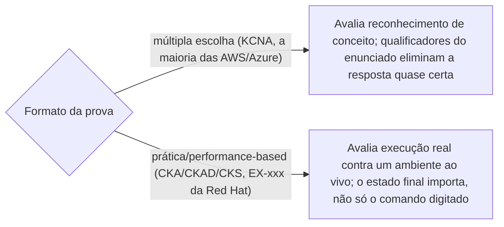

> **Para quem é:** quem já opera o que este notebook ensina (K3s, Argo CD, Prometheus) e está avaliando por onde começar a validar esse conhecimento formalmente.

Esta página não lista certificações; mapeia o território antes de entrar em cada uma. As páginas por ecossistema desta seção ([Kubernetes/CNCF](kubernetes-cncf/), [AWS](aws/), [Azure](azure/), [Red Hat](red-hat/)) cobrem o conteúdo de cada prova; aqui fica só a distinção que evita confundir uma credencial com outra.

## As quatro organizações relevantes para este notebook

- **CNCF / Linux Foundation**: mantém a família de certificações Kubernetes (KCNA, CKA, CKAD, CKS) e um conjunto crescente de especializações por projeto do ecossistema cloud native (Prometheus, OpenTelemetry, Argo, Istio, Cilium, Kyverno). É a organização mais diretamente alinhada com a stack que este notebook usa (K3s é uma distribuição Kubernetes; Argo CD, Prometheus e os demais projetos cobertos aqui têm certificação própria nessa família).
- **AWS**: certificações próprias por papel (arquitetura, operação, desenvolvimento, segurança), mais credenciais específicas de serviço como o EKS Knowledge Badge, relevante para quem roda Kubernetes gerenciado na AWS.
- **Microsoft**: certificações tradicionais (prefixo `AZ-`) mais uma linha mais recente e específica, os Applied Skills, relevante para quem usa AKS.
- **Red Hat**: certificações práticas construídas em torno do OpenShift e do RHEL, com provas de laboratório reais contra um cluster ao vivo, não simulação.

## Certificação, badge e Applied Skill não são a mesma categoria de credencial

Os três termos aparecem misturados com frequência, mas descrevem coisas estruturalmente diferentes:

- **Certificação** é o credential formal, geralmente com validade determinada (a maioria das certificações Kubernetes/CNCF vale por tempo limitado antes de exigir renovação), avaliada por um exame com objetivos publicados e um processo de proctoring. É o que aparece como "AWS Certified", "Microsoft Certified" ou "Red Hat Certified" no nome oficial da credencial.
- **Badge** (o termo usado pela AWS para o EKS Knowledge Badge, por exemplo) é uma credencial de aprendizagem, obtida por uma avaliação mais curta, sem o mesmo peso formal de uma certificação profissional; a própria AWS não lista o EKS Knowledge Badge junto das certificações "AWS Certified" no portfólio principal, uma distinção que vale levar a sério ao decidir o que colocar num currículo como certificação de fato.
- **Applied Skills** (linha específica da Microsoft) é uma credencial baseada em avaliação prática de laboratório ("lab-based assessment"), mais rápida de preparar e obter que uma certificação `AZ-` completa, desenhada para validar uma habilidade específica em vez de um papel inteiro; a própria Microsoft apresenta Applied Skills e Certifications como dois caminhos complementares, não como o mesmo tipo de credencial em nomes diferentes.

## Formato de prova: por que isso muda como estudar

A distinção mais prática para quem está decidindo como se preparar não é a organização, é o formato da prova:

Uma prova de **múltipla escolha** (o formato do KCNA, confirmado pela própria CNCF como "online, proctored, multiple-choice exam", e da maioria das certificações AWS/Azure de nível associate/expert) avalia se o candidato reconhece o conceito certo entre alternativas plausíveis; a técnica de estudo que mais rende aqui é prestar atenção a qualificadores do enunciado ("mais econômico", "menor esforço operacional", "sem alterar a aplicação"), que costumam eliminar a segunda resposta tecnicamente correta, mas não a mais adequada ao critério pedido.

Uma prova **prática/performance-based** (o formato do CKA, CKAD e CKS, confirmado pela CNCF como "online, proctored, performance-based test that requires solving multiple issues from a command line", e das certificações Red Hat de prefixo `EX`, confirmadas pela própria Red Hat como avaliação em "hands-on lab environment") avalia se o candidato consegue produzir o estado real correto num ambiente ao vivo dentro do tempo do exame; decorar sintaxe de comando isoladamente rende menos aqui do que treinar o fluxo completo (executar, verificar, corrigir), porque o erro mais comum não é não saber o comando, é deixar o ambiente num estado quase correto (namespace errado, configuração que não persiste, objeto criado mas não funcional).

## Páginas relacionadas

- [Trilha CNCF/Linux Foundation: Kubernetes e o ecossistema cloud native](kubernetes-cncf/)
- [Certificações AWS](aws/)
- [Certificações Azure](azure/)
- [Certificações Red Hat](red-hat/)

## Referências

- [CNCF: KCNA](https://www.cncf.io/certification/kcna/): formato de prova (múltipla escolha) e posicionamento como credencial pré-profissional.
- [CNCF: CKA](https://www.cncf.io/certification/cka/): formato de prova (performance-based), duração de 2 horas.
- [AWS Certification: Digital Badges](https://aws.amazon.com/certification/certification-digital-badges/): a distinção entre badges de aprendizagem e certificações formais "AWS Certified".
- [Microsoft: Applied Skills](https://learn.microsoft.com/en-us/credentials/applied-skills/): descrição oficial como avaliação de laboratório, distinta de uma certificação `AZ-`.
- [Red Hat: EX200 (RHCSA)](https://www.redhat.com/en/services/certification/rhcsa): confirmação do formato "performance-based" característico das provas da Red Hat.
