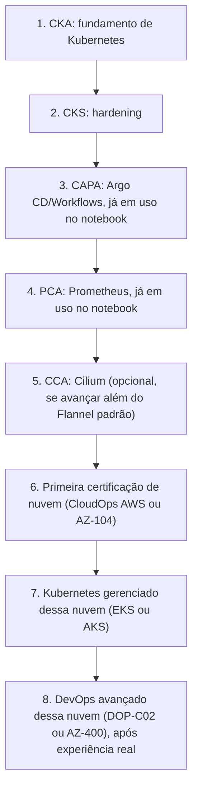

> **Para quem é:** quem já decidiu estudar para uma certificação (ou várias) e não sabe por onde começar entre as [quatro trilhas por ecossistema](../certifications/) já cobertas.

Esta página é recomendação editorial deste notebook, não um caminho oficial de nenhuma organização certificadora: a ordem sugerida aqui reflete a arquitetura real que este projeto ensina (K3s, Traefik, Gateway API, cert-manager, Argo CD, Prometheus, `NetworkPolicy`), não um consenso da indústria. Adapte livremente se o seu contexto de trabalho for diferente do cenário deste notebook.

## A ordem sugerida para o cenário deste notebook

1. **CKA**: o fundamento. Nenhuma das certificações seguintes faz sentido sem o modelo mental de Kubernetes que o CKA valida.
2. **CKS**: hardening, exige CKA aprovado como pré-requisito (não precisa estar ativo, só ter sido aprovado uma vez, conforme já esclarecido na [trilha CNCF](../certifications/kubernetes-cncf/)).
3. **CAPA**: correspondência direta com Argo CD, já em uso na arquitetura GitOps deste notebook.
4. **PCA**: correspondência direta com Prometheus, já em uso na observabilidade deste notebook.
5. **CCA** (opcional): só faz sentido se o operador avançar para Cilium além do Flannel padrão do K3s; não é um passo obrigatório da sequência.
6. **Primeira certificação de nuvem**: AWS CloudOps (SOA-C03) ou AZ-104, conforme qual nuvem o operador usa primeiro. Nenhuma das duas exige a anterior; a ordem entre 1-5 e 6 é o que importa (fundamento antes de nuvem), não uma corrida entre AWS e Azure.
7. **Kubernetes gerenciado dessa nuvem**: EKS Knowledge Badge (AWS) ou, no lado Azure, experiência prática equivalente ao que o Applied Skills de AKS cobria antes de ser retirado (ver a ressalva abaixo).
8. **Certificação de DevOps avançada dessa nuvem** (DOP-C02 ou AZ-400): só depois de experiência real operando a nuvem escolhida, não em sequência imediata ao passo 6.

> **Ressalva sobre o passo 7 no lado Azure:** o [Applied Skills de AKS mais citado está oficialmente retirado desde 17/06/2024](../certifications/azure/#applied-skills-o-estado-real-do-credencial-de-aks), conforme já registrado na página de certificações Azure. Até que a Microsoft publique um substituto direto, o passo equivalente no lado Azure é experiência prática guiada pelo mesmo roteiro conceitual (ACR → identidade → AKS → scheduling → Service → escala) sem uma credencial formal específica para validar isso.

**Fundamento antes de nuvem** é o princípio central desta ordem: as certificações de nuvem (passos 6-8) testam como cada provedor especificamente resolve compute, rede, storage e IAM, mas presumem que o candidato já entende os conceitos gerais de Kubernetes que o CKA/CKS/CAPA/PCA já cobrem de forma agnóstica de nuvem; estudar EKS ou AKS antes de entender Kubernetes em si é otimizar sintaxe específica de um provedor sobre uma base conceitual ainda incompleta.

## Alternativas por objetivo

A ordem acima não é a única leitura válida; dois objetivos diferentes justificam desvios dela.

**Foco em segurança**: CKA → CKS → KCSA (se ainda não feito) → EX430 (RHACS, se o ambiente usa OpenShift) → SCS-C03 ou uma trilha de segurança da nuvem escolhida. Essa ordem prioriza profundidade de segurança sobre amplitude de ferramentas do ecossistema (adia CAPA/PCA), fazendo sentido para quem já opera Kubernetes no dia a dia e quer aprofundar exatamente a camada de risco, não recomeçar do zero.

**Foco em nuvem** (para quem já tem Kubernetes consolidado e quer migrar o eixo de carreira para operação de nuvem gerenciada): CKA (se ainda não feito) → primeira certificação de nuvem associate (SOA-C03 ou AZ-104) → Kubernetes gerenciado dessa nuvem → SAA-C03/AZ-305 (arquitetura) → DOP-C02/AZ-400 (DevOps avançado). Essa ordem inverte a prioridade de CKS/CAPA/PCA para depois, ou as deixa de fora, dependendo de quanto a operação diária realmente depende de gerenciar o cluster Kubernetes em si versus consumi-lo como plataforma gerenciada.

## Páginas relacionadas

- [Mapa de certificações](../certifications/): a distinção entre certificação, badge e Applied Skill que fundamenta as escolhas desta página.
- [Trilha CNCF/Linux Foundation](../certifications/kubernetes-cncf/)
- [Certificações AWS](../certifications/aws/)
- [Certificações Azure](../certifications/azure/)
- [Certificações Red Hat](../certifications/red-hat/)
